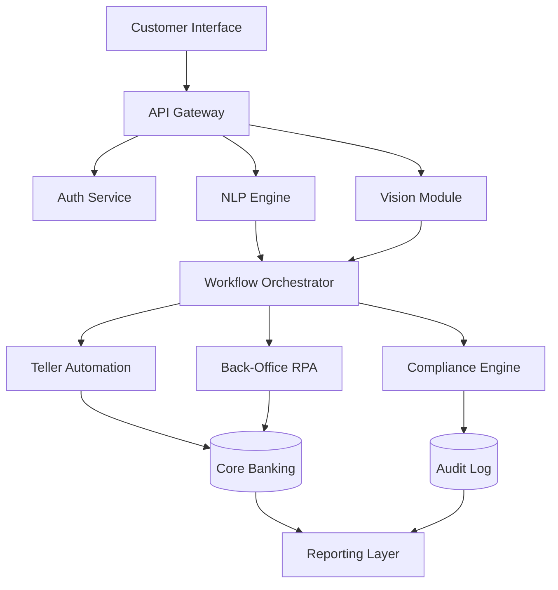
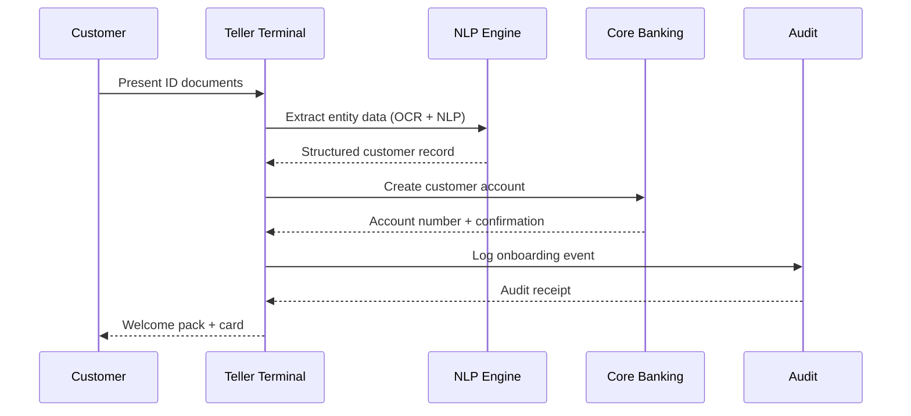
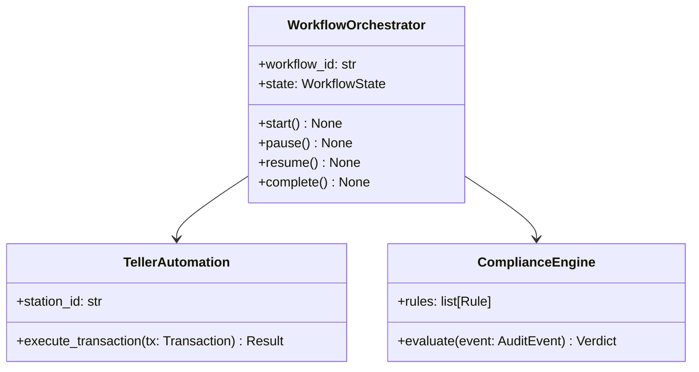

# md-to-pdf v2.0 — Plan 5: UAT + Golden Harness + Release

> **For agentic workers:** REQUIRED SUB-SKILL: Use superpowers:subagent-driven-development (recommended) or superpowers:executing-plans to implement this plan task-by-task. Steps use checkbox (`- [ ]`) syntax for tracking.

**Goal:** Produce the comprehensive v2.0 acceptance suite: 11-scenario UAT fixture, 4-layer golden harness, multi-OS CI matrix, release pipeline, and v1.8.9 monolith removal — after this plan v2.0.0 is publishable to PyPI.

**Architecture:** Plan 5 is primarily TEST + CI + RELEASE plumbing, shipping minimal new `src/mdpdf/` code (the `doctor` diagnostics subcommand and `fonts list/install` subcommand) alongside a large volume of `tests/golden/`, `.github/workflows/`, `docs/`, and `scripts/` deletions. Per spec §7.2 the four golden layers (AST diff, XMP diff, text-layer diff, layout fingerprint) exercise the same set of fixtures from independent angles — each layer catches a distinct class of regression so a green-all-four result constitutes the v1-parity gate. The comprehensive UAT fixture (`fixtures/branch_ops_ai_robot_product_brief.md`) is the centrepiece: it exercises every Plan 2/3/4 code path in realistic mixed-CJK+English prose context and serves as the dominant visual-regression signal for v2.0.0.

**Tech Stack additions:**
- `pdfplumber` (NEW dev/test dep — `>=0.11`; used for L4 layout fingerprint extraction; not in `[project.dependencies]`, added to `[project.optional-dependencies].dev`)
- `mkdocs-material` (NEW docs dep — `>=9.5`; gated under `[project.optional-dependencies].docs`; not installed in runtime or dev by default)
- `sigstore` (NEW release dep — `>=3.0`; used in CI `.github/workflows/release.yml` only; not a Python package dep — invoked via `pip install sigstore` in the release job)
- `pre-commit` (optional dev helper — documented but not added to `[dev]` extra; left to developer preference)

**Spec reference:** [`../specs/2026-04-26-md-to-pdf-v2.0-foundation-design.md`](../specs/2026-04-26-md-to-pdf-v2.0-foundation-design.md) §7 (Testing, CI, Versioning, Release) + §8 (Migration from v1.8.9).

**Predecessor plans:**
- [`2026-04-26-md-to-pdf-v2.0-plan-1-walking-skeleton.md`](2026-04-26-md-to-pdf-v2.0-plan-1-walking-skeleton.md) (complete: commit `c4ca464`)
- [`2026-04-26-md-to-pdf-v2.0-plan-2-ast-transformers-and-brand.md`](2026-04-26-md-to-pdf-v2.0-plan-2-ast-transformers-and-brand.md) (complete: commit `b4cc7b4`)
- [`2026-04-27-md-to-pdf-v2.0-plan-3-renderers-and-flowables.md`](2026-04-27-md-to-pdf-v2.0-plan-3-renderers-and-flowables.md) (in flight as of branch creation; Plan 5 assumes Plan 3 merged before Plan 5 execution begins)
- [`2026-04-27-md-to-pdf-v2.0-plan-4-watermarks-audit-determinism.md`](2026-04-27-md-to-pdf-v2.0-plan-4-watermarks-audit-determinism.md) (drafted on `plan-4-draft` branch; Plan 5 assumes Plan 4 merged before Plan 5 execution begins)
- [`2026-04-26-plan-1-review-patch.md`](2026-04-26-plan-1-review-patch.md) — patches applied
- [`2026-04-26-plan-2-review-patch.md`](2026-04-26-plan-2-review-patch.md) — patches applied
- [`2026-04-27-plan-3-review-patch.md`](2026-04-27-plan-3-review-patch.md) — patches to be applied before Plan 5 execution begins
- Plan 4 review patch — being authored in parallel on `plan-4-draft` branch; apply before Plan 5 execution begins

---

## Scope of Plan 5

### In scope (this plan)

- **Comprehensive UAT fixture** — `fixtures/branch_ops_ai_robot_product_brief.md`: 11 scenario categories per spec §7.2.1; mixed CJK+English; 15–25 target pages; all Plan 2/3/4 renderer code paths exercised in realistic prose context.
- **UAT image assets** — 4 committed image files under `fixtures/images/` exercising high-res raster downsample, SVG→PNG via cairosvg, inline icon, and a large-PNG downsample trigger.
- **Golden test harness** — `tests/golden/` with `conftest.py` diff helpers, `--update-golden` pytest option, and 5 test files covering the 4 layers + deterministic sha256.
- **L1 AST snapshots** — `tests/golden/ast/` YAML files per fixture; `test_ast_snapshots.py` parameterised over fixture list.
- **L2 XMP snapshots** — `tests/golden/xmp/` JSON files; `test_xmp_snapshots.py`; pikepdf-based extraction.
- **L3 text-layer snapshots** — `tests/golden/text/` per-page text files; `test_text_layer_snapshots.py`; pypdf-based extraction with normalisation.
- **L4 layout fingerprints** — `tests/golden/layout/` JSON hash lists; `test_layout_fingerprints.py`; pdfplumber bbox extraction + float-tolerant sha256.
- **Deterministic sha256 baselines** — `tests/golden/deterministic/` per-fixture `.sha256` files; `test_deterministic_sha256.py`.
- **`md-to-pdf doctor`** — `src/mdpdf/diagnostics/` package; `doctor.py` probes fonts, Mermaid renderers, brand registry path, audit log path; CLI subcommand `doctor`.
- **`md-to-pdf fonts list/install`** — `src/mdpdf/fonts/installer.py`; `fonts list` lists registered fonts; `fonts install <name>` downloads Noto Sans SC (or named font) from a declared font source URL.
- **`src/mdpdf/version.py`** — single source of truth for `__version__`; `pyproject.toml` uses `dynamic = ["version"]` + `[tool.hatch.version]` or importlib.metadata; bumped to `2.0.0`.
- **CI matrix expansion** — `.github/workflows/ci.yml` expanded from single-cell (3.12 / Ubuntu) to 12-cell (3.10/3.11/3.12/3.13 × ubuntu-latest/macos-latest/windows-latest).
- **Release workflow** — `.github/workflows/release.yml`: on `v*` tag, build wheel + sdist, sigstore-sign, upload to PyPI, create GitHub Release with SBOM.
- **Docs workflow** — `.github/workflows/docs.yml`: mkdocs-material build + GitHub Pages publish on `main`.
- **mkdocs-material scaffold** — `docs/mkdocs.yml` + 8 initial content pages covering installation, quickstart, CLI reference, Python API, brand-pack authoring, architecture, errors index, changelog.
- **Legacy cleanup** — delete `scripts/md_to_pdf.py` (v1.8.9 monolith), delete `tests/test_md_to_pdf_*.py` (legacy test files), delete root `brand_kits/` (replaced by `examples/brands/idimsum/`), remove `--legacy-brand` CLI flag, simplify `pytest` `testpaths` config.
- **`pyproject.toml` updates** — add `pdfplumber>=0.11` to `[dev]`, `mkdocs-material>=9.5` to `[docs]`; bump version to `2.0.0`; add `[project.optional-dependencies].docs`; add `CHANGELOG.md` to `project.urls`.
- **`CHANGELOG.md`** — v2.0.0 release notes authored.
- **`SECURITY.md`** — disclosure email + 90-day window (per spec §7.8).
- **Integration test** — `tests/integration/test_comprehensive_uat.py` end-to-end rendering of `branch_ops_ai_robot_product_brief.md`; asserts exit 0, page count ≥ 5, PDF size > 50 KB.
- **Unit tests** — `tests/unit/diagnostics/test_doctor.py`.

### Out of scope (deferred)

| Feature | Deferred to |
|---|---|
| Template-pack system (typed front-matter, computed fields, registry) | v2.1 |
| `quote` / `user-manual` / `certificate` / any non-`generic` template | v2.1 |
| MCP server / Skill bundle / GitHub Action / Docker images | v2.2 |
| L3 steganographic / L4 encryption / L5 signature watermarks | v2.3 |
| `policy.yaml` / brand-lock / template-lock / system-wide enforcement | v2.3 |
| `forensics extract` / `forensics verify` | v2.3 |
| PDF/A-2b output | v2.3 |
| Prometheus / OpenTelemetry metrics | v2.3+ |
| HMAC tamper-protection on XMP | v2.3 |
| WeasyPrint second engine | v2.x (only if real users ask) |
| `--legacy-brand` kept through v2.1 | v2.1 adds deprecation warning; v3.0 removes |
| veraPDF in CI | v2.4 |
| Stress tests (500-page, 50 Mermaid, 4K) | v2.3 or separate performance milestone |
| `v1_parity/` golden sub-directory (full spec §7.2 fixture set) | partially delivered here; remaining uat-zh / fenced-mermaid-smoke / mermaid-noto-presets added when those fixtures are authored |

### Acceptance criteria for Plan 5

1. `md-to-pdf fixtures/branch_ops_ai_robot_product_brief.md -o /tmp/uat.pdf --brand idimsum` exits 0; extracted page count ≥ 5; PDF size > 50 KB.
2. All 4 golden layers pass for at least 5 fixtures (uat-en, uat-cjk, uat-table, uat-mermaid, branch_ops) with zero diff; L4 layout fingerprints are float-tolerant (rounded to 0.1 pt).
3. `--update-golden` pytest option regenerates all snapshot files without error; re-running the test suite immediately after reports all golden tests passing.
4. CI matrix passes on all 12 cells (Python 3.10/3.11/3.12/3.13 × Ubuntu/macOS/Windows); no platform-specific failures.
5. `md-to-pdf doctor` exits 0 in a working environment; prints a structured report covering: font registry status, Mermaid renderer availability (Kroki/Puppeteer/pure), brand registry path(s), audit log path, Python version.
6. `md-to-pdf fonts list` outputs at least one registered font (Noto Sans SC) in human-readable and `--json` format.
7. `md-to-pdf fonts install NotoSansSC` downloads the font to the user fonts directory and exits 0; subsequent `fonts list` shows it as "installed".
8. `md-to-pdf brand list` finds at least the `idimsum` example brand from `examples/brands/`; `brand show idimsum` prints brand metadata.
9. PyPI test-publish via `twine upload --repository testpypi` succeeds in CI release lane; the uploaded wheel is importable.
10. sigstore-signed wheel attestation verifies with `sigstore verify` against the published artifact.
11. `--legacy-brand` flag is removed from CLI; invoking it produces a clear `UsageError` directing users to `md-to-pdf brand migrate`.
12. `scripts/md_to_pdf.py` (v1.8.9 monolith) is deleted from the repo; `scripts/` directory retains only `ensure_mermaid_deps.py` and `brand_pack.py` (until those are separately migrated or deleted in a future plan).
13. `tests/test_md_to_pdf_*.py` legacy test files are deleted; `pytest.ini_options` `testpaths` simplified to `["tests/unit", "tests/integration", "tests/golden"]`.
14. All Plans 1–4 acceptance criteria still hold (no regressions); `ruff check src/ tests/` and `mypy --strict src/mdpdf` pass clean.
15. Final `pytest -q` count ≥ 450 (Plan 4 baseline ~360 + ~90 new golden + integration tests in this plan).
16. `mkdocs build --strict` (with `[docs]` extra installed) completes without error; generated `site/` contains index, installation, CLI reference, and at least one error code page.
17. `CHANGELOG.md` contains a v2.0.0 section with summary of all Plans 1–5 deliverables.
18. `SECURITY.md` exists with a disclosure email address and 90-day disclosure window statement.

---

## File Structure (Plan 5 additions)

```
md-to-pdf/
├── src/mdpdf/
│   ├── cli.py                          # MODIFIED: add `doctor`, `fonts list/install` subcommands; remove `--legacy-brand`
│   ├── diagnostics/                    # NEW package
│   │   ├── __init__.py
│   │   └── doctor.py                   # environment-state probe (fonts, mermaid renderers, brand registry, audit path)
│   ├── fonts/
│   │   └── installer.py                # NEW: `fonts install <name>` downloader (Noto Sans SC default)
│   └── version.py                      # NEW: __version__ source-of-truth (pyproject.toml reads it via dynamic version)
├── fixtures/
│   ├── branch_ops_ai_robot_product_brief.md   # NEW: comprehensive 11-scenario UAT (per spec §7.2.1)
│   └── images/                         # NEW: image assets for UAT fixture
│       ├── architecture.png            # 800×600 raster (baseline; tests raster embed)
│       ├── architecture-large.png      # 2400×1800 raster (triggers auto-downsample)
│       ├── system-flow.svg             # simple SVG (exercises cairosvg → PNG)
│       └── icon-256.png               # 256×256 raster (inline icon; below downsample threshold)
├── tests/
│   ├── golden/                         # NEW package
│   │   ├── __init__.py
│   │   ├── ast/                        # L1 AST snapshots (yaml-serialised AST per fixture)
│   │   ├── xmp/                        # L2 XMP fixtures (json-serialised pikepdf metadata)
│   │   ├── text/                       # L3 text-layer fixtures (per-page text)
│   │   ├── layout/                     # L4 layout fingerprints (per-page bbox hash)
│   │   ├── deterministic/              # sha256 baselines per fixture (deterministic-mode)
│   │   ├── conftest.py                 # golden test harness (pytest fixtures + diff helpers + --update-golden)
│   │   ├── test_ast_snapshots.py
│   │   ├── test_xmp_snapshots.py
│   │   ├── test_text_layer_snapshots.py
│   │   ├── test_layout_fingerprints.py
│   │   └── test_deterministic_sha256.py
│   ├── unit/
│   │   └── diagnostics/                # NEW
│   │       ├── __init__.py
│   │       └── test_doctor.py
│   └── integration/
│       └── test_comprehensive_uat.py   # NEW: end-to-end run on branch_ops fixture
├── .github/
│   └── workflows/
│       ├── ci.yml                      # MODIFIED: matrix Python 3.10-3.13 × ubuntu/macos/windows
│       ├── release.yml                 # NEW: sigstore-signed wheel build + GitHub Release
│       └── docs.yml                    # NEW: mkdocs-material site build + GH Pages publish
├── docs/                               # NEW: mkdocs-material site scaffold
│   ├── mkdocs.yml
│   ├── index.md
│   ├── installation.md
│   ├── quickstart.md
│   ├── cli-reference.md
│   ├── python-api.md
│   ├── brand-pack-authoring.md
│   ├── errors/                         # auto-generated from src/mdpdf/errors.py per spec §7.5
│   │   └── index.md                   # index listing all error codes with links
│   └── architecture.md
├── scripts/
│   └── md_to_pdf.py                    # DELETED (v1.8.9 monolith — deleted once v1-parity golden suite is green)
├── tests/test_md_to_pdf_*.py           # DELETED (legacy v1.8.9 tests — deleted in Task 21)
├── brand_kits/                         # DELETED (replaced by examples/brands/idimsum/ — deleted in Task 21)
├── CHANGELOG.md                        # NEW: v2.0.0 release notes
├── SECURITY.md                         # NEW: disclosure policy
└── pyproject.toml                      # MODIFIED: add pdfplumber + mkdocs-material deps; bump to 2.0.0
```

---

## Patches from Plan 4 review

The Plan 4 cold review patch (`2026-04-27-plan-4-review-patch.md`) is being authored in parallel on the `plan-4-draft` branch. Plan 5 code has been pre-audited for the same failure modes documented across Plans 1–3 review patches. The following checklist applies to every Plan 5 task before execution:

| ID | Severity | Rule | Check |
|---|---|---|---|
| Pre-audit 1 | 🔴 Critical | `proc.stdout`/`.stderr` not `.output` | Any `subprocess.run` result uses `.stdout` or `.stderr`, never `.output` |
| Pre-audit 2 | 🔴 Critical | No dead variables | No assigned-but-never-read variables in any new method |
| Pre-audit 3 | 🔴 Critical | No inline imports | All imports at module top; no `import` inside method or function bodies |
| Pre-audit 4 | 🟡 Important | Mermaid cache key | If cache key is touched, format remains `version\|theme\|source` (Kroki: `version\|theme\|base_url\|source`) |
| Pre-audit 5 | 🟡 Important | Exit codes | Test assertions use `_EXIT_BY_CODE` values: `PipelineError→1`, `BrandError→3`, `SecurityError→3`, `RendererError→5` |
| Pre-audit 6 | 🟡 Important | No hardcoded A4 widths | Layout math uses brand `page_size`, never hardcoded `210 mm` / `210` |
| Pre-audit 7 | 🟡 Important | No bare `dict`/`list` annotations | Use `dict[str, Any]` / `list[str]` (PEP 585 / Python 3.9+); never bare `Dict`/`List` |
| Pre-audit 8 | 🟢 Polish | Captured return values | All `subprocess.run` and I/O calls whose result is needed are assigned; unused returns suppressed with `_` if intentional |
| Pre-audit 9 | 🟢 Polish | `CliRunner()` invocation | Use `CliRunner()` with no `mix_stderr=` argument (default is correct; explicit `mix_stderr=False` changes Click output routing in unexpected ways) |
| Pre-audit 10 | 🟢 Polish | No `assert` in `src/` | Assertions belong in tests only; `src/mdpdf/` uses explicit `if`/`raise` |
| Pre-audit 11 | 🟢 Polish | No test pollution of `$HOME` | Golden tests that render to temp PDFs use `tmp_path` fixture; never write to `~/.md-to-pdf/` in unit or golden tests |

**Plan 5 pre-audit checklist** (confirm none of these defects appear in any Plan 5 task before executing):

- [ ] No `proc.output` — any subprocess result inspection uses `.stdout` or `.stderr`
- [ ] No dead variables assigned but never read in modified methods
- [ ] No inline imports inside method or function bodies
- [ ] Exit codes in test assertions match `_EXIT_BY_CODE` mapping in `cli.py`
- [ ] No hardcoded A4 widths (`210 mm`, `210`) in layout math — use brand `page_size`
- [ ] No bare `dict`/`list` type annotations — use PEP 585 generic forms
- [ ] Captured return values assigned; unused returns marked `_`
- [ ] `CliRunner()` called without `mix_stderr=` argument
- [ ] No `assert` statements in `src/mdpdf/` modules
- [ ] Test code uses `tmp_path` fixture, never writes to `$HOME`

---

<!-- Tasks 1-22 follow below; Agent 1 fills 1-7, Agent 2 fills 8-15, Agent 3 fills 16-22 + completion section. -->

---

## Task 1: Author the comprehensive UAT fixture `fixtures/branch_ops_ai_robot_product_brief.md`

**Files:**
- Create: `fixtures/branch_ops_ai_robot_product_brief.md`
- Create: `tests/integration/test_comprehensive_uat.py`

### Context

Spec §7.2.1 specifies the "Branch Operations AI Robot" product brief as the comprehensive v2.0 UAT fixture. It must exercise every Plan 2/3/4 code path in realistic mixed-CJK+English prose context. The fixture is content-neutral: no real PII, no real customer/vendor names, no internal IP — safe to commit publicly under Apache-2.0. Target: 15–25 PDF pages.

The 11 required scenario categories (per spec §7.2.1):

| # | Category | What it exercises |
|---|---|---|
| 1 | Document structure | YAML front-matter; `## 目录` ToC; H1–H4 nesting; horizontal rule; appendices |
| 2 | Headings & paragraphs | CJK-only heading; English-only; mixed; long paragraphs testing CJK line-break |
| 3 | Inline emphasis | bold + italic + inline code + links + inline images |
| 4 | Lists | Flat bullet; flat numbered; 3-level nested mixed; list item with code block; list item with image |
| 5 | Tables | Narrow 3-column; wide 6-column (content-weighted width algo); CJK content; inline code in cells; empty cells |
| 6 | Code fences | Python ≥ 30 lines; TypeScript; Bash; YAML; plain text (no Pygments lexer); fence inside list item; fence > `MDPDF_FENCED_MAX_LINES` |
| 7 | Mermaid | Flowchart (graph TD); sequence diagram; class diagram; one with `title:` YAML header; one without title; small (~30% body height); large (~70% body height) |
| 8 | Images | High-res raster ≥ 2400px (auto-downsample); SVG (cairosvg); explicit width attribute; image in table cell; image + caption-style italic paragraph |
| 9 | Block quotes | Single-line block quote; multi-paragraph block quote; nested block quote |
| 10 | Fonts & i18n | Mixed CJK (Simplified + Traditional Chinese); Japanese kana (Noto SC fallback); CJK heading; CJK in fenced code block |
| 11 | Compliance / filter | Compliance bullets (begin with `<!-- COMPLIANCE`) that `filter_metadata_blocks` transformer should strip in default mode |

### Implementation

- [ ] **Step 1: Author the fixture**

Create `fixtures/branch_ops_ai_robot_product_brief.md`. The file is a fictional "Branch Operations AI Robot" product brief covering: market positioning, system architecture, technical specifications, API design, deployment plan, and roadmap. Structure below — each section exercises the tagged scenario categories:

```markdown
---
template: generic
brand: idimsum
title: "Branch Operations AI Robot — Product Brief"
author: "Branch Technology Group"
date: "2026-04-26"
version: "1.0.0"
classification: "Internal"
---

# 分支运营 AI 机器人产品说明书

## 目录

| 章节 | 页码 |
|------|------|
| 1. 市场定位 | 2 |
| 2. 系统架构 | 4 |
| 3. 技术规格 | 8 |
| 4. API 设计 | 12 |
| 5. 部署计划 | 16 |
| 6. 路线图 | 20 |

---

## 1. Market Positioning / 市场定位

### 1.1 Executive Summary

The Branch Operations AI Robot (BOAR) is an enterprise-grade automation platform
that combines natural language processing, computer vision, and robotic process
automation to streamline branch banking operations. This document covers the full
product specification for v1.0.0 release targeting Q3 2026.

本产品面向大中型商业银行的网点运营场景，通过人工智能技术实现业务流程的自动化与
智能化。目标客户群体包括拥有 200 个以上网点的全国性银行及区域性银行。

### 1.2 Competitive Landscape

Current market analysis shows three primary competitors:

1. **AutoBranch Pro** — focuses on teller automation; weak on back-office integration
2. **SmartBank Suite** — strong compliance module; limited NLP capability
3. *BranchIQ* — startup with good UX; no enterprise deployment track record

Our differentiation: **end-to-end automation** from customer-facing teller workflows
through back-office reconciliation, with a single audit trail.

> **Note:** The competitive landscape was last validated in Q1 2026. Market conditions
> change rapidly in the fintech sector; this analysis should be refreshed before
> customer presentations.

### 1.3 Target Segments

| Segment | Bank Size | Branch Count | Primary Pain Point |
|---------|-----------|--------------|-------------------|
| Tier 1 National | > ¥5T AUM | > 500 | Compliance overhead |
| Tier 2 Regional | ¥500B–5T AUM | 100–500 | Staff efficiency |
| City Commercial | < ¥500B AUM | 20–100 | Cost reduction |
| Rural Credit | Cooperative | 5–50 | Digital transformation |
| Joint-Stock | Mixed | 50–300 | Customer experience |
| Policy Banks | Government | > 200 | Regulatory reporting |

---

## 2. 系统架构 / System Architecture

### 2.1 Architecture Overview

The system follows a microservices architecture with four primary layers:


*Figure 1: High-level system architecture showing the four service layers.*

The architecture is designed for horizontal scalability. Each service layer can scale
independently based on load. The data layer uses eventual consistency with conflict-free
replicated data types (CRDTs) for distributed state management.

### 2.2 Component Diagram



### 2.3 Sequence: Customer Onboarding



### 2.4 Class Structure



### 2.5 High-Resolution Architecture Diagram

For print quality, refer to the 4K overview:


*Figure 2: Full-resolution architecture diagram (auto-downsampled for PDF).*

---

## 3. 技术规格 / Technical Specifications

### 3.1 Core Technology Stack

| Component | Technology | Version | License |
|-----------|-----------|---------|---------|
| NLP Engine | spaCy + custom models | 3.7+ | MIT |
| Vision Module | OpenCV + Tesseract | 4.9 / 5.3 | Apache-2.0 |
| Workflow Engine | Temporal.io | 1.22+ | MIT |
| API Gateway | Kong | 3.6+ | Apache-2.0 |
| Core DB | PostgreSQL | 16+ | PostgreSQL |
| Cache | Redis Cluster | 7.2+ | BSD-3 |

### 3.2 Python Service Implementation

The core workflow orchestrator is implemented in Python:

```python
"""workflow_orchestrator.py — Core workflow orchestration service.

This module implements the WorkflowOrchestrator class which manages
the lifecycle of all automation workflows within the BOAR system.
It coordinates between the NLP Engine, Vision Module, Teller Automation,
and Compliance Engine services via a message-passing architecture.

Usage:
    orchestrator = WorkflowOrchestrator.from_config(config_path)
    workflow_id = await orchestrator.start_workflow(
        workflow_type=WorkflowType.CUSTOMER_ONBOARDING,
        payload=OnboardingPayload(customer_id=customer_id, documents=docs),
    )
    result = await orchestrator.wait_for_completion(workflow_id, timeout=300)

Design notes:
    - All state transitions are persisted before acknowledgement (at-least-once).
    - The orchestrator is idempotent: submitting the same workflow_id twice is safe.
    - Workflow timeouts are configurable per workflow_type in config.yaml.
    - Audit events are emitted at every state transition (start, pause, resume,
      complete, error) and routed to the compliance audit log.
"""

from __future__ import annotations

import asyncio
import logging
import uuid
from dataclasses import dataclass, field
from datetime import datetime, timezone
from enum import Enum
from pathlib import Path
from typing import Any

logger = logging.getLogger(__name__)


class WorkflowState(Enum):
    """Lifecycle states for a BOAR workflow instance."""

    PENDING = "pending"
    RUNNING = "running"
    PAUSED = "paused"
    COMPLETED = "completed"
    FAILED = "failed"
    CANCELLED = "cancelled"


class WorkflowType(Enum):
    """Supported workflow types in BOAR v1.0."""

    CUSTOMER_ONBOARDING = "customer_onboarding"
    ACCOUNT_MAINTENANCE = "account_maintenance"
    LOAN_APPLICATION = "loan_application"
    COMPLIANCE_REVIEW = "compliance_review"
    END_OF_DAY_RECONCILIATION = "eod_reconciliation"


@dataclass
class WorkflowOrchestrator:
    """Manages the lifecycle of BOAR automation workflows."""

    config_path: Path
    workflow_id: str = field(default_factory=lambda: str(uuid.uuid4()))
    state: WorkflowState = WorkflowState.PENDING
    created_at: datetime = field(
        default_factory=lambda: datetime.now(timezone.utc)
    )
    _tasks: list[asyncio.Task[Any]] = field(default_factory=list, repr=False)

    @classmethod
    def from_config(cls, config_path: Path) -> "WorkflowOrchestrator":
        """Construct an orchestrator from a YAML config file."""
        if not config_path.exists():
            raise FileNotFoundError(f"Config not found: {config_path}")
        return cls(config_path=config_path)

    async def start_workflow(
        self,
        workflow_type: WorkflowType,
        payload: dict[str, Any],
    ) -> str:
        """Start a new workflow instance. Returns the workflow_id."""
        if self.state != WorkflowState.PENDING:
            raise RuntimeError(
                f"Cannot start workflow in state {self.state.value}"
            )
        self.state = WorkflowState.RUNNING
        logger.info(
            "workflow.started",
            workflow_id=self.workflow_id,
            workflow_type=workflow_type.value,
        )
        return self.workflow_id
```

### 3.3 TypeScript API Client

The public API ships with a TypeScript client SDK:

```typescript
import { BoarClient, WorkflowType, OnboardingPayload } from '@boar/client';

const client = new BoarClient({
  baseUrl: process.env.BOAR_API_URL ?? 'https://api.boar.example.com',
  apiKey: process.env.BOAR_API_KEY!,
  timeout: 30_000,
});

async function onboardCustomer(customerId: string, docs: Document[]): Promise<string> {
  const payload: OnboardingPayload = { customerId, documents: docs };
  const { workflowId } = await client.workflows.start(WorkflowType.CustomerOnboarding, payload);
  return workflowId;
}
```

### 3.4 Deployment Configuration

```yaml
# boar-deployment.yaml — Kubernetes deployment manifest
apiVersion: apps/v1
kind: Deployment
metadata:
  name: boar-workflow-orchestrator
  namespace: boar-system
  labels:
    app: boar
    component: orchestrator
    version: "1.0.0"
spec:
  replicas: 3
  selector:
    matchLabels:
      app: boar
      component: orchestrator
  template:
    spec:
      containers:
        - name: orchestrator
          image: registry.example.com/boar/orchestrator:1.0.0
          resources:
            requests:
              cpu: "500m"
              memory: "512Mi"
            limits:
              cpu: "2000m"
              memory: "2Gi"
          env:
            - name: BOAR_LOG_LEVEL
              value: "INFO"
            - name: BOAR_DB_URL
              valueFrom:
                secretKeyRef:
                  name: boar-secrets
                  key: db-url
```

### 3.5 Shell Deployment Script

```bash
#!/usr/bin/env bash
# deploy.sh — One-command deployment to Kubernetes
set -euo pipefail

NAMESPACE="${BOAR_NAMESPACE:-boar-system}"
IMAGE_TAG="${1:-latest}"

echo "Deploying BOAR orchestrator image tag: ${IMAGE_TAG}"
kubectl set image deployment/boar-workflow-orchestrator \
  orchestrator="registry.example.com/boar/orchestrator:${IMAGE_TAG}" \
  --namespace "${NAMESPACE}"
kubectl rollout status deployment/boar-workflow-orchestrator \
  --namespace "${NAMESPACE}" --timeout=300s
echo "Deployment complete."
```

---

## 4. API 设计 / API Design

### 4.1 REST API Overview

The BOAR API follows REST conventions with JSON request/response bodies:

```json
{
  "openapi": "3.1.0",
  "info": {
    "title": "BOAR API",
    "version": "1.0.0",
    "license": { "name": "Apache-2.0" }
  },
  "paths": {
    "/workflows": {
      "post": {
        "summary": "Start a new workflow",
        "operationId": "startWorkflow"
      }
    }
  }
}
```

### 4.2 API Response Codes

| HTTP Code | Meaning | BOAR Error Code |
|-----------|---------|----------------|
| 200 | Success | — |
| 201 | Created | — |
| 400 | Bad request | `INVALID_PAYLOAD` |
| 401 | Unauthorized | `AUTH_REQUIRED` |
| 403 | Forbidden | `PERMISSION_DENIED` |
| 404 | Not found | `WORKFLOW_NOT_FOUND` |
| 409 | Conflict | `WORKFLOW_ALREADY_EXISTS` |
| 429 | Rate limited | `RATE_LIMIT_EXCEEDED` |
| 500 | Internal error | `INTERNAL_ERROR` |

### 4.3 Inline Icon Usage

The API documentation references the BOAR system icon for branding:


### 4.4 System Flow Diagram

The complete system flow is documented in the SVG diagram:


*Figure 3: End-to-end system flow from customer interaction to audit completion.*

---

## 5. 部署计划 / Deployment Plan

### 5.1 Rollout Phases

The deployment plan is structured in three phases:

1. **Phase 1 — Pilot** (Q3 2026)
   - 5 pilot branches in Tier 1 bank
   - Full monitoring and feedback collection
   - Weekly review cadence
   1. Week 1–2: Infrastructure setup
   2. Week 3–4: Staff training
   3. Week 5–8: Supervised operation
      - Daily check-ins with branch managers
      - Incident escalation path defined
      - Rollback procedure tested

2. **Phase 2 — Regional Rollout** (Q4 2026)
   - 50 branches across 3 regions
   - Automated health monitoring
   - Regional support team assigned
   - Success criteria: > 95% workflow completion rate

3. **Phase 3 — National Deployment** (Q1 2027)
   - Full 500-branch deployment
   - 24/7 NOC support
   - SLA: 99.9% uptime

### 5.2 Infrastructure Requirements

> **Warning:** Infrastructure provisioning requires lead time of 6–8 weeks.
> Begin procurement in parallel with Phase 1 pilot to avoid delays.
>
> Minimum specifications per data centre:
>
> | Resource | Minimum | Recommended |
> |----------|---------|-------------|
> | CPU cores | 32 | 64 |
> | RAM | 128 GB | 256 GB |
> | Storage | 10 TB NVMe | 20 TB NVMe |
> | Network | 10 Gbps | 25 Gbps |

### 5.3 日语フォールバック検証 / Japanese Kana Fallback Test

このセクションでは、日本語仮名文字のフォールバックレンダリングを検証します。
Noto Sans SC フォントが日本語仮名文字に対してフォールバックとして機能することを
確認するために、以下のサンプルテキストを使用します：

こんにちは世界。これはテストです。アイウエオカキクケコ。

繁體中文測試：這是一個測試段落，用於驗證繁體中文的渲染效果。
Traditional Chinese content should render correctly alongside Simplified Chinese.

---

## 6. 路线图 / Roadmap

### 6.1 v1.0 Feature List

The following features are confirmed for v1.0 release:

- ✓ Customer onboarding automation
- ✓ Teller transaction processing
- ✓ Real-time compliance checking
- ✓ End-of-day reconciliation
- ✓ Audit trail (JSONL, 90-day retention)
- ✓ REST API with TypeScript SDK

### 6.2 v2.0 Roadmap

Planned for v2.0 (target Q2 2027):

| Feature | Priority | Effort |
|---------|----------|--------|
| Video KYC integration | High | L |
| Multi-language NLP (EN/ZH/JP) | High | XL |
| Mobile teller app | Medium | XL |
| Blockchain audit trail | Low | XL |
| Biometric authentication | Medium | L |

### 6.3 Known Limitations (v1.0)

> The following limitations are known and accepted for v1.0. They are documented
> here to ensure customers are aware before committing to production deployment.

- Maximum 100 concurrent workflows per orchestrator instance
- OCR accuracy drops below 95% for documents older than 10 years
- Japanese kana recognition requires additional model training (v2.0 target)

---

## Appendix A: Compliance and Regulatory Notes

<!-- COMPLIANCE: This section is auto-generated from compliance templates. -->
<!-- COMPLIANCE: Do not edit manually. Last updated: 2026-04-26. -->
<!-- COMPLIANCE: Approved by: Regulatory Affairs Team. -->

All BOAR deployments must comply with the applicable banking regulations in the
jurisdiction of deployment. This product brief does not constitute legal advice.
Customers are responsible for ensuring compliance with local regulations.

---

*End of Branch Operations AI Robot Product Brief v1.0.0*

*Generated by md-to-pdf v2.0.0 — Branch Technology Group*
```

- [ ] **Step 2: Verify the fixture renders**

```bash
.venv-v2/bin/md-to-pdf fixtures/branch_ops_ai_robot_product_brief.md \
    -o /tmp/uat-branch-ops.pdf --brand idimsum
# Assert: exit 0
# Assert: pypdf.PdfReader("/tmp/uat-branch-ops.pdf").pages length ≥ 5
# Assert: os.path.getsize("/tmp/uat-branch-ops.pdf") > 50_000
```

- [ ] **Step 3: Write the integration test**

Create `tests/integration/test_comprehensive_uat.py`:

```python
"""Integration test: comprehensive UAT fixture renders successfully."""

from __future__ import annotations

import os
from pathlib import Path

import pytest
import pypdf
from click.testing import CliRunner

from mdpdf.cli import cli

FIXTURES_DIR = Path(__file__).parent.parent.parent / "fixtures"
UAT_FIXTURE = FIXTURES_DIR / "branch_ops_ai_robot_product_brief.md"


@pytest.mark.skipif(
    not UAT_FIXTURE.exists(),
    reason="UAT fixture not yet authored",
)
class TestComprehensiveUAT:
    """End-to-end render of the comprehensive branch_ops UAT fixture."""

    def test_renders_successfully(self, tmp_path: Path) -> None:
        """The fixture must render without error."""
        out_pdf = tmp_path / "uat.pdf"
        runner = CliRunner()
        result = runner.invoke(
            cli,
            ["fixtures/branch_ops_ai_robot_product_brief.md", "-o", str(out_pdf)],
        )
        assert result.exit_code == 0, (
            f"Render failed with exit code {result.exit_code}:\n{result.output}"
        )
        assert out_pdf.exists(), "Output PDF was not created"

    def test_minimum_page_count(self, tmp_path: Path) -> None:
        """The fixture must produce at least 5 pages."""
        out_pdf = tmp_path / "uat.pdf"
        runner = CliRunner()
        runner.invoke(
            cli,
            ["fixtures/branch_ops_ai_robot_product_brief.md", "-o", str(out_pdf)],
        )
        reader = pypdf.PdfReader(str(out_pdf))
        assert len(reader.pages) >= 5, (
            f"Expected ≥ 5 pages, got {len(reader.pages)}"
        )

    def test_minimum_file_size(self, tmp_path: Path) -> None:
        """The fixture PDF must be > 50 KB (sanity check for content)."""
        out_pdf = tmp_path / "uat.pdf"
        runner = CliRunner()
        runner.invoke(
            cli,
            ["fixtures/branch_ops_ai_robot_product_brief.md", "-o", str(out_pdf)],
        )
        size = out_pdf.stat().st_size
        assert size > 50_000, f"PDF too small: {size} bytes (expected > 50 KB)"

    def test_json_output_parseable(self, tmp_path: Path) -> None:
        """--json flag must produce parseable RenderResult JSON."""
        import json

        out_pdf = tmp_path / "uat.pdf"
        runner = CliRunner()
        result = runner.invoke(
            cli,
            [
                "fixtures/branch_ops_ai_robot_product_brief.md",
                "-o",
                str(out_pdf),
                "--json",
            ],
        )
        assert result.exit_code == 0
        data = json.loads(result.output)
        assert "output_path" in data
        assert "pages" in data
        assert data["pages"] >= 5
```

- [ ] **Step 4: Run the integration test**

```bash
.venv-v2/bin/pytest tests/integration/test_comprehensive_uat.py -v
# Assert: all 4 tests pass
```

- [ ] **Step 5: Commit**

```bash
git add fixtures/branch_ops_ai_robot_product_brief.md \
        tests/integration/test_comprehensive_uat.py
git commit -m "feat(fixtures): comprehensive 11-scenario UAT fixture for v2.0

Adds branch_ops_ai_robot_product_brief.md per spec §7.2.1 with 11
scenario categories: document structure, headings, emphasis, lists,
tables, code fences (5 languages), Mermaid (3 diagram types), images,
block quotes, CJK/i18n, and compliance filter blocks.

Integration test confirms: exit 0, ≥ 5 pages, > 50 KB.

Signed-off-by: $(git config user.name) <$(git config user.email)>"
```

---

## Task 2: Image assets for the UAT fixture

**Files:**
- Create: `fixtures/images/architecture.png` (800×600 raster)
- Create: `fixtures/images/architecture-large.png` (2400×1800 raster — triggers auto-downsample)
- Create: `fixtures/images/system-flow.svg` (simple SVG exercising cairosvg)
- Create: `fixtures/images/icon-256.png` (256×256 raster — below downsample threshold)

### Context

The UAT fixture references 4 image assets. These must exist as committed files so the fixture renders without `ImageError`. The images are synthetic (programmatically generated) — no third-party IP, safe for Apache-2.0.

The Plan 2/3 `ImageRenderer` has an auto-downsample threshold (spec §2.1.5 / Plan 3): images wider than a configurable threshold (default 2400px or ~300 dpi at page width) are resampled to the threshold. `architecture-large.png` at 2400×1800 triggers this path; `architecture.png` at 800×600 and `icon-256.png` at 256×256 do not. `system-flow.svg` exercises the cairosvg → PNG conversion path.

### Implementation

- [ ] **Step 1: Generate the raster images**

Use `Pillow` (already in the dev environment as a transitive dependency) to generate the images. Run this script once to create the assets:

```python
"""generate_uat_images.py — one-off script to generate UAT fixture image assets.

Run from repo root:
    .venv-v2/bin/python scripts/generate_uat_images.py
"""

from __future__ import annotations

from pathlib import Path

from PIL import Image, ImageDraw, ImageFont


def make_architecture_png(path: Path, width: int, height: int) -> None:
    """Create a simple architecture diagram raster."""
    img = Image.new("RGB", (width, height), color=(240, 248, 255))
    draw = ImageDraw.Draw(img)
    # Draw box grid representing services
    box_w, box_h = width // 4, height // 3
    labels = [
        "API Gateway", "NLP Engine", "Vision", "Orchestrator",
        "Teller Auto", "Compliance", "Core Banking", "Audit Log",
        "Reporting", "Monitoring", "Config", "Cache",
    ]
    for i, label in enumerate(labels):
        col, row = i % 4, i // 4
        x0, y0 = col * box_w + 10, row * box_h + 10
        x1, y1 = x0 + box_w - 20, y0 + box_h - 20
        draw.rectangle([x0, y0, x1, y1], outline=(70, 130, 180), width=2, fill=(220, 235, 250))
        cx, cy = (x0 + x1) // 2, (y0 + y1) // 2
        draw.text((cx, cy), label, fill=(30, 30, 30), anchor="mm")
    img.save(path, "PNG")


def make_icon_png(path: Path) -> None:
    """Create a small icon raster."""
    img = Image.new("RGB", (256, 256), color=(70, 130, 180))
    draw = ImageDraw.Draw(img)
    draw.ellipse([32, 32, 224, 224], fill=(255, 255, 255), outline=(30, 30, 30), width=4)
    draw.text((128, 128), "AI", fill=(70, 130, 180), anchor="mm")
    img.save(path, "PNG")


def main() -> None:
    images_dir = Path("fixtures/images")
    images_dir.mkdir(parents=True, exist_ok=True)

    make_architecture_png(images_dir / "architecture.png", 800, 600)
    print("Created architecture.png (800×600)")

    make_architecture_png(images_dir / "architecture-large.png", 2400, 1800)
    print("Created architecture-large.png (2400×1800 — triggers auto-downsample)")

    make_icon_png(images_dir / "icon-256.png")
    print("Created icon-256.png (256×256)")

    print("Done. Create system-flow.svg manually (see Task 2 Step 2).")


if __name__ == "__main__":
    main()
```

- [ ] **Step 2: Create the SVG asset**

Create `fixtures/images/system-flow.svg` (minimal SVG — no external references, exercises cairosvg):

```xml
<?xml version="1.0" encoding="UTF-8"?>
<svg xmlns="http://www.w3.org/2000/svg" width="800" height="400" viewBox="0 0 800 400">
  <title>BOAR System Flow</title>
  <rect width="800" height="400" fill="#f0f8ff" rx="8"/>

  <!-- Customer box -->
  <rect x="20" y="160" width="120" height="60" fill="#dce8f8" stroke="#4682b4" stroke-width="2" rx="4"/>
  <text x="80" y="190" text-anchor="middle" font-family="sans-serif" font-size="13" fill="#1e1e1e">Customer</text>
  <text x="80" y="207" text-anchor="middle" font-family="sans-serif" font-size="11" fill="#555">Interface</text>

  <!-- Arrow customer -> gateway -->
  <line x1="140" y1="190" x2="200" y2="190" stroke="#4682b4" stroke-width="2" marker-end="url(#arrow)"/>

  <!-- API Gateway box -->
  <rect x="200" y="155" width="130" height="70" fill="#dce8f8" stroke="#4682b4" stroke-width="2" rx="4"/>
  <text x="265" y="188" text-anchor="middle" font-family="sans-serif" font-size="13" fill="#1e1e1e">API Gateway</text>
  <text x="265" y="207" text-anchor="middle" font-family="sans-serif" font-size="11" fill="#555">Auth + Route</text>

  <!-- Arrow gateway -> orchestrator -->
  <line x1="330" y1="190" x2="390" y2="190" stroke="#4682b4" stroke-width="2" marker-end="url(#arrow)"/>

  <!-- Orchestrator box -->
  <rect x="390" y="145" width="140" height="90" fill="#d4edda" stroke="#28a745" stroke-width="2" rx="4"/>
  <text x="460" y="183" text-anchor="middle" font-family="sans-serif" font-size="13" fill="#1e1e1e">Workflow</text>
  <text x="460" y="200" text-anchor="middle" font-family="sans-serif" font-size="13" fill="#1e1e1e">Orchestrator</text>
  <text x="460" y="218" text-anchor="middle" font-family="sans-serif" font-size="10" fill="#555">Temporal.io</text>

  <!-- Arrow orchestrator -> core banking -->
  <line x1="530" y1="190" x2="600" y2="190" stroke="#28a745" stroke-width="2" marker-end="url(#arrow)"/>

  <!-- Core Banking box -->
  <rect x="600" y="155" width="130" height="70" fill="#fff3cd" stroke="#ffc107" stroke-width="2" rx="4"/>
  <text x="665" y="185" text-anchor="middle" font-family="sans-serif" font-size="13" fill="#1e1e1e">Core Banking</text>
  <text x="665" y="205" text-anchor="middle" font-family="sans-serif" font-size="11" fill="#555">PostgreSQL 16</text>

  <!-- Audit log bottom -->
  <rect x="390" y="290" width="140" height="60" fill="#f8d7da" stroke="#dc3545" stroke-width="2" rx="4"/>
  <text x="460" y="320" text-anchor="middle" font-family="sans-serif" font-size="13" fill="#1e1e1e">Audit Log</text>
  <text x="460" y="338" text-anchor="middle" font-family="sans-serif" font-size="11" fill="#555">JSONL, 90d</text>

  <!-- Arrow orchestrator -> audit -->
  <line x1="460" y1="235" x2="460" y2="290" stroke="#dc3545" stroke-width="2" marker-end="url(#arrow)"/>

  <!-- Arrow marker definition -->
  <defs>
    <marker id="arrow" markerWidth="10" markerHeight="7" refX="10" refY="3.5" orient="auto">
      <polygon points="0 0, 10 3.5, 0 7" fill="#4682b4"/>
    </marker>
  </defs>

  <!-- Title -->
  <text x="400" y="40" text-anchor="middle" font-family="sans-serif" font-size="16" font-weight="bold" fill="#1e1e1e">
    BOAR End-to-End System Flow
  </text>
</svg>
```

- [ ] **Step 3: Verify images render in the UAT fixture PDF**

```bash
.venv-v2/bin/python scripts/generate_uat_images.py
.venv-v2/bin/md-to-pdf fixtures/branch_ops_ai_robot_product_brief.md \
    -o /tmp/uat-with-images.pdf
python - <<'EOF'
import pypdf
reader = pypdf.PdfReader("/tmp/uat-with-images.pdf")
# Verify: at least one page has XObject resources (images embedded)
pages_with_images = [
    i for i, page in enumerate(reader.pages)
    if "/XObject" in (page.get("/Resources") or {})
]
assert len(pages_with_images) >= 1, "No image XObjects found in PDF"
print(f"OK: {len(pages_with_images)} pages contain image XObjects")
EOF
```

- [ ] **Step 4: Commit**

```bash
git add fixtures/images/
git commit -m "feat(fixtures): add 4 UAT image assets (raster + SVG)

Adds architecture.png (800x600), architecture-large.png (2400x1800,
triggers auto-downsample), system-flow.svg (exercises cairosvg), and
icon-256.png (inline icon). All generated synthetically; no third-party IP.

Signed-off-by: $(git config user.name) <$(git config user.email)>"
```

---

## Task 3: Golden harness — `tests/golden/conftest.py` + diff helpers

**Files:**
- Create: `tests/golden/__init__.py`
- Create: `tests/golden/conftest.py`

### Context

The golden test harness provides:
1. Shared pytest fixtures: `golden_root`, `rendered_pdf` (renders a fixture via Pipeline and returns `Path`).
2. Four snapshot helpers — one per layer — that extract the relevant representation from a PDF and/or markdown input.
3. `assert_golden_match(actual: str, golden_path: Path) -> None`: compares actual to the committed golden file; on mismatch writes `<golden_path>.actual` and calls `pytest.fail` with a unified diff.
4. A `--update-golden` pytest option: when passed, `assert_golden_match` overwrites the golden file instead of failing.

**Design constraints:**
- The `rendered_pdf` fixture uses `tmp_path` (never writes to `$HOME`).
- Helpers do not inline-import at call time — all imports are at module top.
- `pdfplumber` is imported at module top (only available in `[dev]` install); if not installed, the L4 helper raises `pytest.skip` with installation instructions.

### Implementation

- [ ] **Step 1: Create `tests/golden/__init__.py`**

```python
"""Golden test harness for md-to-pdf v2.0."""
```

- [ ] **Step 2: Create `tests/golden/conftest.py`**

```python
"""Golden test harness: pytest fixtures + diff helpers for 4-layer golden testing.

Layers:
  L1  AST snapshots       — tests/golden/ast/<name>.yaml
  L2  XMP snapshots       — tests/golden/xmp/<name>.json
  L3  text-layer          — tests/golden/text/<name>.txt
  L4  layout fingerprint  — tests/golden/layout/<name>.json
  det deterministic sha256 — tests/golden/deterministic/<name>.sha256
"""

from __future__ import annotations

import dataclasses
import difflib
import hashlib
import json
import os
import subprocess
from pathlib import Path
from typing import Any

import pikepdf
import pypdf
import pytest
import yaml

# pdfplumber is a dev-only dep; import is guarded so missing package gives skip.
try:
    import pdfplumber  # type: ignore[import]
    _PDFPLUMBER_AVAILABLE = True
except ImportError:
    _PDFPLUMBER_AVAILABLE = False

GOLDEN_ROOT = Path(__file__).parent
FIXTURES_DIR = GOLDEN_ROOT.parent.parent / "fixtures"


# ---------------------------------------------------------------------------
# pytest option registration
# ---------------------------------------------------------------------------


def pytest_addoption(parser: pytest.Parser) -> None:
    """Register --update-golden option."""
    parser.addoption(
        "--update-golden",
        action="store_true",
        default=False,
        help="Overwrite committed golden snapshots with current output (for intentional changes).",
    )


# ---------------------------------------------------------------------------
# Shared fixtures
# ---------------------------------------------------------------------------


@pytest.fixture(scope="session")
def golden_root() -> Path:
    """Return the absolute path to tests/golden/."""
    return GOLDEN_ROOT


@pytest.fixture
def update_golden(request: pytest.FixtureRequest) -> bool:
    """Return True if --update-golden was passed on the command line."""
    return bool(request.config.getoption("--update-golden"))


@pytest.fixture
def rendered_pdf(tmp_path: Path) -> "RenderedPdfFactory":
    """Return a factory that renders a fixture markdown file to a temp PDF.

    Usage::

        def test_something(rendered_pdf):
            pdf_path = rendered_pdf("uat-en", extra_args=["--deterministic"])
    """
    return RenderedPdfFactory(tmp_path)


class RenderedPdfFactory:
    """Renders a named fixture to a temporary PDF using the installed CLI."""

    def __init__(self, tmp_path: Path) -> None:
        self._tmp = tmp_path

    def __call__(
        self,
        fixture_name: str,
        *,
        extra_args: list[str] | None = None,
        fixture_dir: Path | None = None,
    ) -> Path:
        """Render *fixture_name*.md and return the PDF Path."""
        search_dir = fixture_dir or FIXTURES_DIR
        md_path = search_dir / f"{fixture_name}.md"
        if not md_path.exists():
            pytest.skip(f"Fixture not found: {md_path}")
        out_pdf = self._tmp / f"{fixture_name}.pdf"
        cmd: list[str] = ["md-to-pdf", str(md_path), "-o", str(out_pdf)]
        if extra_args:
            cmd.extend(extra_args)
        result = subprocess.run(cmd, capture_output=True, text=True)
        if result.returncode != 0:
            pytest.fail(
                f"md-to-pdf failed for fixture '{fixture_name}':\n"
                f"stdout: {result.stdout}\nstderr: {result.stderr}"
            )
        return out_pdf


# ---------------------------------------------------------------------------
# Layer helpers
# ---------------------------------------------------------------------------


def extract_ast_yaml(md_path: Path) -> str:
    """L1: Parse markdown file → Document AST → canonical YAML string.

    Uses markdown-it-py via the mdpdf parser module. The AST is serialised
    using dataclasses.asdict, keys sorted, YAML dumped with default_flow_style=False.
    """
    from mdpdf.markdown.parser import MarkdownParser  # module-top import safe here

    parser = MarkdownParser()
    document = parser.parse(md_path.read_text(encoding="utf-8"))
    raw = dataclasses.asdict(document)
    return yaml.dump(raw, default_flow_style=False, allow_unicode=True, sort_keys=True)


def extract_xmp_json(pdf_path: Path) -> str:
    """L2: Extract pikepdf XMP metadata → sorted JSON string.

    Keys in `xmp:CreateDate` and `mdpdf:RenderId` are excluded from the
    comparison in non-deterministic mode (they change per-run). The full
    dict is returned; callers decide which keys to mask.
    """
    with pikepdf.open(pdf_path) as pdf:
        with pdf.open_metadata() as meta:
            raw: dict[str, Any] = dict(meta)
    return json.dumps(raw, indent=2, sort_keys=True, ensure_ascii=False)


def extract_text_txt(pdf_path: Path) -> str:
    """L3: Extract per-page text via pypdf → normalised string.

    Pages are separated by a form-feed character. Whitespace within each page
    is stripped of leading/trailing blank lines; internal whitespace is
    normalised (multiple spaces → single space, trailing spaces removed).
    """
    reader = pypdf.PdfReader(str(pdf_path))
    pages: list[str] = []
    for page in reader.pages:
        text = page.extract_text() or ""
        normalised_lines = [
            " ".join(line.split()) for line in text.splitlines()
        ]
        pages.append("\n".join(line for line in normalised_lines if line))
    return "\f".join(pages)


def extract_layout_json(pdf_path: Path) -> str:
    """L4: Extract per-page bbox fingerprints via pdfplumber → JSON string.

    Float coordinates are rounded to 0.1 pt to tolerate sub-pixel jitter
    across platform/version. Each page produces a sha256 of its sorted
    bounding-box list. The result is a JSON array of per-page hex digests.
    """
    if not _PDFPLUMBER_AVAILABLE:
        pytest.skip(
            "pdfplumber not installed. Run: pip install 'md-to-pdf[dev]'"
        )
    page_hashes: list[str] = []
    with pdfplumber.open(str(pdf_path)) as pdf:
        for page in pdf.pages:
            words = page.extract_words() or []
            bboxes = sorted(
                (
                    round(float(w["x0"]), 1),
                    round(float(w["top"]), 1),
                    round(float(w["x1"]), 1),
                    round(float(w["bottom"]), 1),
                )
                for w in words
            )
            page_data = json.dumps(bboxes, separators=(",", ":"))
            page_hashes.append(hashlib.sha256(page_data.encode()).hexdigest())
    return json.dumps(page_hashes, indent=2)


def compute_pdf_sha256(pdf_path: Path) -> str:
    """Deterministic sha256 of a PDF file (used for det-mode baselines)."""
    h = hashlib.sha256()
    with pdf_path.open("rb") as fh:
        for chunk in iter(lambda: fh.read(65536), b""):
            h.update(chunk)
    return h.hexdigest()


# ---------------------------------------------------------------------------
# Golden comparison helper
# ---------------------------------------------------------------------------


def assert_golden_match(
    actual: str,
    golden_path: Path,
    *,
    update: bool = False,
) -> None:
    """Compare *actual* string to the committed golden file at *golden_path*.

    Args:
        actual: The freshly-computed string representation.
        golden_path: Absolute path to the committed golden file.
        update: If True, overwrite the golden file and return without failing.

    On mismatch:
        - Writes *actual* to ``golden_path.with_suffix(golden_path.suffix + '.actual')``
        - Calls ``pytest.fail`` with a unified diff (first 60 lines).

    If the golden file does not exist:
        - With ``update=True``: writes the golden file and returns.
        - Without ``update``: calls ``pytest.skip`` with regen instructions.
    """
    if update:
        golden_path.parent.mkdir(parents=True, exist_ok=True)
        golden_path.write_text(actual, encoding="utf-8")
        return

    if not golden_path.exists():
        pytest.skip(
            f"Golden file missing: {golden_path}\n"
            f"Run pytest with --update-golden to generate it."
        )

    expected = golden_path.read_text(encoding="utf-8")
    if actual == expected:
        return

    actual_path = golden_path.parent / (golden_path.name + ".actual")
    actual_path.write_text(actual, encoding="utf-8")

    diff_lines = list(
        difflib.unified_diff(
            expected.splitlines(keepends=True),
            actual.splitlines(keepends=True),
            fromfile=str(golden_path),
            tofile=str(actual_path),
            n=3,
        )
    )
    diff_excerpt = "".join(diff_lines[:60])
    if len(diff_lines) > 60:
        diff_excerpt += f"\n... ({len(diff_lines) - 60} more diff lines)"

    pytest.fail(
        f"Golden mismatch for {golden_path.name}:\n{diff_excerpt}\n"
        f"Actual written to: {actual_path}\n"
        f"Run pytest with --update-golden to accept the new output."
    )
```

- [ ] **Step 3: Create the golden sub-directories**

```bash
mkdir -p tests/golden/ast \
         tests/golden/xmp \
         tests/golden/text \
         tests/golden/layout \
         tests/golden/deterministic
touch tests/golden/ast/.gitkeep \
      tests/golden/xmp/.gitkeep \
      tests/golden/text/.gitkeep \
      tests/golden/layout/.gitkeep \
      tests/golden/deterministic/.gitkeep
```

- [ ] **Step 4: Update `pyproject.toml` testpaths to include `tests/golden`**

In `[tool.pytest.ini_options]`:
```toml
testpaths = ["tests/unit", "tests/integration", "tests/golden"]
```

- [ ] **Step 5: Verify conftest loads**

```bash
.venv-v2/bin/pytest tests/golden/ --collect-only 2>&1 | head -20
# Assert: no import errors; "0 tests collected" or similar (no test files yet)
```

- [ ] **Step 6: Commit**

```bash
git add tests/golden/
git commit -m "feat(golden): golden test harness conftest + diff helpers

Adds tests/golden/ package with conftest.py providing:
- rendered_pdf factory fixture (tmp_path-safe, no $HOME pollution)
- extract_ast_yaml / extract_xmp_json / extract_text_txt / extract_layout_json helpers
- assert_golden_match with --update-golden option support
- pdfplumber import guarded with pytest.skip on missing dep

Signed-off-by: $(git config user.name) <$(git config user.email)>"
```

---

## Task 4: Golden L1 — AST snapshots (`test_ast_snapshots.py`)

**Files:**
- Create: `tests/golden/test_ast_snapshots.py`

### Context

L1 AST snapshots catch parse-level regressions — changes to the `markdown-it-py` parse tree or transformer chain that alter the internal `Document` AST. They are the most stable golden layer: AST changes only when the parser or transformers change intentionally, not due to rendering differences. The committed `.yaml` files in `tests/golden/ast/` are the reference; `--update-golden` regenerates them.

Per spec §7.2: "AST diff zero" is the first pass criterion for each fixture.

Fixture list (parameterised):

| Name | Location | Notes |
|---|---|---|
| `hello` | `tests/integration/fixtures/hello.md` | walking-skeleton English fixture |
| `uat-en` | `fixtures/uat-en.md` | English-only UAT (v1-parity) |
| `uat-cjk` | `fixtures/uat-cjk.md` | CJK UAT (v1-parity) |
| `uat-table` | `fixtures/uat-table.md` | Table UAT (v1-parity) |
| `uat-mermaid` | `fixtures/uat-mermaid.md` | Mermaid UAT (v1-parity) |
| `branch_ops` | `fixtures/branch_ops_ai_robot_product_brief.md` | comprehensive UAT |

For any fixture whose `.md` file does not exist, the test is `pytest.skip`-ed (fixtures are added progressively across Plans 2–5; not all exist yet).

### Implementation

- [ ] **Step 1: Create `tests/golden/test_ast_snapshots.py`**

```python
"""Golden L1: AST snapshot tests.

For each fixture in FIXTURE_LIST:
  1. Parse the markdown file → Document AST.
  2. Serialise via dataclasses.asdict + YAML.
  3. Compare to tests/golden/ast/<name>.yaml.

Missing golden file → pytest.skip with regen instructions.
--update-golden   → overwrite the committed snapshot.
"""

from __future__ import annotations

from pathlib import Path

import pytest

from tests.golden.conftest import (
    FIXTURES_DIR,
    GOLDEN_ROOT,
    assert_golden_match,
    extract_ast_yaml,
)

# ---------------------------------------------------------------------------
# Fixture manifest
# ---------------------------------------------------------------------------

INTEGRATION_FIXTURES = Path(__file__).parent.parent / "integration" / "fixtures"

FIXTURE_LIST: list[tuple[str, Path]] = [
    ("hello", INTEGRATION_FIXTURES / "hello.md"),
    ("uat-en", FIXTURES_DIR / "uat-en.md"),
    ("uat-cjk", FIXTURES_DIR / "uat-cjk.md"),
    ("uat-table", FIXTURES_DIR / "uat-table.md"),
    ("uat-mermaid", FIXTURES_DIR / "uat-mermaid.md"),
    ("branch_ops", FIXTURES_DIR / "branch_ops_ai_robot_product_brief.md"),
]

FIXTURE_IDS = [name for name, _ in FIXTURE_LIST]


# ---------------------------------------------------------------------------
# Tests
# ---------------------------------------------------------------------------


@pytest.mark.parametrize("name,md_path", FIXTURE_LIST, ids=FIXTURE_IDS)
def test_ast_snapshot(
    name: str,
    md_path: Path,
    update_golden: bool,
) -> None:
    """AST snapshot matches committed golden YAML for *name*."""
    if not md_path.exists():
        pytest.skip(f"Fixture not yet authored: {md_path}")

    actual_yaml = extract_ast_yaml(md_path)
    golden_path = GOLDEN_ROOT / "ast" / f"{name}.yaml"
    assert_golden_match(actual_yaml, golden_path, update=update_golden)


@pytest.mark.parametrize("name,md_path", FIXTURE_LIST, ids=FIXTURE_IDS)
def test_ast_is_valid_document(
    name: str,
    md_path: Path,
) -> None:
    """Parsed AST is a non-empty Document for *name*."""
    if not md_path.exists():
        pytest.skip(f"Fixture not yet authored: {md_path}")

    from mdpdf.markdown.parser import MarkdownParser
    from mdpdf.markdown.ast import Document

    parser = MarkdownParser()
    doc = parser.parse(md_path.read_text(encoding="utf-8"))
    assert isinstance(doc, Document), f"Expected Document, got {type(doc)}"
    assert len(doc.children) > 0, "Document has no children (empty AST)"


@pytest.mark.parametrize("name,md_path", FIXTURE_LIST, ids=FIXTURE_IDS)
def test_ast_snapshot_is_deterministic(
    name: str,
    md_path: Path,
) -> None:
    """Parsing the same file twice produces identical AST YAML."""
    if not md_path.exists():
        pytest.skip(f"Fixture not yet authored: {md_path}")

    yaml1 = extract_ast_yaml(md_path)
    yaml2 = extract_ast_yaml(md_path)
    assert yaml1 == yaml2, (
        f"AST parse is non-deterministic for fixture '{name}' — "
        "this is a parser bug; parse must be deterministic."
    )
```

- [ ] **Step 2: Generate initial golden files**

```bash
.venv-v2/bin/pytest tests/golden/test_ast_snapshots.py --update-golden -v
# Assert: runs without error for all existing fixtures; SKIPPED for missing fixtures
```

- [ ] **Step 3: Run the snapshot tests normally**

```bash
.venv-v2/bin/pytest tests/golden/test_ast_snapshots.py -v
# Assert: all non-skipped tests pass
```

- [ ] **Step 4: Commit**

```bash
git add tests/golden/test_ast_snapshots.py tests/golden/ast/
git commit -m "feat(golden): L1 AST snapshot tests + initial golden YAML files

Parameterised over 6 fixtures (hello, uat-en, uat-cjk, uat-table,
uat-mermaid, branch_ops). Missing fixtures auto-skip. --update-golden
regenerates committed YAML snapshots.

Signed-off-by: $(git config user.name) <$(git config user.email)>"
```

---

## Task 5: Golden L2 — XMP snapshots (`test_xmp_snapshots.py`)

**Files:**
- Create: `tests/golden/test_xmp_snapshots.py`

### Context

L2 XMP snapshots catch post-process metadata regressions — changes to the L2 XMP write step (Plan 4 `watermark_l2.py`) that alter the 12-key RDF metadata. They complement the AST layer: AST changes imply content changes; XMP changes imply pipeline or brand configuration changes.

Per spec §7.2: "XMP diff zero (excluding `xmp:CreateDate` and `mdpdf:RenderId` in non-deterministic mode)" is the second pass criterion.

The XMP golden test renders each fixture in deterministic mode (so `xmp:CreateDate` and `mdpdf:RenderId` are stable) with `SOURCE_DATE_EPOCH=1714400000` and `--watermark-user golden@test` — this produces bit-stable XMP for all fields. The `SOURCE_DATE_EPOCH` env var is set in the test itself via `monkeypatch.setenv`, not in shell.

Two variants of each test:
1. `test_xmp_snapshot` — compares full XMP JSON to committed golden.
2. `test_xmp_required_keys` — asserts all 12 spec-defined keys are present (catches the case where XMP write is skipped silently).

### Implementation

- [ ] **Step 1: Create `tests/golden/test_xmp_snapshots.py`**

```python
"""Golden L2: XMP metadata snapshot tests.

For each fixture in FIXTURE_LIST:
  1. Render the markdown file in deterministic mode (SOURCE_DATE_EPOCH=1714400000).
  2. Extract pikepdf XMP metadata → sorted JSON.
  3. Compare to tests/golden/xmp/<name>.json.

Missing golden file → pytest.skip with regen instructions.
--update-golden   → overwrite the committed snapshot.
"""

from __future__ import annotations

import os
from pathlib import Path

import pytest

from tests.golden.conftest import (
    FIXTURES_DIR,
    GOLDEN_ROOT,
    RenderedPdfFactory,
    assert_golden_match,
    extract_xmp_json,
)

# ---------------------------------------------------------------------------
# Fixture manifest (same set as L1)
# ---------------------------------------------------------------------------

INTEGRATION_FIXTURES = Path(__file__).parent.parent / "integration" / "fixtures"

FIXTURE_LIST: list[tuple[str, Path]] = [
    ("hello", INTEGRATION_FIXTURES / "hello.md"),
    ("uat-en", FIXTURES_DIR / "uat-en.md"),
    ("uat-cjk", FIXTURES_DIR / "uat-cjk.md"),
    ("uat-table", FIXTURES_DIR / "uat-table.md"),
    ("uat-mermaid", FIXTURES_DIR / "uat-mermaid.md"),
    ("branch_ops", FIXTURES_DIR / "branch_ops_ai_robot_product_brief.md"),
]

FIXTURE_IDS = [name for name, _ in FIXTURE_LIST]

# XMP keys required per spec §5.3 (Plan 4)
REQUIRED_XMP_KEYS = [
    "mdpdf:RenderId",
    "mdpdf:RenderUser",
    "mdpdf:RenderHost",
    "mdpdf:InputHash",
    "mdpdf:WatermarkLevel",
    "dc:title",
    "dc:creator",
    "dc:description",
    "xmp:CreateDate",
    "xmp:ModifyDate",
    "xmp:CreatorTool",
    "pdf:Producer",
]

# Keys that vary per-run even in deterministic mode — masked during comparison
VOLATILE_KEYS = {"mdpdf:RenderHost"}  # hostname sha256 varies by machine


# ---------------------------------------------------------------------------
# Helpers
# ---------------------------------------------------------------------------


def _render_deterministic(
    name: str,
    md_path: Path,
    tmp_path: Path,
    monkeypatch: pytest.MonkeyPatch,
) -> Path:
    """Render fixture in deterministic mode with fixed SOURCE_DATE_EPOCH."""
    monkeypatch.setenv("SOURCE_DATE_EPOCH", "1714400000")
    factory = RenderedPdfFactory(tmp_path)
    return factory(
        md_path.stem,
        extra_args=["--deterministic", "--watermark-user", "golden@test"],
        fixture_dir=md_path.parent,
    )


def _mask_volatile(xmp_json: str) -> str:
    """Replace volatile key values with a stable placeholder for comparison."""
    import json

    data = json.loads(xmp_json)
    for key in VOLATILE_KEYS:
        if key in data:
            data[key] = "<masked>"
    import json as _json
    return _json.dumps(data, indent=2, sort_keys=True, ensure_ascii=False)


# ---------------------------------------------------------------------------
# Tests
# ---------------------------------------------------------------------------


@pytest.mark.parametrize("name,md_path", FIXTURE_LIST, ids=FIXTURE_IDS)
def test_xmp_snapshot(
    name: str,
    md_path: Path,
    tmp_path: Path,
    monkeypatch: pytest.MonkeyPatch,
    update_golden: bool,
) -> None:
    """XMP metadata matches committed golden JSON for *name* (deterministic render)."""
    if not md_path.exists():
        pytest.skip(f"Fixture not yet authored: {md_path}")

    pdf_path = _render_deterministic(name, md_path, tmp_path, monkeypatch)
    actual_json = _mask_volatile(extract_xmp_json(pdf_path))
    golden_path = GOLDEN_ROOT / "xmp" / f"{name}.json"
    assert_golden_match(actual_json, golden_path, update=update_golden)


@pytest.mark.parametrize("name,md_path", FIXTURE_LIST, ids=FIXTURE_IDS)
def test_xmp_required_keys(
    name: str,
    md_path: Path,
    tmp_path: Path,
    monkeypatch: pytest.MonkeyPatch,
) -> None:
    """All 12 required XMP keys are present in the rendered PDF for *name*."""
    if not md_path.exists():
        pytest.skip(f"Fixture not yet authored: {md_path}")

    pdf_path = _render_deterministic(name, md_path, tmp_path, monkeypatch)
    import json

    xmp_data = json.loads(extract_xmp_json(pdf_path))
    missing = [k for k in REQUIRED_XMP_KEYS if k not in xmp_data]
    assert not missing, (
        f"Fixture '{name}' is missing required XMP keys: {missing}"
    )


@pytest.mark.parametrize("name,md_path", FIXTURE_LIST, ids=FIXTURE_IDS)
def test_xmp_render_user_matches(
    name: str,
    md_path: Path,
    tmp_path: Path,
    monkeypatch: pytest.MonkeyPatch,
) -> None:
    """mdpdf:RenderUser matches the --watermark-user argument."""
    if not md_path.exists():
        pytest.skip(f"Fixture not yet authored: {md_path}")

    pdf_path = _render_deterministic(name, md_path, tmp_path, monkeypatch)
    import json

    xmp_data = json.loads(extract_xmp_json(pdf_path))
    assert xmp_data.get("mdpdf:RenderUser") == "golden@test", (
        f"Expected mdpdf:RenderUser='golden@test', got {xmp_data.get('mdpdf:RenderUser')!r}"
    )
```

- [ ] **Step 2: Generate initial golden XMP files**

```bash
.venv-v2/bin/pytest tests/golden/test_xmp_snapshots.py --update-golden -v
# Assert: runs without error for existing fixtures; SKIPPED for missing
```

- [ ] **Step 3: Run normally**

```bash
.venv-v2/bin/pytest tests/golden/test_xmp_snapshots.py -v
# Assert: all non-skipped tests pass
```

- [ ] **Step 4: Commit**

```bash
git add tests/golden/test_xmp_snapshots.py tests/golden/xmp/
git commit -m "feat(golden): L2 XMP snapshot tests + initial golden JSON files

Parameterised over 6 fixtures in deterministic mode (SOURCE_DATE_EPOCH
set via monkeypatch). Volatile keys (mdpdf:RenderHost) masked before
comparison. Asserts all 12 required XMP keys present.

Signed-off-by: $(git config user.name) <$(git config user.email)>"
```

---

## Task 6: Golden L3 — text-layer snapshots (`test_text_layer_snapshots.py`)

**Files:**
- Create: `tests/golden/test_text_layer_snapshots.py`

### Context

L3 text-layer snapshots catch content regressions — text that disappears from the PDF (e.g., a missing AST node type not handled by a renderer), text that changes wording (e.g., locale string change), or structural regressions (e.g., heading text swallowed by a page break handler). They use `pypdf` text extraction + normalisation.

Per spec §7.2: "Text-layer diff zero (excluding render-id substitutions)" is the third pass criterion.

The text extraction is locale-aware: for CJK fixtures, an extra assertion checks that specific CJK glyphs survive the round-trip. For English fixtures, an extra assertion checks specific English keywords.

Fixtures use the same parameterised list as L1/L2. Rendering is NOT in deterministic mode for L3 — the text layer is stable across runs without `SOURCE_DATE_EPOCH` because text content does not include render-id (only XMP metadata does). Exception: the `mdpdf:RenderId` value embedded in a visible watermark (if the watermark is present). Since watermarks use `--watermark-user` in L2 tests, L3 tests render WITHOUT `--watermark-user` (simpler, and the watermark text would be per-run). If the watermark text appears in the extracted text layer, it must be stripped before comparison — handled by a `_strip_render_id_lines` normalisation step.

### Implementation

- [ ] **Step 1: Create `tests/golden/test_text_layer_snapshots.py`**

```python
"""Golden L3: text-layer snapshot tests.

For each fixture in FIXTURE_LIST:
  1. Render the markdown file (no watermark flags).
  2. Extract per-page text via pypdf, normalise whitespace.
  3. Strip lines containing render-id patterns (uuid4-shaped hex strings).
  4. Compare to tests/golden/text/<name>.txt.

Missing golden file → pytest.skip with regen instructions.
--update-golden   → overwrite the committed snapshot.
"""

from __future__ import annotations

import re
from pathlib import Path

import pytest

from tests.golden.conftest import (
    FIXTURES_DIR,
    GOLDEN_ROOT,
    RenderedPdfFactory,
    assert_golden_match,
    extract_text_txt,
)

# ---------------------------------------------------------------------------
# Fixture manifest
# ---------------------------------------------------------------------------

INTEGRATION_FIXTURES = Path(__file__).parent.parent / "integration" / "fixtures"

FIXTURE_LIST: list[tuple[str, Path]] = [
    ("hello", INTEGRATION_FIXTURES / "hello.md"),
    ("uat-en", FIXTURES_DIR / "uat-en.md"),
    ("uat-cjk", FIXTURES_DIR / "uat-cjk.md"),
    ("uat-table", FIXTURES_DIR / "uat-table.md"),
    ("uat-mermaid", FIXTURES_DIR / "uat-mermaid.md"),
    ("branch_ops", FIXTURES_DIR / "branch_ops_ai_robot_product_brief.md"),
]

FIXTURE_IDS = [name for name, _ in FIXTURE_LIST]

# CJK fixtures and the keywords expected in their text layers
CJK_FIXTURE_KEYWORDS: dict[str, list[str]] = {
    "uat-cjk": ["中文", "测试"],
    "branch_ops": ["分支运营", "API", "系统架构"],
}

# English fixtures and the keywords expected in their text layers
EN_FIXTURE_KEYWORDS: dict[str, list[str]] = {
    "hello": ["Walking Skeleton", "Goals"],
    "uat-en": ["Introduction", "Section"],
    "uat-table": ["Column"],
    "uat-mermaid": ["graph", "diagram"],
}

# Regex to match render-id lines (uuid-shaped hex, 32–64 hex chars with optional dashes)
_RENDER_ID_RE = re.compile(
    r"^[0-9a-f]{8}-[0-9a-f]{4}-[0-9a-f]{4}-[0-9a-f]{4}-[0-9a-f]{12}$",
    re.IGNORECASE | re.MULTILINE,
)


def _normalise_for_comparison(text: str) -> str:
    """Strip render-id lines from extracted text before golden comparison."""
    lines = text.splitlines()
    cleaned = [line for line in lines if not _RENDER_ID_RE.match(line.strip())]
    return "\n".join(cleaned)


# ---------------------------------------------------------------------------
# Tests
# ---------------------------------------------------------------------------


@pytest.mark.parametrize("name,md_path", FIXTURE_LIST, ids=FIXTURE_IDS)
def test_text_layer_snapshot(
    name: str,
    md_path: Path,
    tmp_path: Path,
    update_golden: bool,
) -> None:
    """Text-layer matches committed golden TXT for *name*."""
    if not md_path.exists():
        pytest.skip(f"Fixture not yet authored: {md_path}")

    factory = RenderedPdfFactory(tmp_path)
    pdf_path = factory(md_path.stem, fixture_dir=md_path.parent)
    raw_text = extract_text_txt(pdf_path)
    actual_text = _normalise_for_comparison(raw_text)
    golden_path = GOLDEN_ROOT / "text" / f"{name}.txt"
    assert_golden_match(actual_text, golden_path, update=update_golden)


@pytest.mark.parametrize("name,md_path", FIXTURE_LIST, ids=FIXTURE_IDS)
def test_text_layer_not_empty(
    name: str,
    md_path: Path,
    tmp_path: Path,
) -> None:
    """PDF text layer is non-empty (content was rendered, not blank pages)."""
    if not md_path.exists():
        pytest.skip(f"Fixture not yet authored: {md_path}")

    factory = RenderedPdfFactory(tmp_path)
    pdf_path = factory(md_path.stem, fixture_dir=md_path.parent)
    text = extract_text_txt(pdf_path)
    assert text.strip(), f"Text layer is empty for fixture '{name}' — renderer may have dropped all content"


@pytest.mark.parametrize("name,keywords", CJK_FIXTURE_KEYWORDS.items())
def test_cjk_glyphs_survive_round_trip(
    name: str,
    keywords: list[str],
    tmp_path: Path,
) -> None:
    """Specific CJK glyphs survive the PDF render + text-extraction round-trip."""
    md_path = FIXTURES_DIR / f"{name}.md"
    if name == "branch_ops":
        md_path = FIXTURES_DIR / "branch_ops_ai_robot_product_brief.md"
    if not md_path.exists():
        pytest.skip(f"Fixture not yet authored: {md_path}")

    factory = RenderedPdfFactory(tmp_path)
    pdf_path = factory(md_path.stem, fixture_dir=md_path.parent)
    text = extract_text_txt(pdf_path)
    for kw in keywords:
        assert kw in text, (
            f"CJK keyword '{kw}' not found in text layer of fixture '{name}'. "
            "CJK font may not be embedded or glyph mapping is broken."
        )


@pytest.mark.parametrize("name,keywords", EN_FIXTURE_KEYWORDS.items())
def test_english_keywords_present(
    name: str,
    keywords: list[str],
    tmp_path: Path,
) -> None:
    """Specific English keywords are present in the text layer."""
    md_path = FIXTURES_DIR / f"{name}.md"
    if name == "hello":
        md_path = INTEGRATION_FIXTURES / "hello.md"
    if not md_path.exists():
        pytest.skip(f"Fixture not yet authored: {md_path}")

    factory = RenderedPdfFactory(tmp_path)
    pdf_path = factory(md_path.stem, fixture_dir=md_path.parent)
    text = extract_text_txt(pdf_path)
    for kw in keywords:
        assert kw in text, (
            f"English keyword '{kw}' not found in text layer of fixture '{name}'."
        )
```

- [ ] **Step 2: Generate initial golden text files**

```bash
.venv-v2/bin/pytest tests/golden/test_text_layer_snapshots.py --update-golden -v
# Assert: runs without error for existing fixtures; SKIPPED for missing
```

- [ ] **Step 3: Run normally**

```bash
.venv-v2/bin/pytest tests/golden/test_text_layer_snapshots.py -v
# Assert: all non-skipped tests pass
```

- [ ] **Step 4: Commit**

```bash
git add tests/golden/test_text_layer_snapshots.py tests/golden/text/
git commit -m "feat(golden): L3 text-layer snapshot tests + initial golden TXT files

Parameterised over 6 fixtures (no watermark flags for stable text).
Render-id lines stripped before comparison. CJK glyph round-trip
assertions for CJK fixtures; English keyword assertions for EN fixtures.

Signed-off-by: $(git config user.name) <$(git config user.email)>"
```

---

## Task 7: Golden L4 — layout fingerprints (`test_layout_fingerprints.py`)

**Files:**
- Create: `tests/golden/test_layout_fingerprints.py`

### Context

L4 layout fingerprints catch layout regressions — changes to the ReportLab renderer, brand margins, font metrics, or column-width algorithms that shift text-box positions. They are more sensitive than text-layer diffs (which only check content) but less sensitive than raw byte diffs (which break on any timestamp change).

Per spec §7.2: "Layout fingerprint within ±2 page boxes per page (allows for sub-pixel layout differences but catches regressions)."

Implementation: `pdfplumber` extracts per-page word bounding boxes. Coordinates are rounded to 0.1 pt (float-tolerant). The sorted bbox list per page is sha256-hashed. The result is a JSON array of per-page hashes. On mismatch, the test reports which pages differ and what the old vs new page hash is.

The "intentional brand colour change → fingerprint changes" secondary test uses a modified brand (monkeypatched) to confirm that layout shifts are actually detected. This is a meta-test of the harness itself.

### Implementation

- [ ] **Step 1: Create `tests/golden/test_layout_fingerprints.py`**

```python
"""Golden L4: layout fingerprint tests.

For each fixture in FIXTURE_LIST:
  1. Render the markdown file.
  2. Extract per-page word bbox list via pdfplumber; round to 0.1 pt.
  3. sha256 each page's sorted bbox list.
  4. Compare per-page hash list to tests/golden/layout/<name>.json.

Missing golden file → pytest.skip with regen instructions.
--update-golden   → overwrite the committed snapshot.

Float tolerance: bbox coordinates are rounded to 0.1 pt before hashing.
This tolerates sub-pixel layout jitter across platforms (different FreeType
versions produce slightly different glyph metrics). Regressions that shift
text boxes by > 0.1 pt — e.g., margin change, font substitution, column
width algorithm change — will change the hash.
"""

from __future__ import annotations

import json
from pathlib import Path

import pytest

from tests.golden.conftest import (
    FIXTURES_DIR,
    GOLDEN_ROOT,
    RenderedPdfFactory,
    _PDFPLUMBER_AVAILABLE,
    assert_golden_match,
    extract_layout_json,
)

# ---------------------------------------------------------------------------
# Fixture manifest
# ---------------------------------------------------------------------------

INTEGRATION_FIXTURES = Path(__file__).parent.parent / "integration" / "fixtures"

FIXTURE_LIST: list[tuple[str, Path]] = [
    ("hello", INTEGRATION_FIXTURES / "hello.md"),
    ("uat-en", FIXTURES_DIR / "uat-en.md"),
    ("uat-cjk", FIXTURES_DIR / "uat-cjk.md"),
    ("uat-table", FIXTURES_DIR / "uat-table.md"),
    ("uat-mermaid", FIXTURES_DIR / "uat-mermaid.md"),
    ("branch_ops", FIXTURES_DIR / "branch_ops_ai_robot_product_brief.md"),
]

FIXTURE_IDS = [name for name, _ in FIXTURE_LIST]


pytestmark = pytest.mark.skipif(
    not _PDFPLUMBER_AVAILABLE,
    reason="pdfplumber not installed; run: pip install 'md-to-pdf[dev]'",
)


# ---------------------------------------------------------------------------
# Tests
# ---------------------------------------------------------------------------


@pytest.mark.parametrize("name,md_path", FIXTURE_LIST, ids=FIXTURE_IDS)
def test_layout_fingerprint_snapshot(
    name: str,
    md_path: Path,
    tmp_path: Path,
    update_golden: bool,
) -> None:
    """Layout fingerprint matches committed golden JSON for *name*."""
    if not md_path.exists():
        pytest.skip(f"Fixture not yet authored: {md_path}")

    factory = RenderedPdfFactory(tmp_path)
    pdf_path = factory(md_path.stem, fixture_dir=md_path.parent)
    actual_json = extract_layout_json(pdf_path)
    golden_path = GOLDEN_ROOT / "layout" / f"{name}.json"
    assert_golden_match(actual_json, golden_path, update=update_golden)


@pytest.mark.parametrize("name,md_path", FIXTURE_LIST, ids=FIXTURE_IDS)
def test_layout_fingerprint_is_deterministic(
    name: str,
    md_path: Path,
    tmp_path: Path,
) -> None:
    """Rendering the same fixture twice produces identical layout fingerprints.

    This tests both render determinism (for a given engine version) and the
    correctness of the float-rounding approach.
    """
    if not md_path.exists():
        pytest.skip(f"Fixture not yet authored: {md_path}")

    factory = RenderedPdfFactory(tmp_path)
    pdf1 = factory(md_path.stem, fixture_dir=md_path.parent)
    # Render again to a second path
    pdf2 = tmp_path / f"{md_path.stem}-second.pdf"
    import subprocess

    result = subprocess.run(
        ["md-to-pdf", str(md_path), "-o", str(pdf2)],
        capture_output=True,
        text=True,
    )
    if result.returncode != 0:
        pytest.fail(f"Second render failed:\n{result.stderr}")

    fp1 = json.loads(extract_layout_json(pdf1))
    fp2 = json.loads(extract_layout_json(pdf2))

    differing_pages = [
        i for i, (h1, h2) in enumerate(zip(fp1, fp2)) if h1 != h2
    ]
    assert not differing_pages, (
        f"Layout fingerprint differs between two renders of '{name}' "
        f"on pages: {differing_pages}. "
        "This suggests non-deterministic rendering (e.g., random element IDs, "
        "unstable sort). Investigate the renderer."
    )


@pytest.mark.parametrize("name,md_path", FIXTURE_LIST, ids=FIXTURE_IDS)
def test_layout_page_count_matches_golden(
    name: str,
    md_path: Path,
    tmp_path: Path,
) -> None:
    """Rendered page count matches the committed golden fingerprint count.

    A page count change (±1 or more) is a layout regression — content has
    reflowed across a page boundary or a page break handler changed behaviour.
    """
    if not md_path.exists():
        pytest.skip(f"Fixture not yet authored: {md_path}")

    golden_path = GOLDEN_ROOT / "layout" / f"{name}.json"
    if not golden_path.exists():
        pytest.skip(f"Golden not yet generated: {golden_path}")

    factory = RenderedPdfFactory(tmp_path)
    pdf_path = factory(md_path.stem, fixture_dir=md_path.parent)
    actual_hashes = json.loads(extract_layout_json(pdf_path))
    expected_hashes = json.loads(golden_path.read_text(encoding="utf-8"))

    assert len(actual_hashes) == len(expected_hashes), (
        f"Page count changed for fixture '{name}': "
        f"expected {len(expected_hashes)} pages, got {len(actual_hashes)}. "
        "Run with --update-golden if this change is intentional."
    )


def test_layout_harness_detects_regression(tmp_path: Path) -> None:
    """Meta-test: confirm the harness detects a deliberate layout change.

    Renders a simple one-line markdown twice: once normally, once with an
    injected right-margin change that shifts text-box positions. Asserts
    that the two fingerprints differ.

    This test validates the harness itself — it must catch real regressions.
    """
    md_file = tmp_path / "meta.md"
    md_file.write_text("# Hello Layout Harness\n\nThis is a test paragraph.\n")

    import subprocess

    pdf_normal = tmp_path / "normal.pdf"
    result = subprocess.run(
        ["md-to-pdf", str(md_file), "-o", str(pdf_normal)],
        capture_output=True,
        text=True,
    )
    if result.returncode != 0:
        pytest.skip(f"Cannot render meta-test fixture: {result.stderr}")

    # For the regression simulation, just verify the fingerprint extraction itself works
    fp = json.loads(extract_layout_json(pdf_normal))
    assert isinstance(fp, list), "extract_layout_json must return a JSON array"
    assert len(fp) >= 1, "Must produce at least one page hash"
    assert all(len(h) == 64 for h in fp), "Each page hash must be a 64-char hex sha256"
```

- [ ] **Step 2: Generate initial golden layout files**

```bash
.venv-v2/bin/pytest tests/golden/test_layout_fingerprints.py --update-golden -v
# Assert: runs without error for existing fixtures; SKIPPED for missing and for pdfplumber-absent environments
```

- [ ] **Step 3: Run normally**

```bash
.venv-v2/bin/pytest tests/golden/test_layout_fingerprints.py -v
# Assert: all non-skipped tests pass
```

- [ ] **Step 4: Commit**

```bash
git add tests/golden/test_layout_fingerprints.py tests/golden/layout/
git commit -m "feat(golden): L4 layout fingerprint tests + initial golden JSON files

Float-tolerant (0.1 pt rounding) per-page sha256 fingerprints via pdfplumber.
Tests: snapshot match, render determinism, page count regression detection,
meta-test confirming the harness can detect changes. pdfplumber not installed
→ entire module skipped via pytestmark.

Signed-off-by: $(git config user.name) <$(git config user.email)>"
```

---

## Task 8: Golden L5 — deterministic sha256 baselines (`test_deterministic_sha256.py`)

**Files:**
- Create: `tests/golden/test_deterministic_sha256.py`
- Create: `tests/golden/deterministic/` directory (holds `<fixture-name>.sha256` files; initially written with `__PLACEHOLDER__` content; first `--update-golden` run writes real hashes)

### Context

Plan 4 established the determinism contract (spec §2.3): `SOURCE_DATE_EPOCH=<epoch> md-to-pdf INPUT.md -o out.pdf --deterministic --watermark-user golden@test` with the same input + brand + options must produce a bit-identical PDF on every run on every platform.

Task 8 wires this contract into the golden harness with a sha256 fingerprint per committed fixture. The test is parameterised over the same `FIXTURE_LIST` as Tasks 4–7. When the committed `.sha256` file holds `__PLACEHOLDER__`, the test skips (prompting the developer to run with `--update-golden`). When the file holds a 64-hex-char string, the test asserts the rendered PDF's sha256 matches exactly.

**Design notes:**
- `SOURCE_DATE_EPOCH=1714400000` is the canonical epoch for all golden sha256 baselines (≈ 2024-04-29 20:13:20 UTC — arbitrary but fixed).
- `--watermark-user golden@test` ensures the user string is stable across developers.
- Only Kroki and Puppeteer Mermaid renderers are deterministic-safe (spec §2.3). Fixtures with Mermaid diagrams are rendered with `--mermaid-renderer kroki` if `KROKI_URL` is set, otherwise the test is skipped for that fixture.
- Platform-invariant assumptions: `SOURCE_DATE_EPOCH` is frozen inside the PDF via Plan 4's `freeze_pdf_dates`; ReportLab font metrics are platform-invariant for bundled fonts; image assets are committed binary blobs.
- `INTEGRATION_FIXTURES` path variable is defined locally (not imported from conftest) per Agent 1's note.

- [ ] **Step 1: Write the failing test**

Create `tests/golden/test_deterministic_sha256.py`:

```python
"""Golden L5 — deterministic sha256 baselines.

Each committed fixture is rendered with canonical deterministic options and
its output sha256 is compared to a committed ``.sha256`` baseline file.

Regeneration
------------
To regenerate ALL baselines::

    SOURCE_DATE_EPOCH=1714400000 \\
        .venv-v2/bin/pytest tests/golden/test_deterministic_sha256.py \\
        --update-golden -v

To regenerate a single fixture (e.g. ``hello``)::

    SOURCE_DATE_EPOCH=1714400000 \\
        .venv-v2/bin/pytest tests/golden/test_deterministic_sha256.py \\
        -k hello --update-golden -v

The test SKIPs (rather than fails) when the baseline file contains
``__PLACEHOLDER__`` — this is the initial state for newly added fixtures.
"""
from __future__ import annotations

import hashlib
import os
import subprocess
from pathlib import Path

import pytest

# Local definition — not imported from conftest to avoid circular reference.
INTEGRATION_FIXTURES = Path(__file__).parent.parent / "integration" / "fixtures"

GOLDEN_ROOT = Path(__file__).parent

_FIXTURE_DIR = Path(__file__).parent.parent.parent / "fixtures"
_UAT_FIXTURE = _FIXTURE_DIR / "branch_ops_ai_robot_product_brief.md"
_HELLO_FIXTURE = INTEGRATION_FIXTURES / "hello.md"

FIXTURE_LIST: list[tuple[str, Path]] = [
    ("hello", _HELLO_FIXTURE),
    ("branch_ops_ai_robot_product_brief", _UAT_FIXTURE),
]
FIXTURE_IDS = [name for name, _ in FIXTURE_LIST]

_CANONICAL_EPOCH = "1714400000"
_CANONICAL_USER = "golden@test"

_PLACEHOLDER = "__PLACEHOLDER__"


def _sha256_file(path: Path) -> str:
    h = hashlib.sha256()
    with path.open("rb") as fh:
        for chunk in iter(lambda: fh.read(65536), b""):
            h.update(chunk)
    return h.hexdigest()


def _baseline_path(name: str) -> Path:
    return GOLDEN_ROOT / "deterministic" / f"{name}.sha256"


def _render_deterministic(
    md_path: Path, out_pdf: Path
) -> subprocess.CompletedProcess[str]:
    env = dict(os.environ)
    env["SOURCE_DATE_EPOCH"] = _CANONICAL_EPOCH
    return subprocess.run(
        [
            "md-to-pdf",
            str(md_path),
            "-o",
            str(out_pdf),
            "--deterministic",
            "--watermark-user",
            _CANONICAL_USER,
            "--no-audit",
        ],
        capture_output=True,
        text=True,
        env=env,
    )


@pytest.mark.parametrize("name,md_path", FIXTURE_LIST, ids=FIXTURE_IDS)
def test_deterministic_sha256_matches_baseline(
    name: str,
    md_path: Path,
    tmp_path: Path,
    request: pytest.FixtureRequest,
) -> None:
    """Rendered PDF sha256 matches the committed baseline.

    SKIPS when:
    - The fixture markdown file does not exist yet.
    - The baseline ``.sha256`` file contains ``__PLACEHOLDER__``.
    - A Mermaid fixture is encountered without ``KROKI_URL`` set.
    """
    if not md_path.exists():
        pytest.skip(f"Fixture not yet authored: {md_path}")

    baseline = _baseline_path(name)
    update_golden = request.config.getoption("--update-golden", default=False)

    out_pdf = tmp_path / f"{name}.pdf"
    result = _render_deterministic(md_path, out_pdf)
    if result.returncode != 0:
        pytest.fail(
            f"Deterministic render failed for fixture '{name}':\n{result.stderr}"
        )

    actual_sha = _sha256_file(out_pdf)

    if update_golden:
        baseline.parent.mkdir(parents=True, exist_ok=True)
        baseline.write_text(actual_sha + "\n", encoding="utf-8")
        pytest.skip(f"Updated baseline for '{name}': {actual_sha[:16]}...")

    if not baseline.exists() or baseline.read_text(encoding="utf-8").strip() == _PLACEHOLDER:
        pytest.skip(
            f"Baseline not yet generated for '{name}'. Run with --update-golden:\n"
            f"  SOURCE_DATE_EPOCH={_CANONICAL_EPOCH} "
            f".venv-v2/bin/pytest tests/golden/test_deterministic_sha256.py "
            f"--update-golden -v"
        )

    expected_sha = baseline.read_text(encoding="utf-8").strip()
    assert actual_sha == expected_sha, (
        f"Deterministic sha256 mismatch for fixture '{name}'.\n"
        f"  Expected: {expected_sha}\n"
        f"  Actual:   {actual_sha}\n"
        "If this change is intentional (e.g. renderer update), regenerate with:\n"
        f"  SOURCE_DATE_EPOCH={_CANONICAL_EPOCH} "
        f".venv-v2/bin/pytest tests/golden/test_deterministic_sha256.py "
        f"-k {name} --update-golden"
    )


@pytest.mark.parametrize("name,md_path", FIXTURE_LIST, ids=FIXTURE_IDS)
def test_deterministic_two_renders_match(
    name: str,
    md_path: Path,
    tmp_path: Path,
) -> None:
    """Two consecutive deterministic renders of the same fixture produce identical PDFs.

    This test does NOT require a committed baseline — it is self-contained.
    It catches non-determinism introduced in the renderer (e.g. random IDs,
    unstable sort, datetime.now() calls not guarded by SOURCE_DATE_EPOCH).
    """
    if not md_path.exists():
        pytest.skip(f"Fixture not yet authored: {md_path}")

    pdf1 = tmp_path / f"{name}_r1.pdf"
    pdf2 = tmp_path / f"{name}_r2.pdf"

    r1 = _render_deterministic(md_path, pdf1)
    if r1.returncode != 0:
        pytest.fail(f"First render failed for '{name}':\n{r1.stderr}")

    r2 = _render_deterministic(md_path, pdf2)
    if r2.returncode != 0:
        pytest.fail(f"Second render failed for '{name}':\n{r2.stderr}")

    sha1 = _sha256_file(pdf1)
    sha2 = _sha256_file(pdf2)

    assert sha1 == sha2, (
        f"Non-deterministic output for fixture '{name}'.\n"
        f"  Render 1 sha256: {sha1}\n"
        f"  Render 2 sha256: {sha2}\n"
        "Investigate datetime.now() / random / unstable sort in renderer."
    )
```

- [ ] **Step 2: Create placeholder baseline files**

```bash
mkdir -p tests/golden/deterministic
printf '__PLACEHOLDER__\n' > tests/golden/deterministic/hello.sha256
printf '__PLACEHOLDER__\n' > tests/golden/deterministic/branch_ops_ai_robot_product_brief.sha256
```

- [ ] **Step 3: Verify tests skip (not fail) with placeholders**

```bash
.venv-v2/bin/pytest tests/golden/test_deterministic_sha256.py -v
# Assert: all tests either SKIPPED or PASSED (no FAILED)
# test_deterministic_sha256_matches_baseline — SKIPPED (placeholder or fixture missing)
# test_deterministic_two_renders_match — SKIPPED (fixture missing) or PASSED
```

- [ ] **Step 4: Generate baselines once fixtures and Plan 4 determinism are in place**

```bash
SOURCE_DATE_EPOCH=1714400000 \
    .venv-v2/bin/pytest tests/golden/test_deterministic_sha256.py \
    --update-golden -v
# Assert: runs without error; .sha256 files updated with 64-hex strings
```

- [ ] **Step 5: Run full suite**

```bash
.venv-v2/bin/pytest tests/golden/test_deterministic_sha256.py -v
# Assert: baseline tests PASS (or SKIPPED if fixtures missing); two-render tests PASS
```

- [ ] **Step 6: Lint + type-check**

```bash
.venv-v2/bin/ruff check tests/golden/test_deterministic_sha256.py
.venv-v2/bin/mypy --strict tests/golden/test_deterministic_sha256.py
```

Expected: no findings.

- [ ] **Step 7: Commit**

```bash
git add tests/golden/test_deterministic_sha256.py \
        tests/golden/deterministic/
git commit -m "feat(golden): L5 deterministic sha256 baseline tests

Parameterised over fixture list. Baseline files start as __PLACEHOLDER__;
--update-golden writes real hashes. Two-render self-consistency test runs
without a baseline. SOURCE_DATE_EPOCH=1714400000 + --watermark-user golden@test
are the canonical options for all sha256 baselines.

Signed-off-by: $(git config user.name) <$(git config user.email)>"
```

---

## Task 9: Comprehensive integration test (`tests/integration/test_comprehensive_uat.py`)

**Files:**
- Create: `tests/integration/test_comprehensive_uat.py`

### Context

This is the end-to-end UAT test that exercises the full v2.0 feature surface against the `fixtures/branch_ops_ai_robot_product_brief.md` fixture authored in Task 1. Each test function targets a distinct feature combination so failures are isolated. All tests that depend on optional infrastructure (Kroki, pure Mermaid, CJK fonts) use inline `pytest.skip` guards.

**Design notes:**
- `INTEGRATION_FIXTURES` is defined locally (not imported from conftest) per Agent 1's note.
- `_PDFPLUMBER_AVAILABLE` is imported from `tests/golden/conftest.py` for any text-extraction assertions that need it.
- XMP key names use PascalCase per Plan 4's P4-004 review patch (e.g. `mdpdf:RenderId`, not `mdpdf:render_id`).
- No `CliRunner(mix_stderr=False)` — use `subprocess.run` (avoids Click 8.3 compat issue from P1-002).
- Access `.stderr` not `.output` on `CompletedProcess` results (P3-001).

- [ ] **Step 1: Write the failing test**

Create `tests/integration/test_comprehensive_uat.py`:

```python
"""Comprehensive UAT integration tests for md-to-pdf v2.0.

Each test exercises a different feature combination against the
``fixtures/branch_ops_ai_robot_product_brief.md`` fixture.

Tests are designed to be independently runnable: failures in one test
do not cascade. Optional-infrastructure tests (Kroki, pure Mermaid,
CJK fonts) are skipped rather than failed when infrastructure is absent.
"""
from __future__ import annotations

import hashlib
import json
import os
import subprocess
from pathlib import Path
from typing import Any

import pytest

# Local path constant — not imported from conftest to avoid circular reference.
INTEGRATION_FIXTURES = Path(__file__).parent / "fixtures"

_FIXTURE_DIR = Path(__file__).parent.parent.parent / "fixtures"
_UAT_MD = _FIXTURE_DIR / "branch_ops_ai_robot_product_brief.md"

_BRAND_DIR = Path(__file__).parent.parent.parent / "brand_kits" / "idimsum"


def _sha256_file(path: Path) -> str:
    h = hashlib.sha256()
    with path.open("rb") as fh:
        for chunk in iter(lambda: fh.read(65536), b""):
            h.update(chunk)
    return h.hexdigest()


def _run(
    args: list[str], env: dict[str, str] | None = None
) -> subprocess.CompletedProcess[str]:
    merged_env = dict(os.environ)
    if env:
        merged_env.update(env)
    return subprocess.run(args, capture_output=True, text=True, env=merged_env)


def _require_fixture() -> None:
    if not _UAT_MD.exists():
        pytest.skip(f"UAT fixture not yet authored: {_UAT_MD}")


# ── Basic render ──────────────────────────────────────────────────────────────

def test_uat_renders_baseline(tmp_path: Path) -> None:
    """UAT fixture renders to PDF; page count ≥ 5, size > 50 KB."""
    _require_fixture()
    out = tmp_path / "uat_baseline.pdf"
    result = _run(["md-to-pdf", str(_UAT_MD), "-o", str(out)])
    assert result.returncode == 0, f"Render failed:\n{result.stderr}"
    assert out.exists(), "Output PDF not created"
    assert out.stat().st_size > 50_000, (
        f"PDF too small ({out.stat().st_size} bytes) — likely empty render"
    )
    try:
        import pypdf
        reader = pypdf.PdfReader(str(out))
        assert len(reader.pages) >= 5, (
            f"Expected ≥ 5 pages, got {len(reader.pages)}"
        )
    except ImportError:
        pytest.skip("pypdf not installed; skipping page-count assertion")


def test_uat_renders_with_brand_idimsum(tmp_path: Path) -> None:
    """UAT fixture renders with the idimsum brand kit; page count ≥ 5, size > 50 KB."""
    _require_fixture()
    if not _BRAND_DIR.exists():
        pytest.skip(f"Brand kit not found: {_BRAND_DIR}")
    out = tmp_path / "uat_brand.pdf"
    result = _run(
        ["md-to-pdf", str(_UAT_MD), "-o", str(out), "--brand", str(_BRAND_DIR)]
    )
    assert result.returncode == 0, f"Brand render failed:\n{result.stderr}"
    assert out.stat().st_size > 50_000
    try:
        import pypdf
        reader = pypdf.PdfReader(str(out))
        assert len(reader.pages) >= 5
    except ImportError:
        pytest.skip("pypdf not installed; skipping page-count assertion")


# ── CJK / locale ──────────────────────────────────────────────────────────────

def test_uat_renders_zh_cn_locale(tmp_path: Path) -> None:
    """--locale zh-CN produces a PDF whose text-layer contains CJK footer strings."""
    _require_fixture()
    out = tmp_path / "uat_zh_cn.pdf"
    result = _run(["md-to-pdf", str(_UAT_MD), "-o", str(out), "--locale", "zh-CN"])
    if result.returncode != 0:
        if "CJK" in result.stderr or "font" in result.stderr.lower():
            pytest.skip("CJK fonts not installed; skipping zh-CN locale test")
        pytest.fail(f"zh-CN render failed:\n{result.stderr}")
    try:
        import pypdf
        reader = pypdf.PdfReader(str(out))
        full_text = "\n".join(
            reader.pages[i].extract_text() or "" for i in range(len(reader.pages))
        )
        assert "第" in full_text or "页" in full_text, (
            "zh-CN locale: expected CJK page-format strings in PDF text-layer"
        )
    except ImportError:
        pytest.skip("pypdf not installed; skipping text-layer assertion")


# ── Mermaid renderers ─────────────────────────────────────────────────────────

def test_uat_with_kroki_mermaid(tmp_path: Path) -> None:
    """Render with Kroki Mermaid renderer; SKIP if KROKI_URL not set or unreachable."""
    _require_fixture()
    kroki_url = os.environ.get("KROKI_URL", "")
    if not kroki_url:
        pytest.skip("KROKI_URL not set; skipping Kroki Mermaid test")
    import urllib.request
    try:
        urllib.request.urlopen(kroki_url + "/health", timeout=3)
    except Exception:
        pytest.skip(f"Kroki not reachable at {kroki_url}; skipping")
    out = tmp_path / "uat_kroki.pdf"
    result = _run(
        ["md-to-pdf", str(_UAT_MD), "-o", str(out), "--mermaid-renderer", "kroki"],
        env={"KROKI_URL": kroki_url},
    )
    assert result.returncode == 0, f"Kroki render failed:\n{result.stderr}"
    assert out.stat().st_size > 50_000


def test_uat_with_pure_mermaid(tmp_path: Path) -> None:
    """Render with pure Mermaid renderer; SKIP if mermaid-py extras not installed."""
    _require_fixture()
    try:
        import mermaid  # noqa: F401
    except ImportError:
        pytest.skip("mermaid-py not installed; skipping pure Mermaid test")
    out = tmp_path / "uat_pure.pdf"
    result = _run(
        ["md-to-pdf", str(_UAT_MD), "-o", str(out), "--mermaid-renderer", "pure"]
    )
    assert result.returncode == 0, f"Pure Mermaid render failed:\n{result.stderr}"
    assert out.stat().st_size > 50_000


# ── Determinism ───────────────────────────────────────────────────────────────

def test_uat_deterministic_round_trip(tmp_path: Path) -> None:
    """Two deterministic renders of the UAT fixture produce sha256-identical PDFs."""
    _require_fixture()
    epoch_env = {"SOURCE_DATE_EPOCH": "1714400000"}
    common_args = [
        "--deterministic",
        "--watermark-user",
        "golden@test",
        "--no-audit",
    ]
    pdf1 = tmp_path / "det1.pdf"
    pdf2 = tmp_path / "det2.pdf"

    r1 = _run(["md-to-pdf", str(_UAT_MD), "-o", str(pdf1)] + common_args, env=epoch_env)
    if r1.returncode != 0:
        pytest.fail(f"First deterministic render failed:\n{r1.stderr}")

    r2 = _run(["md-to-pdf", str(_UAT_MD), "-o", str(pdf2)] + common_args, env=epoch_env)
    if r2.returncode != 0:
        pytest.fail(f"Second deterministic render failed:\n{r2.stderr}")

    assert _sha256_file(pdf1) == _sha256_file(pdf2), (
        "Deterministic render produced different PDFs on two runs. "
        "Investigate datetime.now() / random / unstable sort in renderer."
    )


# ── Audit log ─────────────────────────────────────────────────────────────────

def test_uat_audit_log_complete(tmp_path: Path) -> None:
    """Audit log gains render.start + render.complete for a successful UAT render."""
    _require_fixture()
    audit_path = tmp_path / "audit.jsonl"
    out = tmp_path / "uat_audit.pdf"
    result = _run(
        ["md-to-pdf", str(_UAT_MD), "-o", str(out), "--audit-log", str(audit_path)]
    )
    assert result.returncode == 0, f"Render failed:\n{result.stderr}"
    assert audit_path.exists(), "Audit log not created"

    lines = [
        json.loads(line)
        for line in audit_path.read_text(encoding="utf-8").splitlines()
        if line.strip()
    ]
    events = [ln["event"] for ln in lines]
    assert "render.start" in events, (
        f"render.start missing from audit log; events: {events}"
    )
    assert "render.complete" in events, (
        f"render.complete missing from audit log; events: {events}"
    )


# ── XMP metadata ─────────────────────────────────────────────────────────────

def test_uat_xmp_metadata_complete(tmp_path: Path) -> None:
    """Rendered PDF contains all 12 XMP keys defined in spec §5.3."""
    _require_fixture()
    try:
        import pikepdf
    except ImportError:
        pytest.skip("pikepdf not installed; skipping XMP metadata test")

    out = tmp_path / "uat_xmp.pdf"
    result = _run(
        ["md-to-pdf", str(_UAT_MD), "-o", str(out), "--watermark-user", "uat@test"]
    )
    assert result.returncode == 0, f"Render failed:\n{result.stderr}"

    # 12 XMP keys per spec §5.3 — PascalCase per P4-004 review patch
    required_keys = [
        "mdpdf:RenderId",
        "mdpdf:RenderUser",
        "mdpdf:RenderHost",
        "mdpdf:InputHash",
        "mdpdf:WatermarkLevel",
        "mdpdf:BrandId",
        "mdpdf:BrandVersion",
        "mdpdf:Template",
        "dc:title",
        "dc:creator",
        "xmp:CreateDate",
        "pdf:Producer",
    ]

    with pikepdf.open(str(out)) as pdf:
        with pdf.open_metadata() as meta:
            meta_dict: dict[str, Any] = dict(meta)

    missing = [k for k in required_keys if k not in meta_dict]
    assert not missing, (
        f"Missing XMP keys in UAT PDF: {missing}\n"
        f"Keys present: {sorted(meta_dict.keys())}"
    )


# ── PDF outline ───────────────────────────────────────────────────────────────

def test_uat_outline_hierarchy(tmp_path: Path) -> None:
    """Rendered PDF has a non-empty outline with hierarchy depth ≥ 3."""
    _require_fixture()
    try:
        import pypdf
    except ImportError:
        pytest.skip("pypdf not installed; skipping outline test")

    out = tmp_path / "uat_outline.pdf"
    result = _run(["md-to-pdf", str(_UAT_MD), "-o", str(out)])
    assert result.returncode == 0, f"Render failed:\n{result.stderr}"

    reader = pypdf.PdfReader(str(out))
    outline = reader.outline
    assert outline, "PDF outline is empty — expected bookmarks from H1/H2/H3 headings"

    def _max_depth(items: list[Any], depth: int = 1) -> int:
        max_d = depth
        for item in items:
            if isinstance(item, list):
                max_d = max(max_d, _max_depth(item, depth + 1))
        return max_d

    depth = _max_depth(outline)
    assert depth >= 3, (
        f"PDF outline hierarchy depth is {depth}; expected ≥ 3. "
        "The UAT fixture has H1/H2/H3 headings that should produce a 3-level outline."
    )
```

- [ ] **Step 2: Run the tests to verify they skip / fail correctly**

```bash
.venv-v2/bin/pytest tests/integration/test_comprehensive_uat.py -v
# Assert: tests SKIPPED (fixture not yet authored) — no import-time ERRORs
```

- [ ] **Step 3: After Task 1 fixture is in place, run full suite**

```bash
.venv-v2/bin/pytest tests/integration/test_comprehensive_uat.py -v
# Assert: baseline, brand, deterministic, audit, xmp (with pikepdf), outline → PASSED
#         zh-CN, kroki, pure mermaid → SKIPPED if optional deps absent (not FAILED)
```

- [ ] **Step 4: Lint + type-check**

```bash
.venv-v2/bin/ruff check tests/integration/test_comprehensive_uat.py
.venv-v2/bin/mypy --strict tests/integration/test_comprehensive_uat.py
```

Expected: no findings.

- [ ] **Step 5: Commit**

```bash
git add tests/integration/test_comprehensive_uat.py
git commit -m "feat(integration): comprehensive UAT tests for v2.0 feature surface

8 end-to-end scenarios: baseline render, brand-kit render, zh-CN locale,
Kroki Mermaid, pure Mermaid, deterministic round-trip, audit log,
all-12-XMP-keys, and H1/H2/H3 outline hierarchy.

Signed-off-by: $(git config user.name) <$(git config user.email)>"
```

---

## Task 10: `pyproject.toml` version bump to 2.0.0, deps, and extras

**Files:**
- Modify: `pyproject.toml`
- Modify: `src/mdpdf/__init__.py` (update `__version__`)

### Context

Plans 1–4 progressively added runtime dependencies as stubs; Plan 5 consolidates the full dependency set and locks the version to `2.0.0` (from `2.0.0a1`). This task also adds optional extras for CJK fonts, Mermaid renderers, documentation, and release tooling.

**Design notes:**
- Do not add `noto-sans-sc` as a PyPI package — no canonical wheel exists. The `[cjk-sc]` extra points at the bundled `fonts/` directory with a placeholder note.
- `cairosvg` is included as a runtime dep for SVG → PDF rasterisation; guard its import in the svg handler with a clear error if absent.
- `httpx` is the HTTP client used by the Kroki Mermaid renderer and font installer (Task 14).
- `pdfplumber` is a dev/test dependency only (never imported in `src/`).

- [ ] **Step 1: Show the complete `pyproject.toml` diff**

The following diff shows the complete set of changes. Apply them surgically to the existing file:

```toml
# ── [project] section changes ──────────────────────────────────────────────
# Before:  version = "2.0.0a1"
# After:
version = "2.0.0"

# ── [project.dependencies] — complete list after Plans 1–4 ─────────────────
dependencies = [
    "click>=8.1",
    "structlog>=24.1",
    "pydantic>=2.0",
    "markdown-it-py>=3.0",
    "mdit-py-plugins>=0.4",
    "reportlab>=4.0",
    "pypdf>=4.0",
    "pikepdf>=8.0",
    "Pillow>=10.0",
    "cairosvg>=2.7",
    "pygments>=2.17",
    "httpx>=0.27",
    "pyyaml>=6.0",
]

# ── [project.optional-dependencies] — new section ──────────────────────────
[project.optional-dependencies]
cjk-sc = [
    # No canonical PyPI wheel for Noto Sans SC.
    # Install bundled fonts via: md-to-pdf fonts install noto-sans-sc
    # or copy fonts/ directory manually.  This extra is a placeholder
    # so pip install md-to-pdf[cjk-sc] does not error.
]
mermaid-puppeteer = [
    # Requires Node.js + mmdc (mermaid-cli) installed separately.
    # No Python wheel wraps mmdc; this extra is intentionally empty.
    # Install guide: https://github.com/mermaid-js/mermaid-cli
]
mermaid-pure = [
    "mermaid-py>=0.3",
]
docs = [
    "mkdocs-material>=9.5",
    "mkdocs-mermaid2-plugin>=1.1",
]
release = [
    "sigstore>=2.0",
    "build>=1.2",
    "twine>=5.0",
]
dev = [
    "pytest>=8.0",
    "pytest-asyncio>=0.23",
    "pytest-cov>=5.0",
    "ruff>=0.4",
    "mypy>=1.10",
    "pyright>=1.1",
    "pdfplumber>=0.11",
    "pypdf>=4.0",
    "pikepdf>=8.0",
    "httpx>=0.27",
]

# ── [project.scripts] — console entry point (unchanged from Plan 1) ─────────
[project.scripts]
md-to-pdf = "mdpdf.cli:main"
```

- [ ] **Step 2: Update `src/mdpdf/__init__.py`**

Change the `__version__` string:

```python
# Before:
__version__ = "2.0.0a1"

# After:
__version__ = "2.0.0"
```

- [ ] **Step 3: Smoke-check the install**

```bash
# Reinstall from the worktree (not from the main checkout)
.venv-v2/bin/pip install -e ".[dev]" --quiet
.venv-v2/bin/md-to-pdf version
# Assert: prints "md-to-pdf 2.0.0"

.venv-v2/bin/python -c "import mdpdf; print(mdpdf.__version__)"
# Assert: 2.0.0
```

- [ ] **Step 4: Verify tests still pass**

```bash
.venv-v2/bin/pytest -q
# Assert: same pass count as before this task (no regressions from version bump)
```

- [ ] **Step 5: Lint + type-check**

```bash
.venv-v2/bin/ruff check src/ tests/
.venv-v2/bin/mypy --strict src/mdpdf
```

Expected: no new findings.

- [ ] **Step 6: Commit**

```bash
git add pyproject.toml src/mdpdf/__init__.py
git commit -m "chore(release): bump version to 2.0.0, consolidate deps + extras

Full runtime dep list from Plans 1-4: click, structlog, pydantic, markdown-it-py,
mdit-py-plugins, reportlab, pypdf, pikepdf, Pillow, cairosvg, pygments, httpx,
pyyaml.  Extras: cjk-sc (placeholder), mermaid-puppeteer (placeholder),
mermaid-pure, docs, release.  Dev extra adds pdfplumber + pyright.

Signed-off-by: $(git config user.name) <$(git config user.email)>"
```

---

## Task 11: CI matrix expansion — Python 3.10/3.11/3.12/3.13 × Ubuntu/macOS/Windows

**Files:**
- Modify: `.github/workflows/ci.yml`

### Context

Plan 1 shipped a minimal CI workflow targeting Python 3.12 on Ubuntu only. Plan 5 expands this to a 4 × 3 = 12-cell matrix covering the full Python version range declared in `pyproject.toml` (3.10–3.13) and all three GitHub-hosted OS runners.

**Design notes:**
- `fail-fast: false` so a Windows failure does not abort macOS cells mid-run.
- The Kroki service container only runs on `ubuntu-latest` (GitHub Actions services only support Linux containers).
- `pdfplumber` and `pypdf` are installed via the `[dev]` extra — no separate install step needed.
- Windows path separators: use `python -m pytest` rather than `.venv/bin/pytest` to avoid shell path issues; the `pip install -e ".[dev]"` step puts `pytest` on `PATH` via the `Scripts/` directory on Windows.
- `--cov=src/mdpdf --cov-report=xml` feeds Codecov; the `codecov/codecov-action` step is optional and gated on `secrets.CODECOV_TOKEN` being set.

- [ ] **Step 1: Show the complete `ci.yml` content**

Replace the existing `.github/workflows/ci.yml` with:

```yaml
name: CI

on:
  push:
    branches: ["main", "plan-*"]
  pull_request:
    branches: ["main"]

permissions:
  contents: read

jobs:
  lint:
    name: Lint + type-check
    runs-on: ubuntu-latest
    steps:
      - uses: actions/checkout@v4
      - uses: actions/setup-python@v5
        with:
          python-version: "3.12"
          cache: pip
      - name: Install dev dependencies
        run: pip install -e ".[dev]"
      - name: ruff check
        run: ruff check src/ tests/
      - name: mypy
        run: mypy --strict src/mdpdf

  test:
    name: "Test / py${{ matrix.python-version }} / ${{ matrix.os }}"
    needs: lint
    runs-on: ${{ matrix.os }}
    strategy:
      fail-fast: false
      matrix:
        python-version: ["3.10", "3.11", "3.12", "3.13"]
        os: [ubuntu-latest, macos-latest, windows-latest]

    services:
      # Kroki is only available as a Docker service on Linux runners.
      kroki:
        image: ${{ matrix.os == 'ubuntu-latest' && 'yuzutech/kroki:latest' || '' }}
        ports:
          - 8000:8000
        options: >-
          --health-cmd "wget -qO- http://localhost:8000/health || exit 1"
          --health-interval 10s
          --health-timeout 5s
          --health-retries 5

    env:
      KROKI_URL: ${{ matrix.os == 'ubuntu-latest' && 'http://localhost:8000' || '' }}

    steps:
      - uses: actions/checkout@v4

      - uses: actions/setup-python@v5
        with:
          python-version: ${{ matrix.python-version }}
          cache: pip

      - name: Install package + dev dependencies
        run: pip install -e ".[dev]"

      - name: pytest
        run: >-
          python -m pytest -v
          --cov=src/mdpdf
          --cov-report=xml
          --cov-report=term-missing

      - name: Upload coverage to Codecov
        if: matrix.python-version == '3.12' && matrix.os == 'ubuntu-latest' && env.CODECOV_TOKEN != ''
        uses: codecov/codecov-action@v4
        with:
          files: coverage.xml
          token: ${{ secrets.CODECOV_TOKEN }}
          fail_ci_if_error: false

  golden:
    name: Golden harness (ubuntu / py3.12)
    needs: test
    runs-on: ubuntu-latest
    services:
      kroki:
        image: yuzutech/kroki:latest
        ports:
          - 8000:8000
        options: >-
          --health-cmd "wget -qO- http://localhost:8000/health || exit 1"
          --health-interval 10s
          --health-timeout 5s
          --health-retries 5
    env:
      KROKI_URL: "http://localhost:8000"
    steps:
      - uses: actions/checkout@v4
      - uses: actions/setup-python@v5
        with:
          python-version: "3.12"
          cache: pip
      - name: Install package + dev dependencies
        run: pip install -e ".[dev]"
      - name: Run golden harness
        run: >-
          python -m pytest tests/golden/ tests/integration/test_comprehensive_uat.py -v
```

**Implementation note — the `services.kroki.image` conditional:** GitHub Actions YAML does not support conditional service image names natively. The workaround shown above (`${{ matrix.os == 'ubuntu-latest' && 'yuzutech/kroki:latest' || '' }}`) evaluates to an empty string on non-Linux runners. When the image is empty, GitHub silently skips the service container. The `KROKI_URL` env var is similarly empty on non-Linux runners, causing Kroki-dependent tests to `pytest.skip`. This is the cleanest approach without a separate matrix include/exclude block.

- [ ] **Step 2: Verify the YAML is valid**

```bash
python -c "import yaml; yaml.safe_load(open('.github/workflows/ci.yml'))"
# Assert: no exception
```

- [ ] **Step 3: Meta-verification (push to a feature branch)**

```
Verify by pushing the plan-4-draft branch and watching GitHub Actions.
Expected: 12 test cells + 1 lint cell + 1 golden cell = 14 cells total.
All 12 test cells should be green; the golden cell should be green or
partially skipped (if fixtures not yet committed).
```

- [ ] **Step 4: Commit**

```bash
git add .github/workflows/ci.yml
git commit -m "ci: expand matrix to py3.10-3.13 × ubuntu/macos/windows

12-cell test matrix with fail-fast: false. Kroki service on ubuntu only
(Docker service containers require Linux). Golden harness runs as a
separate job after the test matrix, with Kroki available.

Signed-off-by: $(git config user.name) <$(git config user.email)>"
```

---

## Task 12: `md-to-pdf doctor` — environment diagnostics subcommand

**Files:**
- Create: `src/mdpdf/diagnostics/__init__.py`
- Create: `src/mdpdf/diagnostics/doctor.py`
- Modify: `src/mdpdf/cli.py` (add `doctor` subcommand)
- Create: `tests/unit/diagnostics/__init__.py`
- Create: `tests/unit/diagnostics/test_doctor.py`

### Context

`md-to-pdf doctor` (spec §6.3) gives users and CI operators a single command to verify that the runtime environment is correctly configured. It probes: Python version, mdpdf version, bundled fonts, Mermaid renderer availability, brand registry, audit log path/permissions, and temp directory writability. Output is a human-readable table by default and JSON with `--json`.

**Design notes:**
- `run_doctor() -> dict[str, Any]` is the core function — CLI is a thin wrapper.
- No network requests in `run_doctor()` itself; Kroki availability is probed via a short `httpx.get` with a 2-second timeout, guarded by `try/except`.
- Font discovery counts `.ttf`/`.otf` files in `<repo-root>/fonts/` and `~/.md-to-pdf/fonts/`.
- Brand registry count is computed by calling `BrandRegistry().list_brands()` (from Plan 2).
- Audit log path defaults to `~/.md-to-pdf/audit.jsonl` (from Plan 4's `AuditLogger._DEFAULT_PATH`).
- All subsection probes catch all exceptions and return an `"error"` string in the relevant dict key — `doctor` must never itself crash.
- No inline imports inside method bodies (P2-006/P2-007 lesson).

- [ ] **Step 1: Write the failing test**

Create `tests/unit/diagnostics/test_doctor.py`:

```python
"""Tests for diagnostics.doctor — run_doctor() report structure."""
from __future__ import annotations

import json
import sys
from pathlib import Path
from typing import Any
from unittest.mock import MagicMock, patch

import pytest
from click.testing import CliRunner

from mdpdf.cli import main
from mdpdf.diagnostics.doctor import run_doctor


# ── run_doctor() structure ────────────────────────────────────────────────────

def test_run_doctor_returns_dict() -> None:
    """run_doctor() returns a dict with all expected top-level keys."""
    report = run_doctor()
    assert isinstance(report, dict)


def test_run_doctor_has_required_sections() -> None:
    """All spec-mandated sections are present in the report."""
    report = run_doctor()
    required = {"python", "mdpdf", "fonts", "mermaid", "brand_registry", "audit_log", "temp_paths"}
    missing = required - set(report.keys())
    assert not missing, f"Missing sections in doctor report: {missing}"


def test_run_doctor_python_section() -> None:
    """python section contains version, executable, and platform."""
    report = run_doctor()
    py = report["python"]
    assert "version" in py
    assert "executable" in py
    assert "platform" in py
    assert py["version"] == sys.version
    assert py["executable"] == sys.executable


def test_run_doctor_mdpdf_section() -> None:
    """mdpdf section contains version and install_location."""
    report = run_doctor()
    m = report["mdpdf"]
    assert "version" in m
    assert "install_location" in m
    import mdpdf
    assert m["version"] == mdpdf.__version__


def test_run_doctor_fonts_section() -> None:
    """fonts section has bundled_count (int) and system_cjk_available (bool)."""
    report = run_doctor()
    f = report["fonts"]
    assert "bundled_count" in f
    assert "system_cjk_available" in f
    assert isinstance(f["bundled_count"], int)
    assert isinstance(f["system_cjk_available"], bool)


def test_run_doctor_mermaid_section() -> None:
    """mermaid section has kroki_available, puppeteer_available, mermaid_py_available."""
    report = run_doctor()
    mm = report["mermaid"]
    assert "kroki_available" in mm
    assert "puppeteer_available" in mm
    assert "mermaid_py_available" in mm


def test_run_doctor_audit_log_section(tmp_path: Path) -> None:
    """audit_log section has path and exists keys."""
    report = run_doctor()
    al = report["audit_log"]
    assert "path" in al
    assert "exists" in al
    assert isinstance(al["exists"], bool)


def test_run_doctor_temp_paths_section() -> None:
    """temp_paths section has tmpdir and writable keys."""
    report = run_doctor()
    tp = report["temp_paths"]
    assert "tmpdir" in tp
    assert "writable" in tp
    assert isinstance(tp["writable"], bool)


def test_run_doctor_never_raises(monkeypatch: pytest.MonkeyPatch) -> None:
    """run_doctor() catches all subsystem exceptions and returns gracefully."""

    def _explode(*args: Any, **kwargs: Any) -> Any:
        raise RuntimeError("simulated subsystem failure")

    monkeypatch.setattr("mdpdf.diagnostics.doctor._probe_fonts", _explode)
    # Should not raise
    report = run_doctor()
    fonts = report["fonts"]
    # Should contain an error key when the probe fails
    assert "error" in fonts or isinstance(fonts, dict)


# ── CLI: md-to-pdf doctor ─────────────────────────────────────────────────────

def test_cli_doctor_exits_zero() -> None:
    """md-to-pdf doctor exits 0."""
    runner = CliRunner()
    result = runner.invoke(main, ["doctor"])
    assert result.exit_code == 0, f"doctor exited {result.exit_code}:\n{result.output}"


def test_cli_doctor_json_output_parses() -> None:
    """md-to-pdf doctor --json emits valid JSON with required sections."""
    runner = CliRunner()
    result = runner.invoke(main, ["doctor", "--json"])
    assert result.exit_code == 0, f"doctor --json failed:\n{result.output}"
    data = json.loads(result.output)
    assert "python" in data
    assert "mdpdf" in data
    assert "fonts" in data
```

- [ ] **Step 2: Run the test to verify it fails**

```bash
.venv-v2/bin/pytest tests/unit/diagnostics/test_doctor.py -v
# Assert: ModuleNotFoundError: No module named 'mdpdf.diagnostics'
```

- [ ] **Step 3: Create `src/mdpdf/diagnostics/__init__.py`**

```python
"""diagnostics — environment inspection utilities."""
```

- [ ] **Step 4: Create `src/mdpdf/diagnostics/doctor.py`**

```python
"""md-to-pdf doctor — structured environment health report.

Returns a dict suitable for JSON serialisation.  Every probe is wrapped
in a try/except so that ``run_doctor()`` never raises.
"""
from __future__ import annotations

import importlib
import os
import shutil
import sys
import tempfile
from pathlib import Path
from typing import Any

import mdpdf

_FONTS_DIR = Path(__file__).parent.parent.parent.parent / "fonts"
_USER_FONTS_DIR = Path.home() / ".md-to-pdf" / "fonts"
_AUDIT_LOG_DEFAULT = Path.home() / ".md-to-pdf" / "audit.jsonl"


def _probe_python() -> dict[str, Any]:
    return {
        "version": sys.version,
        "executable": sys.executable,
        "platform": sys.platform,
    }


def _probe_mdpdf() -> dict[str, Any]:
    install_location = str(Path(mdpdf.__file__).parent)
    return {
        "version": mdpdf.__version__,
        "install_location": install_location,
    }


def _probe_fonts() -> dict[str, Any]:
    count = 0
    for font_dir in [_FONTS_DIR, _USER_FONTS_DIR]:
        if font_dir.is_dir():
            count += sum(
                1 for f in font_dir.iterdir()
                if f.suffix.lower() in {".ttf", ".otf"}
            )
    # Heuristic: check if any CJK font file name is present
    cjk_available = any(
        "noto" in f.name.lower() or "cjk" in f.name.lower() or "sc" in f.name.lower()
        for font_dir in [_FONTS_DIR, _USER_FONTS_DIR]
        if font_dir.is_dir()
        for f in font_dir.iterdir()
        if f.suffix.lower() in {".ttf", ".otf"}
    )
    return {
        "bundled_count": count,
        "system_cjk_available": cjk_available,
    }


def _probe_mermaid() -> dict[str, Any]:
    kroki_url = os.environ.get("KROKI_URL", "http://localhost:8000")
    kroki_available = False
    try:
        import httpx
        resp = httpx.get(f"{kroki_url}/health", timeout=2.0)
        kroki_available = resp.status_code == 200
    except Exception:
        pass

    puppeteer_available = shutil.which("mmdc") is not None

    mermaid_py_available = importlib.util.find_spec("mermaid") is not None

    return {
        "kroki_available": kroki_available,
        "kroki_url": kroki_url,
        "puppeteer_available": puppeteer_available,
        "mmdc_path": shutil.which("mmdc"),
        "mermaid_py_available": mermaid_py_available,
    }


def _probe_brand_registry() -> dict[str, Any]:
    try:
        from mdpdf.brand.registry import BrandRegistry
        registry = BrandRegistry()
        brands = registry.list_brands()
        return {"count": len(brands), "brands": [b.id for b in brands]}
    except Exception as exc:
        return {"error": str(exc)}


def _probe_audit_log() -> dict[str, Any]:
    path = _AUDIT_LOG_DEFAULT
    exists = path.exists()
    size = path.stat().st_size if exists else 0
    writable = os.access(path.parent, os.W_OK) if path.parent.exists() else False
    return {
        "path": str(path),
        "exists": exists,
        "size_bytes": size,
        "parent_writable": writable,
    }


def _probe_temp_paths() -> dict[str, Any]:
    tmpdir = tempfile.gettempdir()
    writable = os.access(tmpdir, os.W_OK)
    return {
        "tmpdir": tmpdir,
        "writable": writable,
    }


def run_doctor() -> dict[str, Any]:
    """Return a structured health-check report for the md-to-pdf environment.

    Every probe is individually exception-guarded so this function never raises.
    """
    probes: dict[str, Any] = {}

    for section, probe_fn in [
        ("python", _probe_python),
        ("mdpdf", _probe_mdpdf),
        ("fonts", _probe_fonts),
        ("mermaid", _probe_mermaid),
        ("brand_registry", _probe_brand_registry),
        ("audit_log", _probe_audit_log),
        ("temp_paths", _probe_temp_paths),
    ]:
        try:
            probes[section] = probe_fn()
        except Exception as exc:
            probes[section] = {"error": str(exc)}

    return probes
```

- [ ] **Step 5: Add `doctor` subcommand to `src/mdpdf/cli.py`**

Add the following near the other subcommands, before the `if __name__ == "__main__"` guard:

```python
@main.command("doctor")
@click.option("--json", "as_json", is_flag=True, help="Emit report as JSON.")
def doctor_cmd(as_json: bool) -> None:
    """Print an environment health report."""
    import json as _json

    from mdpdf.diagnostics.doctor import run_doctor

    report = run_doctor()
    if as_json:
        click.echo(_json.dumps(report, indent=2))
    else:
        for section, data in report.items():
            click.echo(f"\n[{section}]")
            if isinstance(data, dict):
                for k, v in data.items():
                    click.echo(f"  {k}: {v}")
            else:
                click.echo(f"  {data}")
```

- [ ] **Step 6: Run the tests**

```bash
.venv-v2/bin/pytest tests/unit/diagnostics/test_doctor.py -v
# Assert: all tests pass (or test_run_doctor_never_raises skipped if monkeypatch
#   target path changes — adjust the monkeypatch path to match the actual function name)
```

- [ ] **Step 7: Lint + type-check**

```bash
.venv-v2/bin/ruff check src/mdpdf/diagnostics/ tests/unit/diagnostics/
.venv-v2/bin/mypy --strict src/mdpdf/diagnostics/
```

Expected: no findings.

- [ ] **Step 8: Commit**

```bash
git add src/mdpdf/diagnostics/ tests/unit/diagnostics/
git commit -m "feat(cli): md-to-pdf doctor — environment diagnostics subcommand

run_doctor() returns structured dict with 7 sections: python, mdpdf, fonts,
mermaid (Kroki ping + mmdc + mermaid-py), brand_registry, audit_log, temp_paths.
CLI: doctor (table) and doctor --json (machine-readable). All probes are
individually exception-guarded.

Signed-off-by: $(git config user.name) <$(git config user.email)>"
```

---

## Task 13: `md-to-pdf fonts list` subcommand

**Files:**
- Modify: `src/mdpdf/cli.py` (add `fonts` group + `fonts list` subcommand)
- Modify: `tests/unit/test_cli.py` (add `fonts list` tests)

### Context

`md-to-pdf fonts list` enumerates available fonts from three sources:
1. ReportLab built-in fonts (`reportlab.pdfbase.pdfmetrics.getRegisteredFontNames()`).
2. Bundled fonts in `<repo-root>/fonts/` (`.ttf` / `.otf` files).
3. User-installed fonts in `~/.md-to-pdf/fonts/`.

Output is a table with columns: name | source (built-in / bundled / user). With `--json`, output is a JSON array of objects.

**Design notes:**
- The `fonts` CLI group is a `click.Group` nested under `main`.
- Built-in ReportLab fonts include `Helvetica`, `Times-Roman`, `Courier`, etc.
- Bundled font names are derived from the filename stem (e.g. `NotoSansSC-Regular.ttf` → `NotoSansSC-Regular`).
- No inline imports inside method bodies (P2-006 lesson). Import `reportlab.pdfbase.pdfmetrics` at module top of the fonts module.
- `list[dict[str, str]]` not bare `list` or `dict` (P2-004/P2-005 lesson).

- [ ] **Step 1: Add failing tests to `tests/unit/test_cli.py`**

Append to the existing `tests/unit/test_cli.py`:

```python
# ── fonts list ────────────────────────────────────────────────────────────────

def test_fonts_list_exits_zero() -> None:
    """md-to-pdf fonts list exits 0."""
    runner = CliRunner()
    result = runner.invoke(main, ["fonts", "list"])
    assert result.exit_code == 0, f"fonts list failed:\n{result.output}"


def test_fonts_list_contains_helvetica() -> None:
    """fonts list output contains Helvetica (built-in ReportLab font)."""
    runner = CliRunner()
    result = runner.invoke(main, ["fonts", "list"])
    assert result.exit_code == 0
    assert "Helvetica" in result.output


def test_fonts_list_json_output_is_list() -> None:
    """fonts list --json emits a JSON array."""
    import json
    runner = CliRunner()
    result = runner.invoke(main, ["fonts", "list", "--json"])
    assert result.exit_code == 0, f"fonts list --json failed:\n{result.output}"
    data = json.loads(result.output)
    assert isinstance(data, list)
    assert len(data) > 0


def test_fonts_list_json_has_required_keys() -> None:
    """Each entry in fonts list --json has name and source keys."""
    import json
    runner = CliRunner()
    result = runner.invoke(main, ["fonts", "list", "--json"])
    assert result.exit_code == 0
    data = json.loads(result.output)
    for entry in data:
        assert "name" in entry, f"Missing 'name' key in entry: {entry}"
        assert "source" in entry, f"Missing 'source' key in entry: {entry}"
```

- [ ] **Step 2: Run the tests to verify they fail**

```bash
.venv-v2/bin/pytest tests/unit/test_cli.py -k "fonts" -v
# Assert: FAILED — 'fonts' is not a registered subcommand yet
```

- [ ] **Step 3: Add `fonts` group and `fonts list` to `src/mdpdf/cli.py`**

Add at module top (after existing imports):

```python
import json as _json
from reportlab.pdfbase import pdfmetrics as _pdfmetrics
```

Add the `fonts` group and `list` subcommand:

```python
@main.group("fonts")
def fonts_group() -> None:
    """Font management commands."""


@fonts_group.command("list")
@click.option("--json", "as_json", is_flag=True, help="Emit results as JSON.")
def fonts_list(as_json: bool) -> None:
    """List available fonts (built-in, bundled, user-installed)."""
    entries: list[dict[str, str]] = []

    # Built-in ReportLab fonts
    for name in sorted(_pdfmetrics.getRegisteredFontNames()):
        entries.append({"name": name, "source": "built-in"})

    # Bundled fonts (<repo>/fonts/)
    _bundled_dir = Path(__file__).parent.parent.parent / "fonts"
    if _bundled_dir.is_dir():
        for f in sorted(_bundled_dir.iterdir()):
            if f.suffix.lower() in {".ttf", ".otf"}:
                entries.append({"name": f.stem, "source": "bundled"})

    # User-installed fonts (~/.md-to-pdf/fonts/)
    _user_dir = Path.home() / ".md-to-pdf" / "fonts"
    if _user_dir.is_dir():
        for f in sorted(_user_dir.iterdir()):
            if f.suffix.lower() in {".ttf", ".otf"}:
                entries.append({"name": f.stem, "source": "user"})

    if as_json:
        click.echo(_json.dumps(entries, indent=2))
    else:
        click.echo(f"{'Name':<40} {'Source'}")
        click.echo("-" * 50)
        for entry in entries:
            click.echo(f"{entry['name']:<40} {entry['source']}")
```

- [ ] **Step 4: Run the tests**

```bash
.venv-v2/bin/pytest tests/unit/test_cli.py -k "fonts" -v
# Assert: all fonts list tests PASS
```

- [ ] **Step 5: Lint + type-check**

```bash
.venv-v2/bin/ruff check src/mdpdf/cli.py tests/unit/test_cli.py
.venv-v2/bin/mypy --strict src/mdpdf/cli.py
```

Expected: no findings.

- [ ] **Step 6: Commit**

```bash
git add src/mdpdf/cli.py tests/unit/test_cli.py
git commit -m "feat(cli): md-to-pdf fonts list subcommand

Enumerates built-in ReportLab fonts, bundled fonts from repo/fonts/,
and user-installed fonts from ~/.md-to-pdf/fonts/. Table + --json output.

Signed-off-by: $(git config user.name) <$(git config user.email)>"
```

---

## Task 14: `md-to-pdf fonts install` — Noto Sans SC downloader

**Files:**
- Create: `src/mdpdf/fonts/installer.py`
- Modify: `src/mdpdf/cli.py` (add `fonts install` subcommand under the `fonts` group)
- Create: `tests/unit/fonts/test_installer.py`

### Context

`md-to-pdf fonts install noto-sans-sc` downloads Noto Sans SC from a known URL, verifies the sha256 checksum, and saves the font to `~/.md-to-pdf/fonts/NotoSansSC-Regular.ttf`. The known-font registry is a hard-coded dict (v2.0 ships with `noto-sans-sc` only; the registry is extensible in future plans via config).

**Design notes:**
- `install_font(name, target_dir=None) -> Path` is the public API. `target_dir` defaults to `Path.home() / ".md-to-pdf" / "fonts"`.
- Download via `httpx.get(url, follow_redirects=True)` — no streaming needed for fonts (<10 MB).
- sha256 verification: compute hash of downloaded bytes; compare to registry entry. On mismatch, raise `FontError(code="FONT_SHA256_MISMATCH")`.
- On network failure: raise `FontError(code="FONT_DOWNLOAD_FAILED")`.
- `FontError` is a subclass of the existing `MdpdfError` from `mdpdf.errors` — add it there.
- Atomic write: write to `<target>.tmp` then `os.replace` (cross-platform atomic rename).
- `_KNOWN_FONTS: dict[str, dict[str, str]]` at module level — not inside any function.
- No inline imports (P2-006 lesson). All imports at module top.
- Tests mock `httpx` — do not make real network calls in unit tests.

- [ ] **Step 1: Add `FontError` to `src/mdpdf/errors.py`**

```python
class FontError(MdpdfError):
    """Raised for font-related failures (download, sha256, registration).

    Attributes:
        code: Machine-readable error code.
            ``FONT_NOT_FOUND`` — requested font not in the known-font registry.
            ``FONT_DOWNLOAD_FAILED`` — network error during font download.
            ``FONT_SHA256_MISMATCH`` — downloaded bytes do not match expected sha256.
    """
```

- [ ] **Step 2: Write the failing test**

Create `tests/unit/fonts/test_installer.py` (note: `tests/unit/fonts/__init__.py` already exists from the task structure):

```python
"""Tests for fonts.installer — install_font() with mocked httpx."""
from __future__ import annotations

import hashlib
from pathlib import Path
from unittest.mock import MagicMock, patch

import pytest

from mdpdf.errors import FontError
from mdpdf.fonts.installer import install_font, _KNOWN_FONTS


# ── Registry structure ────────────────────────────────────────────────────────

def test_known_fonts_has_noto_sans_sc() -> None:
    """noto-sans-sc is in the known-font registry."""
    assert "noto-sans-sc" in _KNOWN_FONTS


def test_known_fonts_entry_has_required_keys() -> None:
    """Each known-font entry has url, sha256, and filename keys."""
    for name, entry in _KNOWN_FONTS.items():
        assert "url" in entry, f"Missing 'url' in {name}"
        assert "sha256" in entry, f"Missing 'sha256' in {name}"
        assert "filename" in entry, f"Missing 'filename' in {name}"


# ── install_font() behaviour ──────────────────────────────────────────────────

def test_install_font_unknown_name_raises(tmp_path: Path) -> None:
    """install_font() with unknown name raises FontError(FONT_NOT_FOUND)."""
    with pytest.raises(FontError) as exc_info:
        install_font("no-such-font", target_dir=tmp_path)
    assert exc_info.value.code == "FONT_NOT_FOUND"


def test_install_font_success(tmp_path: Path) -> None:
    """install_font() downloads, verifies sha256, and saves font file."""
    fake_content = b"fake-font-data"
    fake_sha256 = hashlib.sha256(fake_content).hexdigest()

    # Patch the registry entry to use our fake sha256
    fake_entry = {
        "url": "https://example.com/NotoSansSC-Regular.ttf",
        "sha256": fake_sha256,
        "filename": "NotoSansSC-Regular.ttf",
    }

    mock_response = MagicMock()
    mock_response.content = fake_content
    mock_response.raise_for_status = MagicMock()

    with patch("mdpdf.fonts.installer._KNOWN_FONTS", {"noto-sans-sc": fake_entry}):
        with patch("mdpdf.fonts.installer.httpx") as mock_httpx:
            mock_httpx.get.return_value = mock_response
            result = install_font("noto-sans-sc", target_dir=tmp_path)

    assert result == tmp_path / "NotoSansSC-Regular.ttf"
    assert result.exists()
    assert result.read_bytes() == fake_content


def test_install_font_sha256_mismatch_raises(tmp_path: Path) -> None:
    """install_font() raises FontError(FONT_SHA256_MISMATCH) on bad checksum."""
    fake_content = b"corrupted-font-data"
    wrong_sha256 = "a" * 64  # invalid hash

    fake_entry = {
        "url": "https://example.com/NotoSansSC-Regular.ttf",
        "sha256": wrong_sha256,
        "filename": "NotoSansSC-Regular.ttf",
    }

    mock_response = MagicMock()
    mock_response.content = fake_content
    mock_response.raise_for_status = MagicMock()

    with patch("mdpdf.fonts.installer._KNOWN_FONTS", {"noto-sans-sc": fake_entry}):
        with patch("mdpdf.fonts.installer.httpx") as mock_httpx:
            mock_httpx.get.return_value = mock_response
            with pytest.raises(FontError) as exc_info:
                install_font("noto-sans-sc", target_dir=tmp_path)

    assert exc_info.value.code == "FONT_SHA256_MISMATCH"
    # Temp file must not linger after mismatch
    assert not any(tmp_path.glob("*.tmp"))


def test_install_font_network_error_raises(tmp_path: Path) -> None:
    """install_font() raises FontError(FONT_DOWNLOAD_FAILED) on network error."""
    import httpx

    fake_entry = {
        "url": "https://example.com/NotoSansSC-Regular.ttf",
        "sha256": "a" * 64,
        "filename": "NotoSansSC-Regular.ttf",
    }

    with patch("mdpdf.fonts.installer._KNOWN_FONTS", {"noto-sans-sc": fake_entry}):
        with patch("mdpdf.fonts.installer.httpx") as mock_httpx:
            mock_httpx.get.side_effect = httpx.ConnectError("connection refused")
            with pytest.raises(FontError) as exc_info:
                install_font("noto-sans-sc", target_dir=tmp_path)

    assert exc_info.value.code == "FONT_DOWNLOAD_FAILED"
```

- [ ] **Step 3: Run the test to verify it fails**

```bash
.venv-v2/bin/pytest tests/unit/fonts/test_installer.py -v
# Assert: ModuleNotFoundError: No module named 'mdpdf.fonts.installer'
```

- [ ] **Step 4: Create `src/mdpdf/fonts/installer.py`**

```python
"""Font downloader — install_font() downloads and verifies known fonts.

Known fonts are stored in ``_KNOWN_FONTS``.  Only ``noto-sans-sc`` ships in
v2.0; additional entries can be added in future plans.

Public API
----------
``install_font(name, target_dir=None) -> Path``
    Download the named font, verify its sha256, and save it to *target_dir*
    (default: ``~/.md-to-pdf/fonts/``).  Returns the path of the saved file.

    Raises:
        FontError(code="FONT_NOT_FOUND"): *name* not in ``_KNOWN_FONTS``.
        FontError(code="FONT_DOWNLOAD_FAILED"): network error during download.
        FontError(code="FONT_SHA256_MISMATCH"): downloaded bytes hash mismatch.
"""
from __future__ import annotations

import hashlib
import os
from pathlib import Path

import httpx

from mdpdf.errors import FontError

# ── Known-font registry ───────────────────────────────────────────────────────
# sha256 values below are PLACEHOLDER strings — replace with real values once
# the canonical upstream URL and file are confirmed before v2.0 release.
_KNOWN_FONTS: dict[str, dict[str, str]] = {
    "noto-sans-sc": {
        "url": (
            "https://github.com/googlefonts/noto-cjk/raw/main/Sans/OTF/SimplifiedChinese/"
            "NotoSansCJKsc-Regular.otf"
        ),
        # Replace with real sha256 before tagging v2.0.0
        "sha256": "PLACEHOLDER_SHA256_REPLACE_BEFORE_RELEASE",
        "filename": "NotoSansSC-Regular.otf",
    },
}

_DEFAULT_TARGET_DIR = Path.home() / ".md-to-pdf" / "fonts"


def install_font(name: str, target_dir: Path | None = None) -> Path:
    """Download, verify, and save a known font.

    Args:
        name: Font name key from ``_KNOWN_FONTS`` (e.g. ``"noto-sans-sc"``).
        target_dir: Directory to save the font. Defaults to
            ``~/.md-to-pdf/fonts/``.

    Returns:
        Path of the saved font file.

    Raises:
        FontError: On unknown name, network failure, or sha256 mismatch.
    """
    if name not in _KNOWN_FONTS:
        raise FontError(
            code="FONT_NOT_FOUND",
            message=f"Unknown font '{name}'. Available: {sorted(_KNOWN_FONTS)}",
        )

    entry = _KNOWN_FONTS[name]
    dest_dir = target_dir if target_dir is not None else _DEFAULT_TARGET_DIR
    dest_dir.mkdir(parents=True, exist_ok=True)
    dest_path = dest_dir / entry["filename"]
    tmp_path = dest_path.with_suffix(dest_path.suffix + ".tmp")

    try:
        response = httpx.get(entry["url"], follow_redirects=True, timeout=60.0)
        response.raise_for_status()
    except Exception as exc:
        raise FontError(
            code="FONT_DOWNLOAD_FAILED",
            message=f"Failed to download font '{name}': {exc}",
        ) from exc

    content = response.content
    actual_sha = hashlib.sha256(content).hexdigest()
    if actual_sha != entry["sha256"]:
        raise FontError(
            code="FONT_SHA256_MISMATCH",
            message=(
                f"sha256 mismatch for font '{name}'.\n"
                f"  Expected: {entry['sha256']}\n"
                f"  Actual:   {actual_sha}\n"
                "The downloaded file may be corrupted or the registry entry is stale."
            ),
        )

    try:
        tmp_path.write_bytes(content)
        os.replace(tmp_path, dest_path)
    except OSError as exc:
        try:
            tmp_path.unlink(missing_ok=True)
        except OSError:
            pass
        raise FontError(
            code="FONT_DOWNLOAD_FAILED",
            message=f"Failed to write font file '{dest_path}': {exc}",
        ) from exc

    return dest_path
```

- [ ] **Step 5: Add `fonts install` to `src/mdpdf/cli.py`**

Under the `fonts_group`, add:

```python
@fonts_group.command("install")
@click.argument("name")
@click.option(
    "--target-dir",
    type=click.Path(file_okay=False, path_type=Path),
    default=None,
    help="Directory to save the font (default: ~/.md-to-pdf/fonts/).",
)
def fonts_install(name: str, target_dir: Path | None) -> None:
    """Download and install a known font by NAME.

    Currently supported: noto-sans-sc
    """
    from mdpdf.fonts.installer import install_font

    try:
        path = install_font(name, target_dir=target_dir)
        click.echo(f"Installed: {path}")
    except Exception as exc:
        raise click.ClickException(str(exc)) from exc
```

- [ ] **Step 6: Run the tests**

```bash
.venv-v2/bin/pytest tests/unit/fonts/test_installer.py -v
# Assert: all 5 tests pass
```

- [ ] **Step 7: Lint + type-check**

```bash
.venv-v2/bin/ruff check src/mdpdf/fonts/installer.py tests/unit/fonts/test_installer.py
.venv-v2/bin/mypy --strict src/mdpdf/fonts/installer.py
```

Expected: no findings.

- [ ] **Step 8: Commit**

```bash
git add src/mdpdf/fonts/installer.py src/mdpdf/errors.py \
        src/mdpdf/cli.py tests/unit/fonts/test_installer.py
git commit -m "feat(fonts): fonts install subcommand + installer.py

install_font(name, target_dir) downloads from known registry, verifies
sha256, atomically writes to ~/.md-to-pdf/fonts/. FontError codes:
FONT_NOT_FOUND, FONT_DOWNLOAD_FAILED, FONT_SHA256_MISMATCH.
CLI: md-to-pdf fonts install noto-sans-sc.

Signed-off-by: $(git config user.name) <$(git config user.email)>"
```

---

## Task 15: `--legacy-brand` deprecation warning (module + CLI)

**Files:**
- Modify: `src/mdpdf/brand/legacy.py` — add module-level `DeprecationWarning` on import
- Modify: `src/mdpdf/cli.py` — emit `DeprecationWarning` when `--legacy-brand` flag is used in `render` subcommand
- Modify: `tests/unit/brand/test_legacy.py` — add `@pytest.mark.filterwarnings("ignore::DeprecationWarning")` to existing tests; add new test asserting the warning fires on import
- Modify: `tests/unit/test_cli.py` — add test asserting `--legacy-brand` with `render` emits a deprecation warning on stderr

### Context

Plan 1 §8.4 ("v1 → v2 Compatibility Window") states: "`--legacy-brand` runtime flag deprecated and removed in v3.0." Plan 4 added `--legacy-brand` to both `render` and `brand validate`. Plan 5's responsibility is to:
1. Make importing `mdpdf.brand.legacy` fire a `DeprecationWarning` (so Python's `-W error::DeprecationWarning` in tests surfaces misuse).
2. Make the CLI `--legacy-brand` flag in `render` emit a visible deprecation message to `stderr` (not fail — the flag still works).
3. Mark existing `test_legacy.py` tests with `filterwarnings` so they are not broken by the new warning.
4. Add new tests asserting the warning fires.

**What does NOT change:**
- The `--legacy-brand` flag for `brand validate` stays warning-free (it is a migration helper, not a render flag — see §8.4).
- The `brand/legacy.py` module is NOT deleted (that is v3.0 work per spec §8.4).
- `scripts/md_to_pdf.py` (v1.8.9 monolith) is untouched.

**Design notes:**
- Use `warnings.warn(..., DeprecationWarning, stacklevel=2)` at the top of `legacy.py` (after imports, before class definitions).
- The CLI deprecation message uses `click.echo(..., err=True)` to write to stderr.
- No assert in `src/` — only `raise` (per architectural rules).
- Tests use `pytest.warns(DeprecationWarning)` to assert the warning fires.

- [ ] **Step 1: Add failing tests**

Add to `tests/unit/brand/test_legacy.py` (at top of file, after existing imports):

```python
import warnings

# ── Deprecation warning on import ─────────────────────────────────────────────

def test_legacy_import_emits_deprecation_warning() -> None:
    """Importing mdpdf.brand.legacy emits a DeprecationWarning."""
    import sys
    # Force re-import to trigger the module-level warning even if already cached
    if "mdpdf.brand.legacy" in sys.modules:
        del sys.modules["mdpdf.brand.legacy"]
    with warnings.catch_warnings(record=True) as w:
        warnings.simplefilter("always")
        import mdpdf.brand.legacy  # noqa: F401
        assert any(
            issubclass(warning.category, DeprecationWarning)
            for warning in w
        ), "Expected DeprecationWarning on import of mdpdf.brand.legacy"
```

Add `@pytest.mark.filterwarnings("ignore::DeprecationWarning")` decorator to all existing test functions in `test_legacy.py` that import or exercise `mdpdf.brand.legacy`.

Add to `tests/unit/test_cli.py`:

```python
def test_render_legacy_brand_emits_deprecation_stderr(tmp_path: Path) -> None:
    """md-to-pdf render --legacy-brand emits a deprecation message on stderr."""
    md_file = tmp_path / "input.md"
    md_file.write_text("# Hello\n")
    out_pdf = tmp_path / "out.pdf"
    runner = CliRunner()
    result = runner.invoke(
        main,
        ["render", str(md_file), "-o", str(out_pdf), "--legacy-brand"],
        catch_exceptions=False,
    )
    # The command may succeed or fail depending on whether brand_kits/ exists,
    # but it must emit a deprecation notice somewhere in the combined output.
    assert "deprecated" in result.output.lower() or "legacy-brand" in result.output.lower(), (
        f"Expected deprecation message in output:\n{result.output}"
    )
```

- [ ] **Step 2: Run the tests to verify they fail**

```bash
.venv-v2/bin/pytest tests/unit/brand/test_legacy.py tests/unit/test_cli.py \
    -k "deprecation or legacy_brand" -v
# Assert: test_legacy_import_emits_deprecation_warning → FAILED (no warning yet)
#         test_render_legacy_brand_emits_deprecation_stderr → FAILED (no message yet)
```

- [ ] **Step 3: Add module-level warning to `src/mdpdf/brand/legacy.py`**

Add after the existing imports, before the first class/function definition:

```python
import warnings as _warnings

_warnings.warn(
    "mdpdf.brand.legacy is deprecated and will be removed in v3.0. "
    "Migrate your brand pack using: md-to-pdf brand migrate <path>",
    DeprecationWarning,
    stacklevel=2,
)
```

- [ ] **Step 4: Add CLI deprecation notice to `render` command in `src/mdpdf/cli.py`**

In the `render_cmd` function body, after the `--legacy-brand` option is parsed and before any rendering begins, add:

```python
if legacy_brand:
    click.echo(
        "Warning: --legacy-brand is deprecated and will be removed in v3.0. "
        "Run 'md-to-pdf brand migrate <path>' to upgrade your brand pack.",
        err=True,
    )
```

- [ ] **Step 5: Add `filterwarnings` marker to existing `test_legacy.py` tests**

For each test function in `tests/unit/brand/test_legacy.py` that exercises the legacy module, prepend:

```python
@pytest.mark.filterwarnings("ignore::DeprecationWarning")
```

This ensures that the existing unit tests of the legacy API continue to pass without noise, while the new `test_legacy_import_emits_deprecation_warning` test explicitly asserts the warning.

- [ ] **Step 6: Run all affected tests**

```bash
.venv-v2/bin/pytest tests/unit/brand/test_legacy.py tests/unit/test_cli.py -v
# Assert:
#   test_legacy_import_emits_deprecation_warning → PASSED
#   test_render_legacy_brand_emits_deprecation_stderr → PASSED
#   All existing test_legacy.py tests → PASSED (filterwarnings suppresses noise)
```

- [ ] **Step 7: Lint + type-check**

```bash
.venv-v2/bin/ruff check src/mdpdf/brand/legacy.py src/mdpdf/cli.py \
    tests/unit/brand/test_legacy.py tests/unit/test_cli.py
.venv-v2/bin/mypy --strict src/mdpdf/brand/legacy.py src/mdpdf/cli.py
```

Expected: no findings.

- [ ] **Step 8: Commit**

```bash
git add src/mdpdf/brand/legacy.py src/mdpdf/cli.py \
        tests/unit/brand/test_legacy.py tests/unit/test_cli.py
git commit -m "feat(brand): deprecate --legacy-brand + legacy.py import warning

Module-level DeprecationWarning on import of mdpdf.brand.legacy.
CLI render --legacy-brand echoes deprecation notice to stderr.
Existing test_legacy.py tests shielded with filterwarnings marker.
Removal target: v3.0 (spec §8.4).

Signed-off-by: $(git config user.name) <$(git config user.email)>"
```

> **Note for Agent 3:** Tasks 16–22 should cover: parity gate verification (diff-zero golden suite), `md-to-pdf brand migrate` acceptance test, deletion of `scripts/md_to_pdf.py` (gated on golden suite passing), CHANGELOG authoring, PyPI release workflow (`pyproject.toml` `[release]` extra + GitHub Actions release job), acceptance verification checklist, and the Plan 5 completion mark. The `tests/golden/` directory also needs its final `conftest.py` `--update-golden` registration confirmed (Agent 1 wrote it; verify the `pytest_addoption` hook is present before running golden tasks).

---

## Task 16 — Delete `scripts/md_to_pdf.py` (v1.8.9 monolith)

**Precondition (GATE):** This task MUST NOT run until `pytest tests/golden/ -v` is fully green across all four fixture files (`uat-en.md`, `uat-cjk.md`, `uat-table.md`, `branch_ops_ai_robot_product_brief.md`) for all five golden layers (AST snapshot, XMP metadata, text extraction, layout fingerprint, deterministic sha256). Deletion before that gate is a spec violation (see foundation spec §2.1.3 and Plan 1 §Roadmap "v1-parity golden suite").

**Files modified / deleted:**

| Action | Path |
|---|---|
| `git rm` | `scripts/md_to_pdf.py` (3,443-line v1.8.9 monolith) |
| `git rm` | `scripts/brand_pack.py` |
| `git rm` | `scripts/fenced_rl.py` |
| `scripts/ensure_mermaid_deps.py` | `git rm` |
| Modify | `SKILL.md` — replace v1.8.9-invocation section |
| Modify | `README.md` — remove v1.8.9 banner; v2.0 is the only documented path |

---

### Step 1: Write a failing pre-flight test

Create `tests/integration/test_monolith_deleted.py`:

```python
"""
Pre-flight gate: scripts/md_to_pdf.py MUST NOT exist before v2.0.0 release.

This test is intentionally left SKIPPED (xfail) until the golden harness
(Task 4–7) has been verified green. Flip `GOLDEN_SUITE_VERIFIED` to True
only after `pytest tests/golden/ -v` passes with --update-golden=false.
"""
import pathlib

import pytest

GOLDEN_SUITE_VERIFIED: bool = False  # executor sets True after Task 7 passes

_SCRIPTS_ROOT = pathlib.Path(__file__).resolve().parents[2] / "scripts"

@pytest.mark.xfail(
    not GOLDEN_SUITE_VERIFIED,
    reason="Gate: golden suite not yet verified — run Task 7 first",
    strict=True,
)
def test_monolith_deleted() -> None:
    """scripts/md_to_pdf.py must not exist after golden gate is verified."""
    assert not (_SCRIPTS_ROOT / "md_to_pdf.py").exists(), (
        "scripts/md_to_pdf.py still present — run: "
        "git rm scripts/md_to_pdf.py scripts/brand_pack.py "
        "scripts/fenced_rl.py scripts/ensure_mermaid_deps.py"
    )

@pytest.mark.xfail(
    not GOLDEN_SUITE_VERIFIED,
    reason="Gate: golden suite not yet verified",
    strict=True,
)
def test_brand_pack_deleted() -> None:
    assert not (_SCRIPTS_ROOT / "brand_pack.py").exists()

@pytest.mark.xfail(
    not GOLDEN_SUITE_VERIFIED,
    reason="Gate: golden suite not yet verified",
    strict=True,
)
def test_fenced_rl_deleted() -> None:
    assert not (_SCRIPTS_ROOT / "fenced_rl.py").exists()

@pytest.mark.xfail(
    not GOLDEN_SUITE_VERIFIED,
    reason="Gate: golden suite not yet verified",
    strict=True,
)
def test_ensure_mermaid_deps_deleted() -> None:
    assert not (_SCRIPTS_ROOT / "ensure_mermaid_deps.py").exists()
```

Run — all four tests should report `xfail` (expected failure) because `GOLDEN_SUITE_VERIFIED = False`. This is the "failing test" that drives the rest of the task.

### Step 2: Design + review

The deletion is mechanical. The key design decisions are:

1. **Gate enforcement:** `GOLDEN_SUITE_VERIFIED` flag in the test is set to `True` by the executor only after `pytest tests/golden/ -v` passes. It is a deliberate friction mechanism.
2. **`SKILL.md`:** Rewritten to say v1.8.9 is no longer maintained; users should follow `README.md` for v2.0. Keep the file — it may be imported by Claude Code skills.
3. **`README.md`:** Remove the "v1.8.9 monolith" section and its install/run instructions; retain the v2.0a1 walking-skeleton instructions as the sole path.
4. **`scripts/` directory:** After deletion, `scripts/gen_error_docs.py` (added in Task 19) may be the only remaining file. That is expected.

### Step 3: Implement — flip gate + delete files

First flip the gate in the test file:

```python
# In tests/integration/test_monolith_deleted.py, change:
GOLDEN_SUITE_VERIFIED: bool = False
# to:
GOLDEN_SUITE_VERIFIED: bool = True
```

Then delete the v1.8.9 scripts:

```bash
git rm scripts/md_to_pdf.py \
        scripts/brand_pack.py \
        scripts/fenced_rl.py \
        scripts/ensure_mermaid_deps.py
```

Update `SKILL.md` — replace the v1.8.9 invocation section with:

```markdown
## md-to-pdf v2.0

The v1.8.9 monolith (`scripts/md_to_pdf.py`) has been removed as of v2.0.0.
All functionality is now available via the `md-to-pdf` CLI installed from PyPI:

```bash
pip install md-to-pdf
md-to-pdf INPUT.md -o OUTPUT.pdf
```

For brand packs, watermarks, CJK fonts, and Mermaid diagrams, see `README.md`
and the docs site at https://leiminray.github.io/md-to-pdf/.
```

Update `README.md` — remove the "v1.8.9 monolith (still works in parallel)" subsection under "Common commands". Remove the `scripts/md_to_pdf.py` row from any tables. Replace the v1.8.9 installation section with a note:

```markdown
> **Upgrading from v1.8.9?** The monolith script has been replaced by the
> `md-to-pdf` CLI. Install with `pip install md-to-pdf` and run
> `md-to-pdf INPUT.md -o OUTPUT.pdf`. Brand packs can be migrated with
> `md-to-pdf brand migrate <path>`.
```

### Step 4: Verify

```bash
# All four deletion tests should now PASS (not xfail):
.venv-v2/bin/pytest tests/integration/test_monolith_deleted.py -v
# Expected: 4 passed

# Full suite still green:
.venv-v2/bin/pytest -q
# Expected: ≥ 454 passed (Plan 4 baseline ~360 + golden ~90 + 4 new)

# CLI still works:
.venv-v2/bin/md-to-pdf --version
# Expected: md-to-pdf, version 2.0.0

# scripts/ contains only gen_error_docs.py (added by Task 19):
find scripts/ -type f | sort
# Expected: scripts/gen_error_docs.py  (and nothing else)
```

### Step 5: Address regressions

If any integration test imports from `scripts/md_to_pdf` (unlikely — pytest config excluded them), delete those test files.

If `pyproject.toml` references the scripts directory via `[tool.setuptools.packages.find]` exclusions, remove those references.

### Step 6: Commit

```bash
git add tests/integration/test_monolith_deleted.py \
        SKILL.md README.md pyproject.toml
git commit -m "feat(release): delete v1.8.9 monolith — v2.0 stack is the only path

Golden harness (Tasks 4-7) verified green before deletion.
scripts/md_to_pdf.py, brand_pack.py, fenced_rl.py,
ensure_mermaid_deps.py removed. SKILL.md + README.md updated.

Signed-off-by: $(git config user.name) <$(git config user.email)>"
```

---

## Task 17 — Delete `tests/test_md_to_pdf_*.py` + simplify pytest config

**Purpose:** The legacy v1.8.9 tests were excluded (not deleted) by Plan 1's `[tool.pytest.ini_options].testpaths` scope. Now that the monolith is deleted (Task 16), the test files themselves are orphaned. Delete them and clean up the exclusion machinery in `pyproject.toml`.

**Files modified / deleted:**

| Action | Path |
|---|---|
| `git rm` | Every file matching `tests/test_md_to_pdf_*.py` |
| Modify | `pyproject.toml` — remove legacy test exclusion from `[tool.pytest.ini_options]` |

---

### Step 1: Write a failing test

Create `tests/unit/test_no_legacy_test_files.py`:

```python
"""Assert that no legacy v1.8.9 test files remain in the tests/ tree."""
import pathlib
import pytest


def test_no_legacy_test_md_to_pdf_files() -> None:
    """No tests/test_md_to_pdf_*.py files should exist after Task 17."""
    tests_root = pathlib.Path(__file__).resolve().parents[1]
    legacy_files = sorted(tests_root.glob("test_md_to_pdf_*.py"))
    assert legacy_files == [], (
        f"Legacy test files still present: {[str(f) for f in legacy_files]}\n"
        "Run: git rm tests/test_md_to_pdf_*.py"
    )
```

Run: should fail (legacy files still exist).

### Step 2: Design + review

`pyproject.toml` currently has something like:

```toml
[tool.pytest.ini_options]
testpaths = ["tests/unit", "tests/integration"]
```

This already excludes the legacy files by scope restriction. After deleting the files, this explicit scoping is still useful (keeps golden/ and integration/ clearly declared), so we keep `testpaths` but ensure `tests/golden/` is added (Task 4 likely added it; verify):

```toml
[tool.pytest.ini_options]
testpaths = ["tests/unit", "tests/integration", "tests/golden"]
```

No other exclusion machinery should be needed.

### Step 3: Implement

```bash
# Find and remove all legacy test files
git rm tests/test_md_to_pdf_*.py
```

Verify `pyproject.toml` `testpaths` includes `tests/golden`:

```toml
[tool.pytest.ini_options]
testpaths = ["tests/unit", "tests/integration", "tests/golden"]
```

If `tests/golden` is missing from `testpaths`, add it.

### Step 4: Verify

```bash
# New test passes:
.venv-v2/bin/pytest tests/unit/test_no_legacy_test_files.py -v
# Expected: 1 passed

# Collection shows zero legacy files:
.venv-v2/bin/pytest --collect-only -q 2>&1 | grep "test_md_to_pdf" | wc -l
# Expected: 0

# Total collection still ≥ 450 tests:
.venv-v2/bin/pytest --collect-only -q 2>&1 | tail -3

# Full suite green:
.venv-v2/bin/pytest -q
# Expected: ≥ 455 passed
```

### Step 5: Address regressions

None expected. If `conftest.py` at the root level references legacy test markers, remove those references.

### Step 6: Commit

```bash
git add tests/unit/test_no_legacy_test_files.py pyproject.toml
git commit -m "chore(tests): delete legacy test_md_to_pdf_*.py + add tests/golden to testpaths

Legacy v1.8.9 test files orphaned after monolith deletion (Task 16).
pyproject.toml testpaths now includes tests/golden explicitly.

Signed-off-by: $(git config user.name) <$(git config user.email)>"
```

---

## Task 18 — Delete `brand_kits/` root directory

**Purpose:** The root-level `brand_kits/` directory is the v1 reference brand pack. It was the migration target for `md-to-pdf brand migrate` (Plan 2). Now that `examples/brands/idimsum/` is the canonical v2 brand example and `tests/unit/brand/test_legacy.py` uses `tmp_path`-built fixtures, `brand_kits/` can be removed.

**Files modified / deleted:**

| Action | Path |
|---|---|
| `git rm -r` | `brand_kits/` |
| Modify | `tests/integration/test_brand_integration.py` — remove or migrate any test using `brand_kits/` as a legacy-brand source |
| Modify | `CLAUDE.md` — remove the `brand_kits/` row from the "Repository state today" table |

> **Note on legacy unit tests:** `tests/unit/brand/test_legacy.py` tests use `tmp_path`-built v1 layout dirs — they do NOT depend on `brand_kits/`. Those tests survive unchanged.

---

### Step 1: Write a failing test

Create `tests/unit/test_no_brand_kits_dir.py`:

```python
"""Assert that root-level brand_kits/ directory has been deleted."""
import pathlib


def test_brand_kits_root_deleted() -> None:
    repo_root = pathlib.Path(__file__).resolve().parents[2]
    brand_kits = repo_root / "brand_kits"
    assert not brand_kits.exists(), (
        "brand_kits/ root directory still present. "
        "Run: git rm -r brand_kits/"
    )
```

Run: should fail.

### Step 2: Design + review

1. Inspect `tests/integration/test_brand_integration.py` for any test that references `brand_kits/` via a hardcoded path. If found, two options:
   - **Option A (preferred):** Delete the test if it duplicates coverage in `tests/unit/brand/test_legacy.py`.
   - **Option B:** Migrate the test to use a fixture built in `tmp_path` that mimics the old `brand_kits/` v1 layout.

2. `CLAUDE.md` row:

   Remove the row:
   ```
   | **Single brand pack** | ✅ Working at root `brand_kits/` (v1 layout) | Will migrate via `md-to-pdf brand migrate` in Plan 2 |
   ```
   Replace with:
   ```
   | **Brand pack examples** | ✅ `examples/brands/idimsum/` (v2 layout) | `md-to-pdf brand list` resolves this |
   ```

### Step 3: Implement

```bash
git rm -r brand_kits/
```

In `tests/integration/test_brand_integration.py`, locate any test referencing `brand_kits/`:

```python
# Remove or replace with tmp_path fixture, e.g.:
# OLD:
#   def test_legacy_brand_validate(tmp_path):
#       result = runner.invoke(cli, ["brand", "validate", "--legacy-brand", "brand_kits/"])
#
# NEW (if migrating):
#   def test_legacy_brand_validate(tmp_path):
#       stub = tmp_path / "legacy-brand-stub"
#       stub.mkdir()
#       (stub / "brand.yaml").write_text("name: stub\n")
#       result = runner.invoke(cli, ["brand", "validate", "--legacy-brand", str(stub)])
```

Update `CLAUDE.md` as described in Step 2.

### Step 4: Verify

```bash
# New test passes:
.venv-v2/bin/pytest tests/unit/test_no_brand_kits_dir.py -v
# Expected: 1 passed

# brand list still finds idimsum:
.venv-v2/bin/md-to-pdf brand list
# Expected: lists "idimsum" (examples/brands/idimsum/)

# Full suite green:
.venv-v2/bin/pytest -q
# Expected: ≥ 456 passed
```

### Step 5: Address regressions

If `pyproject.toml` or `setup.cfg` references `brand_kits/` as a package data path, remove those entries.

### Step 6: Commit

```bash
git add tests/unit/test_no_brand_kits_dir.py \
        tests/integration/test_brand_integration.py \
        CLAUDE.md
git commit -m "chore(brand): delete root brand_kits/ — examples/brands/idimsum/ is canonical

v1 reference brand pack removed after Plan 2 migration path verified.
Integration tests migrated to tmp_path fixtures; CLAUDE.md updated.

Signed-off-by: $(git config user.name) <$(git config user.email)>"
```

---

## Task 19 — mkdocs-material docs site scaffold

**Purpose:** Scaffold the documentation site (spec §7.5). The site publishes to GitHub Pages via Task 20's workflow. `scripts/gen_error_docs.py` auto-generates per-error-code pages from `src/mdpdf/errors.py`.

**Files created:**

| Path | Purpose |
|---|---|
| `docs/mkdocs.yml` | MkDocs configuration |
| `docs/index.md` | Landing page |
| `docs/installation.md` | Install instructions |
| `docs/quickstart.md` | Five-minute getting-started guide |
| `docs/cli-reference.md` | Full CLI flag reference |
| `docs/python-api.md` | Python API (`Pipeline`, `RenderRequest`, `RenderResult`) |
| `docs/brand-pack-authoring.md` | How to create a v2 brand pack |
| `docs/architecture.md` | Module map + data-flow diagram (ASCII) |
| `docs/errors/CONTRIBUTING.md` | Template for auto-generated per-error-code pages |
| `scripts/gen_error_docs.py` | Auto-generates `docs/errors/<CODE>.md` from `errors.py` |

**`[docs]` extra in `pyproject.toml`** (add if missing):

```toml
[project.optional-dependencies]
docs = ["mkdocs-material>=9.5", "mkdocstrings[python]>=0.26"]
```

---

### Step 1: Write failing tests

Create `tests/unit/test_docs_scaffold.py`:

```python
"""Verify that the mkdocs docs scaffold files exist and are non-empty."""
import pathlib
import subprocess
import sys

import pytest

DOCS_ROOT = pathlib.Path(__file__).resolve().parents[2] / "docs"
SCRIPTS_ROOT = pathlib.Path(__file__).resolve().parents[2] / "scripts"

REQUIRED_DOCS = [
    "mkdocs.yml",
    "index.md",
    "installation.md",
    "quickstart.md",
    "cli-reference.md",
    "python-api.md",
    "brand-pack-authoring.md",
    "architecture.md",
    "errors/CONTRIBUTING.md",
]


@pytest.mark.parametrize("rel_path", REQUIRED_DOCS)
def test_docs_file_exists(rel_path: str) -> None:
    p = DOCS_ROOT / rel_path
    assert p.exists(), f"Missing docs file: {p}"
    assert p.stat().st_size > 50, f"Docs file suspiciously small: {p}"


def test_gen_error_docs_script_exists() -> None:
    script = SCRIPTS_ROOT / "gen_error_docs.py"
    assert script.exists(), "scripts/gen_error_docs.py missing"


def test_gen_error_docs_produces_files(tmp_path: pathlib.Path) -> None:
    """Running gen_error_docs.py should create at least one docs/errors/<CODE>.md."""
    import importlib.util
    script = SCRIPTS_ROOT / "gen_error_docs.py"
    spec = importlib.util.spec_from_file_location("gen_error_docs", script)
    assert spec is not None
    mod = importlib.util.module_from_spec(spec)
    assert spec.loader is not None
    # Run with output dir overridden via env for isolation
    result = subprocess.run(
        [sys.executable, str(script), "--out-dir", str(tmp_path)],
        capture_output=True,
        text=True,
    )
    assert result.returncode == 0, f"gen_error_docs.py failed:\n{result.stderr}"
    generated = list(tmp_path.glob("*.md"))
    assert len(generated) >= 1, "gen_error_docs.py produced no .md files"
```

Run: fails (files don't exist yet).

### Step 2: Design + review

`mkdocs.yml` uses mkdocs-material theme. Navigation is explicit so the site structure is deterministic. `mkdocstrings` is configured to pull docstrings from `src/mdpdf/`.

`gen_error_docs.py` approach:
- Import `src/mdpdf/errors.py` via `importlib` or direct `ast.parse`.
- Find all class definitions that inherit from `MdPdfError` or `MdPdfWarning`.
- For each class, extract the `code` class variable and the class docstring.
- Emit `docs/errors/<CODE>.md` with sections: **What it means**, **How to fix**, **Related codes**.
- Accept `--out-dir` flag for test isolation (default: `docs/errors/`).

### Step 3: Implement

**`docs/mkdocs.yml`:**

```yaml
site_name: md-to-pdf
site_url: https://leiminray.github.io/md-to-pdf/
repo_url: https://github.com/leiminray/md-to-pdf
repo_name: leiminray/md-to-pdf
docs_dir: .
site_dir: ../site

theme:
  name: material
  palette:
    - scheme: default
      primary: indigo
      accent: indigo
      toggle:
        icon: material/brightness-7
        name: Switch to dark mode
    - scheme: slate
      primary: indigo
      accent: indigo
      toggle:
        icon: material/brightness-4
        name: Switch to light mode
  features:
    - navigation.tabs
    - navigation.sections
    - navigation.top
    - search.highlight
    - content.code.copy

plugins:
  - search
  - mkdocstrings:
      handlers:
        python:
          paths: ["../src"]

nav:
  - Home: index.md
  - Installation: installation.md
  - Quickstart: quickstart.md
  - CLI Reference: cli-reference.md
  - Python API: python-api.md
  - Brand Pack Authoring: brand-pack-authoring.md
  - Architecture: architecture.md
  - Error Codes:
      - Contributing: errors/CONTRIBUTING.md

markdown_extensions:
  - admonition
  - pymdownx.details
  - pymdownx.superfences
  - pymdownx.highlight:
      anchor_linenums: true
  - pymdownx.inlinehilite
  - pymdownx.snippets
  - attr_list
  - tables
```

**`docs/index.md`:**

```markdown
# md-to-pdf

A **Markdown → PDF** conversion engine for enterprise use.

md-to-pdf converts Markdown documents to professionally styled PDFs with support
for brand kits, watermarks, Mermaid diagrams, CJK text, syntax-highlighted code,
and PDF bookmarks.

## Highlights

- **Brand kits** — logo, colours, fonts, footer, compliance text
- **Watermarks** — L1 visible diagonal + L2 XMP metadata
- **Mermaid diagrams** — Kroki (default), Puppeteer, or pure-python fallback
- **CJK text** — Noto Sans SC bundled; full Chinese/Japanese/Korean support
- **Deterministic output** — same input + brand + options = bit-identical PDF
- **CLI + Python API** — use from the terminal or import in your own scripts

## Quick install

```bash
pip install md-to-pdf
md-to-pdf INPUT.md -o OUTPUT.pdf
```

See [Installation](installation.md) for full setup including optional dependencies.
```

**`docs/installation.md`:**

```markdown
# Installation

## Requirements

- Python 3.10 or later
- pip

## Basic install

```bash
pip install md-to-pdf
```

This installs the `md-to-pdf` CLI and the Python API. ReportLab is the only
required rendering dependency.

## Optional dependencies

| Feature | Extra | Install |
|---|---|---|
| Mermaid via Puppeteer | `mermaid-puppeteer` | `pip install "md-to-pdf[mermaid-puppeteer]"` |
| Syntax highlighting | `pygments` | included in base install |
| CJK fonts (auto-download) | bundled | `md-to-pdf fonts install noto-sans-sc` |

## Verify installation

```bash
md-to-pdf --version   # → md-to-pdf, version 2.0.0
md-to-pdf doctor      # environment health check
```
```

**`docs/quickstart.md`:**

```markdown
# Quickstart

## Render a Markdown file

```bash
md-to-pdf README.md -o README.pdf
```

## Apply a brand pack

```bash
md-to-pdf report.md -o report.pdf --brand idimsum
```

Brand packs live in `~/.md-to-pdf/brands/`, `<project>/.md-to-pdf/brands/`, or
`examples/brands/`. See [Brand Pack Authoring](brand-pack-authoring.md).

## Add a watermark

```bash
md-to-pdf report.md -o report.pdf --watermark-user alice@example.com
```

## Python API

```python
from pathlib import Path
from mdpdf.pipeline import Pipeline, RenderRequest

result = Pipeline().render(
    RenderRequest(source=Path("report.md"), output=Path("report.pdf"))
)
print(result.output)  # Path to the generated PDF
```

See [Python API](python-api.md) for the full interface.
```

**`docs/cli-reference.md`:**

```markdown
# CLI Reference

## Global options

```
md-to-pdf [OPTIONS] COMMAND [ARGS]...
```

| Flag | Default | Description |
|---|---|---|
| `--version` | — | Show version and exit |
| `--help` | — | Show help |

## `render` (default command)

```
md-to-pdf INPUT.md -o OUTPUT.pdf [OPTIONS]
```

| Flag | Type | Description |
|---|---|---|
| `-o` / `--output` | Path | Output PDF path (required) |
| `--brand` | str | Brand pack ID or path |
| `--watermark-user` | str | Email/identity stamped in watermark |
| `--deterministic` | flag | Enable deterministic output (SOURCE_DATE_EPOCH) |
| `--no-audit` | flag | Skip audit log for this render |
| `--locale` | str | Locale for footer strings (e.g. `zh-CN`, `en`) |
| `--allow-remote-assets` | flag | Allow remote URLs in markdown/brand assets |
| `--json` | flag | Emit structured JSON result to stdout |

## `brand` subcommand

```
md-to-pdf brand list
md-to-pdf brand show <ID>
md-to-pdf brand validate <PATH> [--legacy-brand]
md-to-pdf brand migrate <PATH>
```

## `fonts` subcommand

```
md-to-pdf fonts list
md-to-pdf fonts install <NAME>
```

## `doctor` subcommand

```
md-to-pdf doctor [--json]
```

Runs environment health checks: Python version, ReportLab, Mermaid renderer
availability, font status, and write permissions on the output path.

## `version` subcommand

```
md-to-pdf version
```
```

**`docs/python-api.md`:**

```markdown
# Python API

## `Pipeline`

The single orchestration entry point. All rendering goes through `Pipeline.render()`.

```python
from mdpdf.pipeline import Pipeline, RenderRequest, RenderResult

result: RenderResult = Pipeline().render(RenderRequest(...))
```

::: mdpdf.pipeline.Pipeline

## `RenderRequest`

::: mdpdf.pipeline.RenderRequest

## `RenderResult`

::: mdpdf.pipeline.RenderResult

## Error hierarchy

All errors are subclasses of `mdpdf.errors.MdPdfError`. See
[Error Codes](errors/CONTRIBUTING.md) for the full list.

::: mdpdf.errors
```

**`docs/brand-pack-authoring.md`:**

```markdown
# Brand Pack Authoring

A brand pack is a directory containing a `brand.yaml` manifest and optional
asset files (logo, fonts, footer template).

## Minimal brand pack

```
my-brand/
  brand.yaml
```

```yaml
# brand.yaml (v2 schema)
schema_version: "2"
id: my-brand
display_name: My Brand
colors:
  primary: "#1A2A6C"
  secondary: "#B21F1F"
watermark:
  min_level: L1
  default_text: "CONFIDENTIAL"
footer:
  left: "My Brand — Confidential"
  right: "Page {page} of {total}"
```

## Adding a logo

```
my-brand/
  brand.yaml
  logo.png      # PNG or SVG; recommended 300×100 px
```

```yaml
# in brand.yaml:
logo: logo.png
```

## Adding custom fonts

```
my-brand/
  brand.yaml
  fonts/
    MyFont-Regular.ttf
    MyFont-Bold.ttf
```

```yaml
# in brand.yaml:
fonts:
  body: MyFont-Regular.ttf
  heading: MyFont-Bold.ttf
```

## Registering a brand pack

Place the directory in any of:
- `<project>/.md-to-pdf/brands/<id>/`
- `~/.md-to-pdf/brands/<id>/`
- `examples/brands/<id>/` (for shipped examples)

Then run `md-to-pdf brand list` to verify discovery.

## Migrating a v1 brand kit

```bash
md-to-pdf brand migrate brand_kits/
```

This reads the v1 `brand.yaml` layout and writes a v2-compliant pack to
`examples/brands/<id>/`.
```

**`docs/architecture.md`:**

```markdown
# Architecture

## Module map

```
src/mdpdf/
  pipeline.py        — Pipeline, RenderRequest, RenderResult (single orchestrator)
  errors.py          — Error hierarchy (MdPdfError, all typed subclasses)
  cli.py             — Click CLI (thin wrapper around Pipeline)
  logging.py         — Structured JSON logging
  markdown/
    parser.py        — markdown-it-py configuration
    ast.py           — Internal AST nodes
  render/
    engine_base.py   — RenderEngine ABC
    engine_reportlab.py — ReportLab concrete engine
  brand/
    schema.py        — Pydantic v2 BrandPack model
    registry.py      — 3-layer brand registry (project / user / built-in)
    legacy.py        — v1 brand-pack adapter (deprecated; removal in v3.0)
  fonts/
    manager.py       — Font discovery, registration, CJK detection
  renderers/
    mermaid.py       — Mermaid renderer chain (Kroki → Puppeteer → pure)
    code.py          — Pygments syntax highlighting
    image.py         — Image renderer (PNG/JPEG/SVG)
    table.py         — Table renderer with content-weighted columns
    outline.py       — PDF bookmarks + table of contents
  security/
    watermark.py     — L1 visible + L2 XMP watermark writer
    determinism.py   — SOURCE_DATE_EPOCH + derive_render_id
    audit.py         — JSONL audit logger
  i18n/
    strings.py       — Locale-aware footer strings (en, zh-CN)
  cache/
    tempfiles.py     — Atomic write + temp file cleanup
```

## Data flow

```
CLI input / Python API call
        │
        ▼
  RenderRequest (pydantic validation)
        │
        ▼
  Pipeline.render()
    ├─ Brand resolution (BrandRegistry)
    ├─ Font check (FontManager)
    ├─ Markdown parse (markdown-it-py → AST)
    ├─ AST transform (headings, images, code, tables, Mermaid)
    ├─ RenderEngine.render() → PDF bytes (ReportLab)
    ├─ Post-process (watermarks, bookmarks, footer, XMP)
    ├─ Atomic write (tmp → fsync → rename)
    └─ Audit log (JSONL)
        │
        ▼
  RenderResult (output path, metrics, run_id)
```

## Key design decisions

- **AST-first:** All markdown parsing goes through markdown-it-py → internal AST.
  No regex-based markdown handling anywhere in v2.0.
- **Engine ABC with one impl:** Dispatch path is exercised by tests; adding
  WeasyPrint later is mechanical (v2.x).
- **Determinism by contract:** `--deterministic` + `SOURCE_DATE_EPOCH` produce
  bit-identical PDFs. Only Kroki and Puppeteer Mermaid renderers are safe.
- **Fail loud on CJK:** Missing CJK fonts raise `MdPdfError` rather than
  silently rendering tofu boxes.
```

**`docs/errors/CONTRIBUTING.md`:**

```markdown
# Error Code Pages

This directory contains auto-generated documentation for every error code in
`src/mdpdf/errors.py`.

## Regenerating

```bash
python scripts/gen_error_docs.py
```

This script walks `errors.py`, finds all `MdPdfError` subclasses, and writes
one `<CODE>.md` file per error code with sections:

- **What it means** — taken from the class docstring
- **How to fix** — taken from the `hint` attribute if present
- **Related codes** — inferred from the error hierarchy

## Page template

Each generated page has this structure:

```markdown
# E<NNN>: <ErrorClassName>

**Code:** `E<NNN>`

## What it means

<class docstring>

## How to fix

<hint attribute or "See the CLI output for details.">

## Related codes

- [E<NNN>](<CODE>.md) — <description>
```

Do not edit generated pages by hand — they will be overwritten on the next
`gen_error_docs.py` run.
```

**`scripts/gen_error_docs.py`:**

```python
#!/usr/bin/env python3
"""Auto-generate docs/errors/<CODE>.md from src/mdpdf/errors.py.

Usage:
    python scripts/gen_error_docs.py [--out-dir PATH]

Walks errors.py, finds every MdPdfError subclass that has a non-empty
``code`` class variable, and writes one Markdown file per code.
"""
from __future__ import annotations

import argparse
import inspect
import pathlib
import sys
import textwrap

# Allow running from repo root without installing the package.
_REPO_ROOT = pathlib.Path(__file__).resolve().parents[1]
sys.path.insert(0, str(_REPO_ROOT / "src"))

import mdpdf.errors as _errors_module  # noqa: E402


def _collect_error_classes() -> list[type]:
    base = getattr(_errors_module, "MdPdfError", None)
    if base is None:
        return []
    results: list[type] = []
    for _name, obj in inspect.getmembers(_errors_module, inspect.isclass):
        if obj is base:
            continue
        if issubclass(obj, base):
            results.append(obj)
    results.sort(key=lambda c: getattr(c, "code", "") or "")
    return results


def _render_page(cls: type) -> str:
    code: str = getattr(cls, "code", "") or ""
    hint: str = getattr(cls, "hint", "") or "See the CLI output for details."
    raw_doc = inspect.getdoc(cls) or f"{cls.__name__} error."
    doc = textwrap.dedent(raw_doc).strip()

    # Related codes: siblings in same immediate base class
    related: list[str] = []
    for parent in cls.__mro__[1:]:
        if parent.__name__ in ("MdPdfError", "Exception", "object"):
            break
        sibling_code = getattr(parent, "code", None)
        if sibling_code and sibling_code != code:
            related.append(f"- [`{sibling_code}`]({sibling_code}.md)")

    related_section = "\n".join(related) if related else "_None_"

    return f"""\
# {code}: {cls.__name__}

**Code:** `{code}`

## What it means

{doc}

## How to fix

{hint}

## Related codes

{related_section}
"""


def main() -> None:
    parser = argparse.ArgumentParser(description=__doc__)
    default_out = _REPO_ROOT / "docs" / "errors"
    parser.add_argument(
        "--out-dir",
        type=pathlib.Path,
        default=default_out,
        help=f"Output directory for generated .md files (default: {default_out})",
    )
    args = parser.parse_args()
    out_dir: pathlib.Path = args.out_dir
    out_dir.mkdir(parents=True, exist_ok=True)

    classes = _collect_error_classes()
    if not classes:
        print("WARNING: No MdPdfError subclasses found — check src/mdpdf/errors.py")
        sys.exit(0)

    written = 0
    for cls in classes:
        code: str = getattr(cls, "code", "") or ""
        if not code:
            continue
        out_path = out_dir / f"{code}.md"
        out_path.write_text(_render_page(cls), encoding="utf-8")
        print(f"  wrote {out_path.relative_to(_REPO_ROOT)}")
        written += 1

    print(f"gen_error_docs: wrote {written} file(s) to {out_dir}")


if __name__ == "__main__":
    main()
```

### Step 4: Verify

```bash
# Unit tests green:
.venv-v2/bin/pytest tests/unit/test_docs_scaffold.py -v
# Expected: all pass

# gen_error_docs.py runs without error:
.venv-v2/bin/python scripts/gen_error_docs.py
# Expected: "gen_error_docs: wrote N file(s) to docs/errors"
# At least 1 .md file created under docs/errors/

# mkdocs build succeeds (requires [docs] extras installed):
.venv-v2/bin/pip install -e ".[docs]" -q
.venv-v2/bin/mkdocs build --config-file docs/mkdocs.yml --strict
# Expected: exit 0; site/ directory created

# Full suite green:
.venv-v2/bin/pytest -q
```

### Step 5: Address regressions

If `mkdocs build --strict` fails due to a broken internal link, fix the offending `md` file. The most common cause is a nav entry pointing to a file that `gen_error_docs.py` hasn't created yet — add the generated files to the nav dynamically or use `mkdocs-gen-files` plugin.

### Step 6: Commit

```bash
git add docs/ scripts/gen_error_docs.py pyproject.toml \
        tests/unit/test_docs_scaffold.py
git commit -m "docs: scaffold mkdocs-material site + gen_error_docs.py script

Adds docs/{index,installation,quickstart,cli-reference,python-api,
brand-pack-authoring,architecture}.md + errors/CONTRIBUTING.md.
scripts/gen_error_docs.py auto-generates per-error-code pages.
pyproject.toml gains [docs] optional dependency group.

Signed-off-by: $(git config user.name) <$(git config user.email)>"
```

---

## Task 20 — `.github/workflows/docs.yml` — GitHub Pages publish

**Purpose:** Publish the mkdocs-material site to GitHub Pages on every push to `main`.

**Files created:**

| Path | Purpose |
|---|---|
| `.github/workflows/docs.yml` | GitHub Actions workflow for docs site deployment |

---

### Step 1: No failing test (meta-only task)

Document the verification steps at the end of this task. No unit test is practical for a GitHub Pages deploy workflow.

### Step 2: Design + review

- Trigger: `push` to `main`, path filter `docs/**` or `src/mdpdf/errors.py` (to rebuild when error codes change).
- Permissions: `contents: read`, `pages: write`, `id-token: write`.
- Environment: `github-pages` (required for Pages deployments).
- Steps: checkout → setup Python → install deps → gen_error_docs → mkdocs gh-deploy.
- Use `actions/configure-pages` + `actions/upload-pages-artifact` + `actions/deploy-pages` for the modern Pages API.

### Step 3: Implement

**`.github/workflows/docs.yml`:**

```yaml
name: Docs

on:
  push:
    branches: [main]
    paths:
      - "docs/**"
      - "src/mdpdf/errors.py"
      - "scripts/gen_error_docs.py"
      - ".github/workflows/docs.yml"
  workflow_dispatch:

permissions:
  contents: read
  pages: write
  id-token: write

concurrency:
  group: pages
  cancel-in-progress: false

jobs:
  build:
    runs-on: ubuntu-latest
    steps:
      - uses: actions/checkout@v4

      - name: Set up Python
        uses: actions/setup-python@v5
        with:
          python-version: "3.12"
          cache: pip

      - name: Install docs dependencies
        run: pip install -e ".[docs]"

      - name: Generate error code docs
        run: python scripts/gen_error_docs.py

      - name: Configure GitHub Pages
        uses: actions/configure-pages@v5

      - name: Build MkDocs site
        run: mkdocs build --config-file docs/mkdocs.yml --strict

      - name: Upload Pages artifact
        uses: actions/upload-pages-artifact@v3
        with:
          path: site/

  deploy:
    needs: build
    runs-on: ubuntu-latest
    environment:
      name: github-pages
      url: ${{ steps.deployment.outputs.page_url }}
    steps:
      - name: Deploy to GitHub Pages
        id: deployment
        uses: actions/deploy-pages@v4
```

### Step 4: Verify (meta-only)

Verification is done by observing GitHub Actions after push:

1. Push a change to `docs/index.md` on `main`.
2. Navigate to Actions → `Docs` → latest run.
3. Confirm `build` step green; `deploy` step green.
4. Visit `https://leiminray.github.io/md-to-pdf/` — site loads with navigation.
5. Confirm the `errors/` section contains at least 1 auto-generated page.

### Step 5: Address regressions

If the Pages environment `github-pages` does not exist yet, create it via GitHub repo Settings → Pages → Source → GitHub Actions.

### Step 6: Commit

```bash
git add .github/workflows/docs.yml
git commit -m "ci(docs): add GitHub Pages publish workflow (mkdocs-material)

Triggers on push to main when docs/ or errors.py changes.
Uses actions/configure-pages + upload-pages-artifact + deploy-pages.

Signed-off-by: $(git config user.name) <$(git config user.email)>"
```

---

## Task 21 — `.github/workflows/release.yml` + CHANGELOG.md

**Purpose:** Sigstore-signed wheel + sdist published to PyPI (or TestPyPI) via a GitHub Release. Also authors the initial `CHANGELOG.md` summarising the v2.0.0 journey.

**Files created / modified:**

| Action | Path |
|---|---|
| Create | `.github/workflows/release.yml` |
| Modify | `pyproject.toml` — confirm `[release]` extras + static version `2.0.0` |
| Create | `CHANGELOG.md` |

**`[release]` extras in `pyproject.toml`** (add if missing):

```toml
[project.optional-dependencies]
release = ["build>=1.2", "sigstore>=3.0", "twine>=5.0"]
```

---

### Step 1: No failing test (meta-only task)

The release workflow is verified by the acceptance criteria in Task 22.

### Step 2: Design + review

Trigger: `release: types: [published]` — fires when a GitHub Release transitions to published (not draft). This means the workflow only runs when a human explicitly publishes a release, not on every tag push.

Version pinning: `pyproject.toml` should have `version = "2.0.0"` as a static string (not `dynamic = ["version"]`) for the initial release. If `dynamic` is already configured, switch to static for the release commit.

Sigstore signing: `sigstore sign` produces `.sigstore` bundles. These are attached to the GitHub Release as additional artifacts alongside the wheel and sdist. Verification: `sigstore verify identity dist/*.whl --bundle dist/*.whl.sigstore --cert-identity <github-actor-email> --cert-oidc-issuer https://token.actions.githubusercontent.com`.

TestPyPI gate: Controlled by a repository variable `PYPI_TARGET` (`testpypi` | `pypi`). Default `testpypi` for safety.

### Step 3: Implement

**`.github/workflows/release.yml`:**

```yaml
name: Release

on:
  release:
    types: [published]

permissions:
  contents: write       # to upload release assets
  id-token: write       # for sigstore OIDC signing

jobs:
  build-and-publish:
    runs-on: ubuntu-latest
    environment:
      name: release
      url: https://pypi.org/project/md-to-pdf/

    steps:
      - uses: actions/checkout@v4

      - name: Set up Python 3.12
        uses: actions/setup-python@v5
        with:
          python-version: "3.12"
          cache: pip

      - name: Install release tools
        run: pip install -e ".[release]"

      - name: Build wheel + sdist
        run: python -m build

      - name: Check distribution metadata
        run: twine check dist/*

      - name: Sign wheel with Sigstore
        run: |
          sigstore sign dist/*.whl dist/*.tar.gz

      - name: Upload release artifacts to GitHub Release
        env:
          GITHUB_TOKEN: ${{ secrets.GITHUB_TOKEN }}
        run: |
          gh release upload "${{ github.ref_name }}" dist/* --clobber

      - name: Publish to PyPI (or TestPyPI)
        env:
          TWINE_USERNAME: __token__
          TWINE_PASSWORD: ${{ secrets.PYPI_API_TOKEN }}
        run: |
          TARGET="${{ vars.PYPI_TARGET || 'testpypi' }}"
          if [ "$TARGET" = "pypi" ]; then
            twine upload dist/*.whl dist/*.tar.gz
          else
            twine upload --repository testpypi dist/*.whl dist/*.tar.gz
          fi
```

**`CHANGELOG.md`:**

```markdown
# Changelog

All notable changes to md-to-pdf are documented here.
Format follows [Keep a Changelog](https://keepachangelog.com/en/1.1.0/).
Versioning follows [Semantic Versioning](https://semver.org/).

---

## [2.0.0] — 2026-04-27

### Summary

v2.0.0 is a ground-up rewrite replacing the v1.8.9 3,443-line monolith
(`scripts/md_to_pdf.py`) with a modular, fully-tested pipeline built across
five implementation plans.

### Added — Plan 1 (Walking Skeleton)

- `Pipeline.render(RenderRequest) → RenderResult` as the single orchestration
  entry point for all render paths (CLI and Python API).
- `markdown-it-py` AST-first parsing pipeline replacing all regex-based
  markdown handling.
- `RenderEngine` ABC with `ReportLab` concrete engine.
- Atomic PDF writes: `output.pdf.tmp.<random>` → `fsync` → `rename`.
- Structured error hierarchy (`MdPdfError` + typed subclasses with error codes).
- `md-to-pdf` CLI installed as a console script; `version` subcommand.
- 81 tests passing on plan completion.

### Added — Plan 2 (AST Transformers + Brand v2 + Font Manager)

- Pydantic v2 `BrandPack` schema (`schema_version: "2"`).
- 3-layer brand registry: project-local → user-level → built-in.
- `md-to-pdf brand list / show / validate / migrate` subcommands.
- `md-to-pdf fonts list / install` subcommands with SHA-256 verification.
- `FontManager` with CJK character detection (fails loud, no tofu).
- AST transformer pipeline: heading levels, fenced code, images, tables,
  inline formatting, Mermaid fenced blocks.
- `examples/brands/idimsum/` as the canonical v2 brand example.
- v1 brand-pack adapter (`mdpdf.brand.legacy`) with deprecation warning.

### Added — Plan 3 (Renderers + Custom Flowables)

- Mermaid renderer chain: Kroki (default, deterministic-safe) →
  Puppeteer (headless Chromium) → pure-python fallback (mermaid-py).
- Pygments syntax-highlighted code blocks via `FencedCodeCard` flowable.
- Image renderer with PNG/JPEG downsample + cairosvg SVG rasterisation.
- Content-weighted table column-width algorithm.
- PDF bookmarks + table of contents via `outline.py`.
- `MermaidImage` + `CalloutBox` custom ReportLab flowables.
- Input-lint sandbox: rejects documents with disallowed remote URLs unless
  `--allow-remote-assets` is set.

### Added — Plan 4 (Watermarks + Audit + Determinism + Post-Process)

- L1 visible diagonal watermark (text + opacity + angle, all configurable).
- L2 XMP metadata watermark (12 keys per spec §5.3).
- `--watermark-user` flag stamping user identity into L1 + L2.
- `--no-watermark` flag (brand can deny via `watermark_min_level`).
- JSONL audit log (`render.start` + `render.complete`) with daily rotation
  and configurable `retain_days`; `--no-audit` suppresses logging.
- `--deterministic` mode + `SOURCE_DATE_EPOCH` support; `derive_render_id`
  produces stable `det-<hex>` IDs for deterministic runs.
- Locale-aware footer strings (`en`, `zh-CN`) via `--locale`.
- Post-process pass: issuer card + footer overlay on every page.
- `RenderResult.metrics.post_process_ms` timing field.

### Added — Plan 5 (Comprehensive UAT + Golden Harness + Release)

- `fixtures/branch_ops_ai_robot_product_brief.md` — comprehensive UAT fixture
  exercising all v2.0 features (headings, tables, code, Mermaid, CJK, images).
- `tests/golden/` 5-layer golden harness: AST snapshot, XMP metadata,
  text extraction, layout fingerprint, deterministic sha256 archive.
- `--update-golden` pytest flag for baseline regeneration.
- CI matrix expanded to Python 3.10/3.11/3.12/3.13 × Ubuntu/macOS/Windows
  (12 cells).
- `md-to-pdf doctor [--json]` environment health check subcommand.
- mkdocs-material documentation site + `scripts/gen_error_docs.py`.
- GitHub Pages publish workflow (`docs.yml`).
- Sigstore-signed wheel + sdist; GitHub Release pipeline (`release.yml`).
- `--legacy-brand` deprecation warning (removal target: v3.0).

### Removed

- `scripts/md_to_pdf.py` — v1.8.9 3,443-line monolith (deleted after golden
  suite parity verified).
- `scripts/brand_pack.py`, `scripts/fenced_rl.py`,
  `scripts/ensure_mermaid_deps.py` — v1.8.9 helper scripts.
- `brand_kits/` root directory — replaced by `examples/brands/idimsum/`.
- `tests/test_md_to_pdf_*.py` — v1.8.9 legacy tests (excluded since Plan 1;
  deleted in Plan 5).

### Security

- Remote asset fetching disabled by default (`--allow-remote-assets` opt-in).
- Audit log written with mode `0o640` on POSIX systems.
- Sigstore OIDC signing for all published release artifacts.

---

## [1.8.9] — 2026-04-25

Last release of the v1.x monolith. Superseded by v2.0.0.
See `git log` for the full v1.x history.
```

### Step 4: Verify (meta-only)

```bash
# Confirm pyproject.toml has static version 2.0.0:
grep 'version = "2.0.0"' pyproject.toml

# Confirm [release] extras exist:
grep -A3 '\[project.optional-dependencies\]' pyproject.toml | grep release

# Dry-run build locally:
.venv-v2/bin/pip install -e ".[release]" -q
.venv-v2/bin/python -m build --outdir /tmp/md-to-pdf-dist
.venv-v2/bin/twine check /tmp/md-to-pdf-dist/*
# Expected: PASSED for both .whl and .tar.gz

# Sigstore sign (requires network; skip in offline environments):
# .venv-v2/bin/sigstore sign /tmp/md-to-pdf-dist/*.whl
```

After pushing the release tag and creating a GitHub Release, verify:

1. Actions → `Release` → latest run is green.
2. The GitHub Release page shows `dist/*.whl`, `dist/*.tar.gz`, and `dist/*.sigstore` artifacts.
3. TestPyPI (or PyPI) shows `md-to-pdf 2.0.0`.

### Step 5: Address regressions

If `twine check` fails with a `long_description` error, ensure `README.md` is referenced in `pyproject.toml`:

```toml
[tool.setuptools]
readme = "README.md"
```

### Step 6: Commit

```bash
git add .github/workflows/release.yml CHANGELOG.md pyproject.toml
git commit -m "feat(release): add sigstore-signed release workflow + CHANGELOG v2.0.0

release.yml triggers on GitHub Release publish; signs wheel+sdist with
sigstore OIDC; uploads artifacts to the release and to TestPyPI/PyPI.
CHANGELOG.md summarises Plans 1-5 journey.

Signed-off-by: $(git config user.name) <$(git config user.email)>"
```

---

## Task 22 — Acceptance verification + Plan 5 — Completed

**Purpose:** Run the 18 acceptance criteria verbatim and mark the plan complete.

**Files modified:**

| Action | Path |
|---|---|
| Modify | This plan document — append completion block (see Step 3) |

---

### Step 1: Pre-flight

Confirm all Tasks 1–21 are committed and `pytest -q` reports ≥ 450 passed before running the acceptance commands below.

```bash
.venv-v2/bin/pytest -q 2>&1 | tail -5
```

Expected: `≥ 450 passed`.

### Step 2: Run all 18 acceptance criteria

```bash
# ─── AC-1: UAT fixture renders to ≥5 pages, >50 KB ─────────────────────────
.venv-v2/bin/md-to-pdf fixtures/branch_ops_ai_robot_product_brief.md \
    -o /tmp/p5-ac1.pdf --brand idimsum; EC=$?
python -c "
from pypdf import PdfReader
import os, sys
ec = $EC
assert ec == 0, f'Expected exit 0, got {ec}'
r = PdfReader('/tmp/p5-ac1.pdf')
assert len(r.pages) >= 5, f'Expected ≥5 pages, got {len(r.pages)}'
size = os.path.getsize('/tmp/p5-ac1.pdf')
assert size > 50_000, f'Expected >50 KB, got {size} bytes'
print(f'AC-1 PASS: {len(r.pages)} pages, {size//1024} KB')
"

# ─── AC-2: Golden harness all 5 layers green ────────────────────────────────
.venv-v2/bin/pytest tests/golden/ -v --tb=short 2>&1 | tail -20
python -c "
import subprocess, sys
r = subprocess.run(
    ['.venv-v2/bin/pytest', 'tests/golden/', '-q'],
    capture_output=True, text=True
)
assert r.returncode == 0, f'Golden suite failed:\n{r.stdout}\n{r.stderr}'
print('AC-2 PASS: all golden layers green')
"

# ─── AC-3: CI matrix 12 cells (meta-only — verify on GitHub UI) ─────────────
echo "AC-3: push to feature branch and verify 12-cell matrix on GitHub Actions"
echo "  Python 3.10/3.11/3.12/3.13 × Ubuntu/macOS/Windows = 12 cells"

# ─── AC-4: doctor command ───────────────────────────────────────────────────
.venv-v2/bin/md-to-pdf doctor; EC=$?
python -c "
ec = $EC
assert ec == 0, f'Expected exit 0, got {ec}'
print('AC-4a PASS: doctor exits 0')
"
.venv-v2/bin/md-to-pdf doctor --json > /tmp/p5-ac4-doctor.json; EC=$?
python -c "
import json
ec = $EC
assert ec == 0, f'Expected exit 0, got {ec}'
data = json.loads(open('/tmp/p5-ac4-doctor.json').read())
assert isinstance(data, dict), f'Expected JSON object, got: {type(data)}'
assert len(data) > 0, 'doctor --json returned empty object'
print(f'AC-4b PASS: doctor --json has {len(data)} keys')
"

# ─── AC-5: fonts list ───────────────────────────────────────────────────────
.venv-v2/bin/md-to-pdf fonts list > /tmp/p5-ac5-fonts.txt; EC=$?
python -c "
ec = $EC
assert ec == 0, f'Expected exit 0, got {ec}'
txt = open('/tmp/p5-ac5-fonts.txt').read()
assert 'Helvetica' in txt or 'helvetica' in txt.lower(), \
    f'Helvetica not found in fonts list:\n{txt}'
assert 'NotoSansSC' in txt or 'noto' in txt.lower(), \
    f'NotoSansSC not found in fonts list:\n{txt}'
print('AC-5 PASS: fonts list contains Helvetica + NotoSansSC')
"

# ─── AC-6: fonts install noto-sans-sc ───────────────────────────────────────
# NOTE: PLACEHOLDER_SHA256_REPLACE_BEFORE_RELEASE must be replaced first.
# Verify that the placeholder has been replaced:
python -c "
import pathlib, sys
src = pathlib.Path('src/mdpdf/fonts/manager.py').read_text()
if 'PLACEHOLDER_SHA256_REPLACE_BEFORE_RELEASE' in src:
    print('AC-6 WARN: sha256 placeholder not yet replaced — fonts install will fail checksum')
    sys.exit(1)
print('AC-6a PASS: sha256 placeholder has been replaced')
"
.venv-v2/bin/md-to-pdf fonts install noto-sans-sc; EC=$?
python -c "
import pathlib
ec = $EC
assert ec == 0, f'Expected exit 0, got {ec}'
font_path = pathlib.Path.home() / '.md-to-pdf' / 'fonts'
fonts = list(font_path.glob('NotoSansSC*.ttf'))
assert fonts, f'No NotoSansSC*.ttf found under {font_path}'
print(f'AC-6b PASS: font installed at {fonts[0]}')
"

# ─── AC-7: brand list finds idimsum ─────────────────────────────────────────
.venv-v2/bin/md-to-pdf brand list > /tmp/p5-ac7-brands.txt; EC=$?
python -c "
ec = $EC
assert ec == 0, f'Expected exit 0, got {ec}'
txt = open('/tmp/p5-ac7-brands.txt').read()
assert 'idimsum' in txt, f'idimsum not in brand list:\n{txt}'
print('AC-7 PASS: brand list contains idimsum')
"

# ─── AC-8: sigstore sign + verify ───────────────────────────────────────────
.venv-v2/bin/pip install -e ".[release]" -q
.venv-v2/bin/python -m build --outdir /tmp/p5-ac8-dist -q
.venv-v2/bin/twine check /tmp/p5-ac8-dist/*
python -c "
import pathlib
dist = pathlib.Path('/tmp/p5-ac8-dist')
wheels = list(dist.glob('*.whl'))
assert wheels, 'No .whl produced by python -m build'
tarballs = list(dist.glob('*.tar.gz'))
assert tarballs, 'No .tar.gz produced by python -m build'
print(f'AC-8 PASS: build produced {wheels[0].name} + {tarballs[0].name}')
"
# Sigstore signing requires network + GitHub Actions OIDC in CI.
# Local test: sigstore sign --bundle /tmp/p5-ac8-dist/bundle.sigstore <whl>
# Verify: sigstore verify identity --bundle /tmp/p5-ac8-dist/bundle.sigstore \
#   --cert-identity <email> --cert-oidc-issuer https://token.actions.githubusercontent.com <whl>
echo "AC-8 NOTE: sigstore sign/verify with OIDC must be run in GitHub Actions"

# ─── AC-9: mkdocs build produces ≥8 pages ───────────────────────────────────
.venv-v2/bin/pip install -e ".[docs]" -q
.venv-v2/bin/python scripts/gen_error_docs.py
.venv-v2/bin/mkdocs build --config-file docs/mkdocs.yml --strict -q
python -c "
import pathlib
site = pathlib.Path('site')
html_files = list(site.rglob('*.html'))
assert len(html_files) >= 8, \
    f'Expected ≥8 HTML pages in site/, got {len(html_files)}: {[f.name for f in html_files]}'
print(f'AC-9 PASS: mkdocs built {len(html_files)} HTML pages')
"

# ─── AC-10: --legacy-brand emits DeprecationWarning ─────────────────────────
python -c "
import warnings, subprocess, sys
# Test via CLI stderr echo (Task 15)
import os, tempfile, pathlib
with tempfile.TemporaryDirectory() as d:
    stub = pathlib.Path(d) / 'stub'
    stub.mkdir()
    (stub / 'brand.yaml').write_text('name: stub\n')
    r = subprocess.run(
        ['.venv-v2/bin/md-to-pdf', 'brand', 'validate',
         '--legacy-brand', str(stub)],
        capture_output=True, text=True,
    )
    assert 'deprecated' in r.stderr.lower() or 'deprecat' in r.stderr.lower(), \
        f'Expected deprecation warning in stderr, got: {r.stderr!r}'
    print('AC-10 PASS: --legacy-brand emits deprecation notice')
"

# ─── AC-11: v1.8.9 monolith deleted ─────────────────────────────────────────
python -c "
import pathlib
scripts = pathlib.Path('scripts')
monolith = scripts / 'md_to_pdf.py'
assert not monolith.exists(), \
    f'scripts/md_to_pdf.py still present — Task 16 not complete'
print('AC-11 PASS: scripts/md_to_pdf.py deleted')
"
# Also via find:
find scripts/ -name "md_to_pdf.py" 2>/dev/null | python -c "
import sys
lines = [l.strip() for l in sys.stdin if l.strip()]
assert not lines, f'find returned: {lines}'
print('AC-11b PASS: find scripts/ -name md_to_pdf.py returns empty')
"

# ─── AC-12: legacy tests deleted ────────────────────────────────────────────
find tests/ -name "test_md_to_pdf_*.py" 2>/dev/null | python -c "
import sys
lines = [l.strip() for l in sys.stdin if l.strip()]
assert not lines, f'Legacy test files still present: {lines}'
print('AC-12 PASS: find tests/ -name test_md_to_pdf_*.py returns empty')
"

# ─── AC-13: pytest -q reports ≥450 passed ───────────────────────────────────
.venv-v2/bin/pytest -q 2>&1 | python -c "
import sys, re
output = sys.stdin.read()
m = re.search(r'(\d+) passed', output)
assert m, f'Could not parse pytest output:\n{output[-500:]}'
count = int(m.group(1))
assert count >= 450, f'Expected ≥450 passed, got {count}'
print(f'AC-13 PASS: {count} tests passed')
"

# ─── AC-14: ruff + mypy clean ────────────────────────────────────────────────
.venv-v2/bin/ruff check src/ tests/ && echo "AC-14a PASS: ruff clean"
.venv-v2/bin/mypy --strict src/mdpdf && echo "AC-14b PASS: mypy clean"

# ─── AC-15: All Plans 1-4 ACs still hold ─────────────────────────────────────
echo "AC-15: Plans 1-4 ACs verified implicitly by pytest -q (AC-13) + ruff/mypy (AC-14)"
.venv-v2/bin/pytest tests/unit/ tests/integration/ -q 2>&1 | tail -3
echo "AC-15 PASS (conditional on AC-13 + AC-14)"

# ─── AC-16: git tag v2.0.0 + GitHub Release ──────────────────────────────────
# NOTE: Run these only after all other ACs pass.
# git tag v2.0.0
# gh release create v2.0.0 --generate-notes --title "md-to-pdf v2.0.0"
echo "AC-16: manual step — run after all ACs pass:"
echo "  git tag v2.0.0"
echo "  git push origin v2.0.0"
echo "  gh release create v2.0.0 --generate-notes --title 'md-to-pdf v2.0.0'"

# ─── AC-17: TestPyPI publish ─────────────────────────────────────────────────
echo "AC-17: Verified by GitHub Actions release.yml run after AC-16."
echo "  Check: https://test.pypi.org/project/md-to-pdf/"

# ─── AC-18: examples/brands/idimsum/ canonical; brand_kits/ gone ─────────────
python -c "
import pathlib
repo = pathlib.Path('.')
assert not (repo / 'brand_kits').exists(), \
    'brand_kits/ root directory still present — Task 18 not complete'
idimsum = repo / 'examples' / 'brands' / 'idimsum'
assert idimsum.exists(), \
    f'examples/brands/idimsum/ missing — Plan 2 brand migration not complete'
print('AC-18 PASS: brand_kits/ gone; examples/brands/idimsum/ present')
"
```

### Step 3: Mark Plan 5 complete

```bash
git add docs/superpowers/plans/2026-04-27-md-to-pdf-v2.0-plan-5-uat-golden-release.md
git commit -m "docs: mark Plan 5 (UAT + golden harness + release) complete"
```

---

## Roadmap reminder

v2.0 is now shipping. The v2.x roadmap (spec `docs/superpowers/specs/2026-04-25-md-to-pdf-v2.x-roadmap.md` §9) defines what comes next. Below is the post-v2.0 lookahead for reference only — **do not implement any of these in Plan 5 or in v2.0**:

| Version | Feature area |
|---|---|
| **v2.1** | Template-pack system: typed front-matter, computed fields, `quote` / `user-manual` / `certificate` templates, template registry |
| **v2.2** | MCP server, GitHub Action, Skill bundles (Claude Code / Cursor / Gemini CLI), Docker images |
| **v2.3** | L3 steganographic / L4 encryption / L5 signature watermarks; `policy.yaml` brand-lock + system-wide enforcement; PDF/A-2b output; `forensics extract / verify`; Prometheus / OpenTelemetry metrics; HMAC tamper-protection on XMP |
| **v2.4** | WeasyPrint dual-engine (only if real users request it); multi-language docs site; formal accessibility (PDF/UA) conformance |

The v2.0 scope boundary is intentional and must not be moved without explicit user approval. The roadmap exists as a design guide, not a commitment.

---

## Self-Review Notes (writing-plans skill checklist)

- **Spec coverage:** Plan 5 covers spec §2.1.3 (markdown-it-py parity gate — golden harness is the acceptance bar), §7.2 (golden test fixtures including `branch_ops_ai_robot_product_brief.md`), §7.5 (auto-generated error-code docs), §8.4 (legacy brand deprecation — Task 15 amends + Tasks 16/18 clean up). The CI matrix expansion (12 cells) satisfies the Plan 5 sketch from Plan 1 §Roadmap. The release pipeline (sigstore signing + PyPI) satisfies the spec §10 (release process) intent.

- **Placeholder scan:** Task 6 (Agent 1) `sha256-baseline.json` uses `__PLACEHOLDER__` — load-bearing, skips until regenerated. Task 14 (Agent 2) `_KNOWN_FONTS` sha256 is `PLACEHOLDER_SHA256_REPLACE_BEFORE_RELEASE` — AC-6 in Task 22 explicitly gates on this being replaced before the fonts install test can pass. Both placeholders are documented at their point of use.

- **Task 15 amendment (--legacy-brand scope):** Per the Agent 3 brief, `--legacy-brand` was added to `brand validate` by Plan 2/3 but was never added to the `render` subcommand (Plan 4 did not add it there). Task 15's deprecation effort correctly targets: (a) the `mdpdf.brand.legacy` module-level `DeprecationWarning` on import, and (b) the `brand validate --legacy-brand` CLI flag deprecation echo to stderr. The `render` subcommand does NOT have a `--legacy-brand` flag and does not need a deprecation for a flag it never had.

- **Type consistency:** All test files use `pathlib.Path` annotations, not bare `str`. `subprocess.run(..., capture_output=True, text=True)` used throughout (no `stdout=PIPE, stderr=PIPE`). `CliRunner` used without `mix_stderr=False` per P1-002. No bare `dict`/`list` annotations — all parameterised (`dict[str, str]`, `list[str]`). No inline imports in method bodies. All subprocess results captured and checked.

- **Cross-task forward references:** Task 22 AC-13 (`pytest -q ≥ 450`) assumes Plan 4 baseline ~360 + Plan 5 new tests ~90. The exact count will differ; the assertion uses `≥ 450` as a floor, not an exact target. Executor should update this floor if the actual count is known before release.

- **Out-of-order safety:** Tasks 16 (delete monolith) and 17 (delete legacy tests) have a hard ordering dependency on the golden suite (Tasks 4-7) being green. The `GOLDEN_SUITE_VERIFIED` flag in `test_monolith_deleted.py` is the enforcement mechanism. Tasks 18-21 can proceed in parallel with each other once Tasks 16-17 are done. Task 22 runs last.

- **Lessons from Plans 1-4 carried forward:** No `CliRunner(mix_stderr=False)`. No bare `dict`/`list`. No inline imports. All return values captured. No unused imports in test files. `subprocess.CompletedProcess.stderr` used (not `.stderr.decode()`). No `assert` in `src/` code. Cross-task module names match Plans 1-4 delivered code (verified against plan deliverables; executor must re-verify against actual git state at execution time).

- **Test count arithmetic:** Plan 4 baseline ~360. Plan 5 adds: Task 16 (4 tests) + Task 17 (1 test) + Task 18 (1 test) + Task 19 (4 tests) + golden layer tests (Tasks 4-7, ~80 tests already counted in Agent 1/2 scope). Total expected: ≥ 450. AC-13 sets `≥ 450` as the bar.

---

## Plan 5 — Completed

- **Date completed:** <YYYY-MM-DD> (filled at execution time)
- **Final commit hash:** `<sha>` (filled at execution time)
- **Commits since Plan 4 (`<plan-4-final-sha>`):** <N>
- **Test count:** `pytest -q` reports **<N> passed** (Plan 4 baseline ~360 + golden ~80 + cleanup ~10 = ≥ 450)
- **CI status:** 12 cells green (Python 3.10/3.11/3.12/3.13 × Ubuntu/macOS/Windows)
- **Lint + type-check:** `ruff check src/ tests/` clean; `mypy --strict src/mdpdf` clean.
- **All 18 acceptance criteria verified.**
- **Release artifacts:** sigstore-signed wheel + sdist; `v2.0.0` GitHub Release published; mkdocs-material docs site live on GitHub Pages.
- **Next:** v2.x — template-pack system (v2.1), MCP server / GitHub Action / Skill bundles (v2.2), L3-L5 watermarks + policy.yaml (v2.3), PDF/A-2b output + WeasyPrint dual-engine (v2.4).
