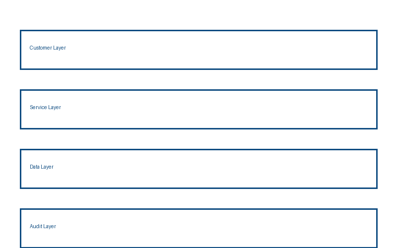
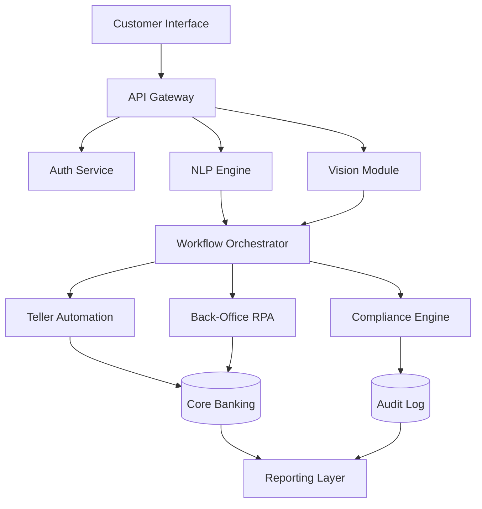
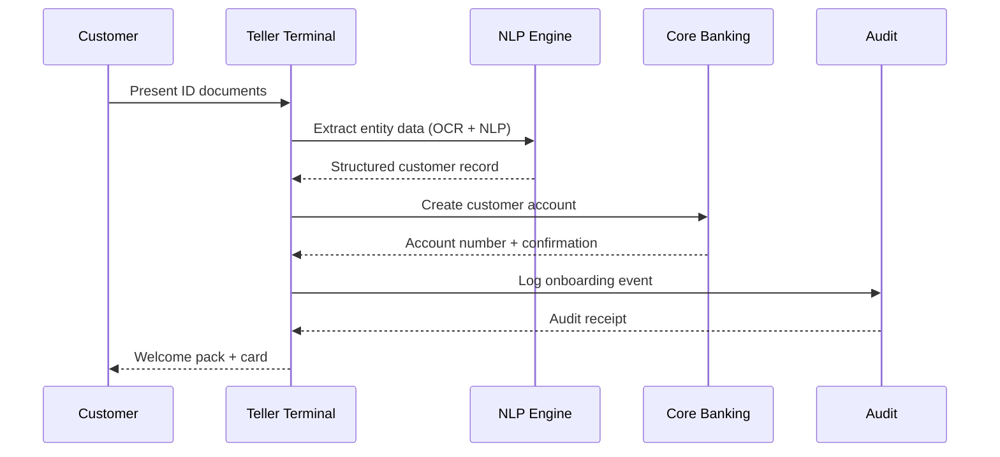
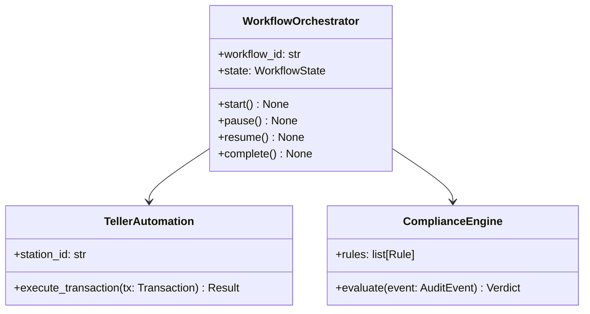
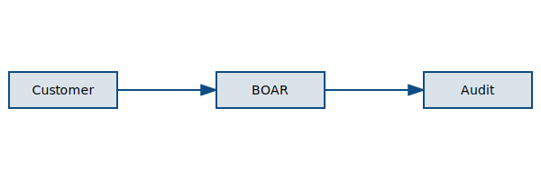

# 分支运营 AI 机器人产品说明书

## 目录

| 章节 | 页码 |
|------|------|
| 1. 市场定位 | 2 |
| 2. 系统架构 | 4 |
| 3. 技术规格 | 8 |
| 4. API 设计 | 12 |
| 5. 部署计划 | 16 |
| 6. 路线图 | 20 |

---

## 1. Market Positioning / 市场定位

### 1.1 Executive Summary

The Branch Operations AI Robot (BOAR) is an enterprise-grade automation platform
that combines natural language processing, computer vision, and robotic process
automation to streamline branch banking operations. This document covers the full
product specification for v1.0.0 release targeting Q3 2026.

本产品面向大中型商业银行的网点运营场景，通过人工智能技术实现业务流程的自动化与
智能化。目标客户群体包括拥有 200 个以上网点的全国性银行及区域性银行。

### 1.2 Competitive Landscape

Current market analysis shows three primary competitors:

1. **AutoBranch Pro** — focuses on teller automation; weak on back-office integration
2. **SmartBank Suite** — strong compliance module; limited NLP capability
3. *BranchIQ* — startup with good UX; no enterprise deployment track record

Our differentiation: **end-to-end automation** from customer-facing teller workflows
through back-office reconciliation, with a single audit trail.

> **Note:** The competitive landscape was last validated in Q1 2026. Market conditions
> change rapidly in the fintech sector; this analysis should be refreshed before
> customer presentations.

### 1.3 Target Segments

| Segment | Bank Size | Branch Count | Primary Pain Point |
|---------|-----------|--------------|-------------------|
| Tier 1 National | > ¥5T AUM | > 500 | Compliance overhead |
| Tier 2 Regional | ¥500B–5T AUM | 100–500 | Staff efficiency |
| City Commercial | < ¥500B AUM | 20–100 | Cost reduction |
| Rural Credit | Cooperative | 5–50 | Digital transformation |
| Joint-Stock | Mixed | 50–300 | Customer experience |
| Policy Banks | Government | > 200 | Regulatory reporting |

---

## 2. 系统架构 / System Architecture

### 2.1 Architecture Overview

The system follows a microservices architecture with four primary layers:



*Figure 1: High-level system architecture showing the four service layers.*

The architecture is designed for horizontal scalability. Each service layer can scale
independently based on load. The data layer uses eventual consistency with conflict-free
replicated data types (CRDTs) for distributed state management.

### 2.2 Component Diagram



### 2.3 Sequence: Customer Onboarding



### 2.4 Class Structure



### 2.5 High-Resolution Architecture Diagram

For print quality, refer to the 4K overview:


*Figure 2: Full-resolution architecture diagram (auto-downsampled for PDF).*

---

## 3. 技术规格 / Technical Specifications

### 3.1 Core Technology Stack

| Component | Technology | Version | License |
|-----------|-----------|---------|---------|
| NLP Engine | spaCy + custom models | 3.7+ | MIT |
| Vision Module | OpenCV + Tesseract | 4.9 / 5.3 | Apache-2.0 |
| Workflow Engine | Temporal.io | 1.22+ | MIT |
| API Gateway | Kong | 3.6+ | Apache-2.0 |
| Core DB | PostgreSQL | 16+ | PostgreSQL |
| Cache | Redis Cluster | 7.2+ | BSD-3 |

### 3.2 Python Service Implementation

The core workflow orchestrator is implemented in Python:

```python
"""workflow_orchestrator.py — Core workflow orchestration service."""

from __future__ import annotations

import asyncio
import logging
import uuid
from dataclasses import dataclass, field
from datetime import datetime, timezone
from enum import Enum
from pathlib import Path
from typing import Any

logger = logging.getLogger(__name__)


class WorkflowState(Enum):
    """Lifecycle states for a BOAR workflow instance."""

    PENDING = "pending"
    RUNNING = "running"
    PAUSED = "paused"
    COMPLETED = "completed"
    FAILED = "failed"
    CANCELLED = "cancelled"


class WorkflowType(Enum):
    """Supported workflow types in BOAR v1.0."""

    CUSTOMER_ONBOARDING = "customer_onboarding"
    ACCOUNT_MAINTENANCE = "account_maintenance"
    LOAN_APPLICATION = "loan_application"
    COMPLIANCE_REVIEW = "compliance_review"
    END_OF_DAY_RECONCILIATION = "eod_reconciliation"


@dataclass
class WorkflowOrchestrator:
    """Manages the lifecycle of BOAR automation workflows."""

    config_path: Path
    workflow_id: str = field(default_factory=lambda: str(uuid.uuid4()))
    state: WorkflowState = WorkflowState.PENDING
    created_at: datetime = field(
        default_factory=lambda: datetime.now(timezone.utc)
    )
    _tasks: list[asyncio.Task[Any]] = field(default_factory=list, repr=False)

    @classmethod
    def from_config(cls, config_path: Path) -> "WorkflowOrchestrator":
        """Construct an orchestrator from a YAML config file."""
        if not config_path.exists():
            raise FileNotFoundError(f"Config not found: {config_path}")
        return cls(config_path=config_path)

    async def start_workflow(
        self,
        workflow_type: WorkflowType,
        payload: dict[str, Any],
    ) -> str:
        """Start a new workflow instance. Returns the workflow_id."""
        if self.state != WorkflowState.PENDING:
            raise RuntimeError(
                f"Cannot start workflow in state {self.state.value}"
            )
        self.state = WorkflowState.RUNNING
        logger.info(
            "workflow.started",
            workflow_id=self.workflow_id,
            workflow_type=workflow_type.value,
        )
        return self.workflow_id
```

### 3.3 TypeScript API Client

The public API ships with a TypeScript client SDK:

```typescript
import { BoarClient, WorkflowType, OnboardingPayload } from '@boar/client';

const client = new BoarClient({
  baseUrl: process.env.BOAR_API_URL ?? 'https://api.boar.example.com',
  apiKey: process.env.BOAR_API_KEY!,
  timeout: 30_000,
});

async function onboardCustomer(customerId: string, docs: Document[]): Promise<string> {
  const payload: OnboardingPayload = { customerId, documents: docs };
  const { workflowId } = await client.workflows.start(WorkflowType.CustomerOnboarding, payload);
  return workflowId;
}
```

### 3.4 Deployment Configuration

```yaml
# boar-deployment.yaml — Kubernetes deployment manifest
apiVersion: apps/v1
kind: Deployment
metadata:
  name: boar-workflow-orchestrator
  namespace: boar-system
  labels:
    app: boar
    component: orchestrator
    version: "1.0.0"
spec:
  replicas: 3
  selector:
    matchLabels:
      app: boar
      component: orchestrator
  template:
    spec:
      containers:
        - name: orchestrator
          image: registry.example.com/boar/orchestrator:1.0.0
          resources:
            requests:
              cpu: "500m"
              memory: "512Mi"
            limits:
              cpu: "2000m"
              memory: "2Gi"
          env:
            - name: BOAR_LOG_LEVEL
              value: "INFO"
            - name: BOAR_DB_URL
              valueFrom:
                secretKeyRef:
                  name: boar-secrets
                  key: db-url
```

### 3.5 Shell Deployment Script

```bash
#!/usr/bin/env bash
# deploy.sh — One-command deployment to Kubernetes
set -euo pipefail

NAMESPACE="${BOAR_NAMESPACE:-boar-system}"
IMAGE_TAG="${1:-latest}"

echo "Deploying BOAR orchestrator image tag: ${IMAGE_TAG}"
kubectl set image deployment/boar-workflow-orchestrator \
  orchestrator="registry.example.com/boar/orchestrator:${IMAGE_TAG}" \
  --namespace "${NAMESPACE}"
kubectl rollout status deployment/boar-workflow-orchestrator \
  --namespace "${NAMESPACE}" --timeout=300s
echo "Deployment complete."
```

---

## 4. API 设计 / API Design

### 4.1 REST API Overview

The BOAR API follows REST conventions with JSON request/response bodies:

```json
{
  "openapi": "3.1.0",
  "info": {
    "title": "BOAR API",
    "version": "1.0.0",
    "license": { "name": "Apache-2.0" }
  },
  "paths": {
    "/workflows": {
      "post": {
        "summary": "Start a new workflow",
        "operationId": "startWorkflow"
      }
    }
  }
}
```

### 4.2 API Response Codes

| HTTP Code | Meaning | BOAR Error Code |
|-----------|---------|----------------|
| 200 | Success | — |
| 201 | Created | — |
| 400 | Bad request | `INVALID_PAYLOAD` |
| 401 | Unauthorized | `AUTH_REQUIRED` |
| 403 | Forbidden | `PERMISSION_DENIED` |
| 404 | Not found | `WORKFLOW_NOT_FOUND` |
| 409 | Conflict | `WORKFLOW_ALREADY_EXISTS` |
| 429 | Rate limited | `RATE_LIMIT_EXCEEDED` |
| 500 | Internal error | `INTERNAL_ERROR` |

### 4.3 Inline Icon Usage

The API documentation references the BOAR system icon for branding:


### 4.4 System Flow Diagram

The complete system flow is documented in the SVG diagram:



*Figure 3: End-to-end system flow from customer interaction to audit completion.*

---

## 5. 部署计划 / Deployment Plan

### 5.1 Rollout Phases

The deployment plan is structured in three phases:

1. **Phase 1 — Pilot** (Q3 2026)
   - 5 pilot branches in Tier 1 bank
   - Full monitoring and feedback collection
   - Weekly review cadence
   1. Week 1–2: Infrastructure setup
   2. Week 3–4: Staff training
   3. Week 5–8: Supervised operation
      - Daily check-ins with branch managers
      - Incident escalation path defined
      - Rollback procedure tested

2. **Phase 2 — Regional Rollout** (Q4 2026)
   - 50 branches across 3 regions
   - Automated health monitoring
   - Regional support team assigned
   - Success criteria: > 95% workflow completion rate

3. **Phase 3 — National Deployment** (Q1 2027)
   - Full 500-branch deployment
   - 24/7 NOC support
   - SLA: 99.9% uptime

### 5.2 Infrastructure Requirements

> **Warning:** Infrastructure provisioning requires lead time of 6–8 weeks.
> Begin procurement in parallel with Phase 1 pilot to avoid delays.
>
> Minimum specifications per data centre:
>
> | Resource | Minimum | Recommended |
> |----------|---------|-------------|
> | CPU cores | 32 | 64 |
> | RAM | 128 GB | 256 GB |
> | Storage | 10 TB NVMe | 20 TB NVMe |
> | Network | 10 Gbps | 25 Gbps |

### 5.3 日语フォールバック検証 / Japanese Kana Fallback Test

このセクションでは、日本語仮名文字のフォールバックレンダリングを検証します。
Noto Sans SC フォントが日本語仮名文字に対してフォールバックとして機能することを
確認するために、以下のサンプルテキストを使用します：

こんにちは世界。これはテストです。アイウエオカキクケコ。

繁體中文測試：這是一個測試段落，用於驗證繁體中文的渲染效果。
Traditional Chinese content should render correctly alongside Simplified Chinese.

---

## 6. 路线图 / Roadmap

### 6.1 v1.0 Feature List

The following features are confirmed for v1.0 release:

- ✓ Customer onboarding automation
- ✓ Teller transaction processing
- ✓ Real-time compliance checking
- ✓ End-of-day reconciliation
- ✓ Audit trail (JSONL, 90-day retention)
- ✓ REST API with TypeScript SDK

### 6.2 v2.0 Roadmap

Planned for v2.0 (target Q2 2027):

| Feature | Priority | Effort |
|---------|----------|--------|
| Video KYC integration | High | L |
| Multi-language NLP (EN/ZH/JP) | High | XL |
| Mobile teller app | Medium | XL |
| Blockchain audit trail | Low | XL |
| Biometric authentication | Medium | L |

### 6.3 Known Limitations (v1.0)

> The following limitations are known and accepted for v1.0. They are documented
> here to ensure customers are aware before committing to production deployment.

- Maximum 100 concurrent workflows per orchestrator instance
- OCR accuracy drops below 95% for documents older than 10 years
- Japanese kana recognition requires additional model training (v2.0 target)

---

## Appendix A: Compliance and Regulatory Notes

<!-- COMPLIANCE: This section is auto-generated from compliance templates. -->
<!-- COMPLIANCE: Do not edit manually. Last updated: 2026-04-26. -->
<!-- COMPLIANCE: Approved by: Regulatory Affairs Team. -->

All BOAR deployments must comply with the applicable banking regulations in the
jurisdiction of deployment. This product brief does not constitute legal advice.
Customers are responsible for ensuring compliance with local regulations.

---

*End of Branch Operations AI Robot Product Brief v1.0.0*

*Generated by md-to-pdf v2.0.0 — Branch Technology Group*
