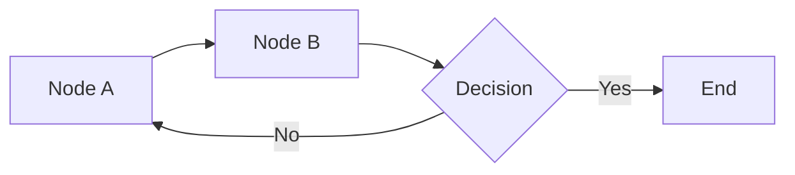
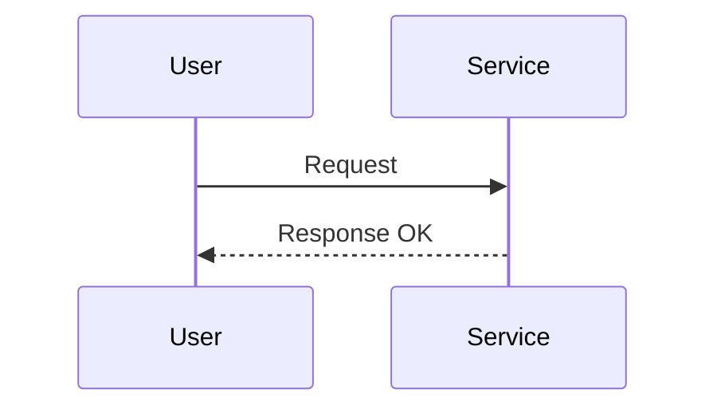
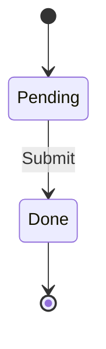

# Mermaid Noto + preset smoke fixture

English-only diagrams for mmdc + bundled Noto. For **CJK body and diagram labels**, use [`uat-zh.md`](uat-zh.md).

## Flowchart

```mermaid
flowchart LR
  A[Node A] --> B[Node B]
  B --> C{Decision}
  C -->|Yes| D[End]
  C -->|No| A
```

## Sequence

```mermaid
sequenceDiagram
  participant User as User
  participant API as Service
  User->>API: Request
  API-->>User: Response OK
```

## State

```mermaid
stateDiagram-v2
  [*] --> Pending
  Pending --> Done: Submit
  Done --> [*]
```
